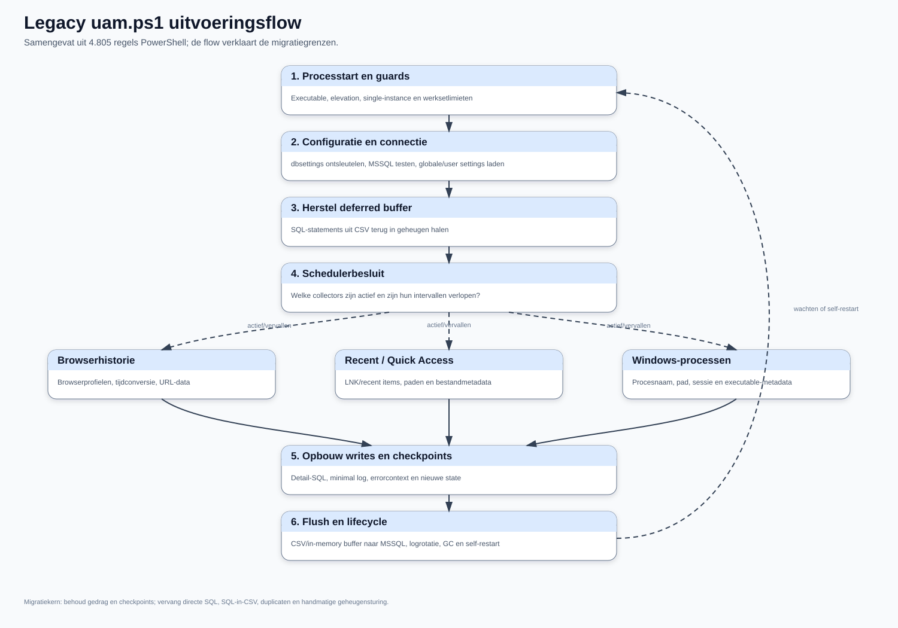

# Legacy agent `uam.ps1`

## Samenvatting

`uam.ps1` is een monolithische, sequentiële PowerShell-agent. Eén proces verzorgt procesbewaking, configuratie, databaseverkeer, drie datacollectors, lokale buffering, foutafhandeling, logrotatie en self-restart. De functionele waarde zit vooral in de verzamellogica, checkpoints, uitsluitingen en foutcontext. De technische koppeling tussen al die verantwoordelijkheden moet niet één-op-één naar C# worden vertaald.

De productiebuild bestaat uit twee PS2EXE-varianten:

- `UAM.exe`: x64, zonder console, output/errorvenster onderdrukt;
- `UAM_console.exe`: x64 met console voor debugdoeleinden;
- bestandsversie: `0.7.0.0`;
- runtimebestanden: executable plus `DbSettings.txt`; voor SQLite kan daarnaast `winsqlite3.dll` of de fallback onder `sqlite\uam.exe` nodig zijn.

`DbSettings.txt` bevat de MSSQL-connectie-informatie via `ConvertTo/From-SecureString` met een vaste sleutel in de bron. Dat is obfuscatie, geen veilige secretopslag. De sleutel wordt bewust niet in dit document herhaald.

## Uitvoeringsflow

De doorlopende hoofdlijn toont de lifecycle van het huidige proces. De drie
zijtakken zijn de bestaande collectors. De gestippelde terugkoppeling maakt
zichtbaar dat wachten, geheugencontrole en self-restart onderdeel zijn van de
legacy lifecycle en niet van de toekomstige collectortaken horen te zijn.

## Functiekaart

De regelnummers verwijzen naar de gefixeerde V0.7-bron.

| Gebied | Belangrijkste functies | Regels | Betekenis voor migratie |
| --- | --- | ---: | --- |
| Proces/start | `Get-CurrentExecutableName`, `Test-IsElevated`, `Set-ProcesGeheugenBescherming` | 40-204 | Bootstrap-/hostverantwoordelijkheid; niet in collectors opnemen. |
| Doelgroep/guards | `Test-GroupMembership`, `Test-HasContent`, `Test-HasRows`, `Test-IsTrue`, `Test-IsDateTime` | 207-420 | Normalisatie van slordige legacy instellingstypen is functioneel waardevol. |
| SQL-escaping | `Format-SqlString`, oude variant, `Get-SafeSqlString` | 423-531, 1907-1941 | Alleen als migratiebewijs gebruiken; nieuwe code moet parameters gebruiken. |
| Bestandslog | twee `Manage-LogRotation`, `Write-Log` | 534-852 | Duplicaat verwijderen; vervangen door structured logging en retention policy. |
| Telemetrie | `Get-ProcessPerformance`, `Check-RAMandCPU` | 854-913, 1298-1323 | Behoud signalen, niet de handmatige GC-/restartimplementatie. |
| Tijd/paden | browser-/epochconversies, `Get-SafeStoragePath`, waits | 933-1295 | Browser timestampconversies en profielbestandsstabiliteit blijven nodig. |
| MSSQL | `Invoke-SqlQuery`, `Test-SqlConnection` | 1325-1627 | Vervangen door parameterized API/outbox; endpoints schrijven niet direct naar SQL. |
| Buffer | `Restore-DeferredQueriesFromCSV`, `Invoke-DeferredQueryProcessing` | 1629-1737 | Functionele outbox behouden, complete SQL in CSV afschaffen. |
| Settings | `Get-AppSetting` | 1739-1904 | Typed settings, scope en defaults expliciet modelleren. |
| Fouten | `Write-DetailedError`, twee `ErrorHandler`, `Write-Error2DB` | 1944-2339 | Correlation/context behouden; secrets/PII redigeren en duplicaat verwijderen. |
| Lokale SQLite | `Invoke-SQLiteQuery` | 2341-2397 | Bewijst lokale SQLite-haalbaarheid; in C# `Microsoft.Data.Sqlite` gebruiken. |
| Procescoördinatie | `Stop-OtherProcesses`, `Test-OtherProcessRunning` | 2439-2650 | Vervangen door named mutex/service single-instance-contract. |
| Minimal model | `New-MinimalLoggingQueryBlock` | 2663-2694 | Functionele aggregatie behouden, maar server-side/idempotent uitvoeren. |
| Browser | `Export-BrowserHistory2DB`, `Get-BrowserHistory`, exclude update | 2700-2989 | Aparte BrowserHistory-taskplugin. |
| Recent files | `Export-RecentFilesAndFolders2DB`, `Get-RecentFilesAndFolders` | 2996-3232 | Aparte RecentItems-taskplugin. |
| Processen | `Export-WindowsProcesses2DB`, `Get-WindowsProcesses`, exclude update | 3239-3504 | Aparte ProcessInventory-taskplugin. |
| Orchestratie | `Invoke-PreStart`, `Start-Logging` | 3511-4760 | Opsplitsen in bootstrapper, agent host, scheduler en task executor. |

## Collectors

### Browserhistorie

De agent ondersteunt Firefox, Edge en Chrome. Hij lokaliseert profielbestanden, wacht tot bestanden benaderbaar zijn, leest SQLite en vertaalt browser-eigen tijdstempels naar lokale tijd. Browsercheckpoints worden per browser in `DeviceLoggingUsers` bijgehouden. Er is ook een later geconsolideerd browsercheckpoint, waardoor dubbel modelleren is ontstaan.

Behoud in C#:

- profiel- en browserdetectie;
- veilig lezen van gelockte databases via een tijdelijke snapshot/copy;
- expliciete timestampconversie;
- per taak/per gebruiker/per apparaat een checkpoint;
- normalisatie van domein, URL en applicatiematch.

Wijzig in C#:

- log alleen URL-/domeinpatronen die op een centraal allowlist-item matchen;
- verwijder of hash querystring, fragment en gevoelige padsegmenten vóór opslag;
- koppel een match aan een interne `ApplicationId` en optioneel een externe CMDB-sleutel;
- gebruik parameterized SQLite en HTTPS-ingestie.

### Windows Recent/Quick Access

De agent leest `.lnk`-bestanden en registreert meerdere bestandstijdstempels, doelpad en attributen. Dit levert nuttige gebruikssignalen op, maar paden kunnen persoons- of zaakgegevens bevatten.

De nieuwe taak moet een expliciet dataminimalisatiebeleid hebben: wel applicatie-/shareclassificatie, niet standaard de volledige bestandsnaam of het volledige pad.

### Processen

De collector beperkt zich tot processen in de huidige Windows-sessie en registreert onder andere starttijd, executablepad, product en company. De bestaande uitsluitlijst is denylist-gebaseerd.

De nieuwe variant moet allowlist-gebaseerd zijn en bij voorkeur op meerdere kenmerken matchen: genormaliseerde procesnaam, ondertekende publisher, productnaam, optioneel padpatroon en interne applicatiesleutel.

### Incidentele taken

Browserextensie-inventarisatie past functioneel als aparte taskplugin. Een generieke “voer willekeurige PowerShell uit”-plugin vergroot het aanvalsoppervlak sterk. Als zo'n compatibiliteitstaak tijdelijk nodig is, voer hem dan out-of-process uit met een ondertekend manifest, expliciete capability allowlist, timeout, outputlimiet en centrale kill switch.

## Settings en checkpoints

`DeviceLoggingSettings` is een globale key/value-store met beschrijving, groep, waarde, eenheid, type en enabled-vlag. `DeviceLoggingUserSettings` legt afwijkingen vast voor gebruiker/domein/apparaat. `DeviceLoggingUsers` combineert identiteit, runtimegegevens, installatieversie, loggingstatus, geheugenmetingen en veel taakcheckpoints.

Deze semantiek moet in C# worden gescheiden:

- settings snapshot met schema- en revisienummer;
- user/device overrides met geldigheidsduur;
- task definition en task schedule;
- task checkpoint per `DeviceId + UserId + TaskId`;
- agent installation/runtime state;
- diagnostics policy.

De lokale SQLite-database is een cache en outbox, niet de enige bron van globale waarheid. Iedere centrale snapshot krijgt een revision/hash; de agent wisselt atomisch naar een volledig gevalideerde snapshot.

## Legacy buffer en MSSQL-write

De agent bouwt complete `INSERT`-/`UPDATE`-statements als strings op, bewaart die in memory en CSV en voert ze later in één transactie uit. Dit beperkt directe SQL-druk, maar mengt data en uitvoerbare code.

Belangrijkste problemen:

- waarden worden via stringconcatenatie in SQL geplaatst;
- databaseacties gebruiken op plekken `Invoke-Expression`;
- de CSV kan complete SQL plus gevoelige pad-/URL-/foutwaarden bevatten;
- een foutpad verwijdert het CSV-bestand en kan daarmee data verliezen;
- replay/idempotency is niet formeel vastgelegd;
- endpoints hebben directe MSSQL-connectiviteit en databasecredentials nodig.

De vervanger is een SQLite-outbox met records, niet SQL: immutable event-id, task-run-id, schema version, payload, created time, attempts en next-attempt. De server accepteert idempotente batches via HTTPS en verwerkt ze achter een queue.

## Minimal logging

Naast detailtabellen houdt de agent `uam_log_minimal` en `uam_log_minimal_dates` bij. De intentie is waardevol: één logisch datapunt plus de dagen waarop dat punt is gebruikt. De implementatie laadt echter eerder minimal-historie voor een gebruiker in geheugen en de natuurlijke uniciteit wordt niet door een unieke constraint beschermd.

In het nieuwe model:

- bepaal een canonical key/hash uit tenant, user, application/data type en genormaliseerde waarde;
- gebruik server-side upsert met idempotency;
- maak de natuurlijke combinatie uniek;
- schrijf gebruiksdagen als unieke `(MinimalLogId, UsedOnDate)`-relatie of leid ze uit events af.

## Fouten en observability

De agent bewaart bruikbare context: computer, gebruiker, loglevel, fout, script, regel, positie, callstack, commandline, versie, settingssnapshot en Windowsversie. Die context moet behouden blijven, maar velden als commandline, settings, URL, path en callstack moeten vóór transport worden geredigeerd.

Aanbevolen niveaus:

- `Information`: lifecycle, taakstatus, batchaantallen;
- `Debug`: timings en beslispaden zonder payload;
- `Trace`: tijdelijk, centraal geautoriseerd per gebruiker/apparaat en automatisch vervallend;
- `Warning/Error/Critical`: structured exception met correlation-, task-run- en device-id.

Gebruik OpenTelemetry voor metrics/traces en structured JSON logs voor supportbundles.

## Concrete technische risico's

1. SQL-stringconcatenatie en dynamische uitvoering.
2. Vaste SecureString-sleutel in de bron.
3. Complete SQL-statements en gevoelige data in CSV.
4. CSV-verwijdering in een foutpad met mogelijk dataverlies.
5. Handmatige GC, vaste working-setlimieten van circa 50-200 MB en self-restart als geheugenbeheersing.
6. Mogelijke `RunAs`/UAC-prompt bij self-restart.
7. Dubbele definities van `Manage-LogRotation` en `ErrorHandler`; de laatste definitie wint stilzwijgend.
8. Een browsercheckpointquery mist op één plek `userdomain` en kan de verkeerde samengestelde identiteit raken.
9. Geen database-uniekheid voor de natuurlijke minimal-logcombinatie.
10. Volledige eerdere minimal-historie per gebruiker wordt in geheugen geladen.
11. Hardcoded klanttabellen en HR/AD-aannames.
12. Eén proces bezit alle verantwoordelijkheden en native dependencies.

## Wat zeker behouden moet blijven

- expliciete taskcheckpoints en herstartbaarheid;
- local-first buffering bij netwerk- of serverstoringen;
- browser timestamp-/profielkennis;
- filtering vóór transport;
- per gebruiker/apparaat overrides;
- minimal/aggregated usage naast detaildata;
- rijke, centraal instelbare foutdiagnostiek;
- single-instance- en updatecontrole;
- duidelijke console- en stille productiemodus, vertaald naar service plus supporttool.
