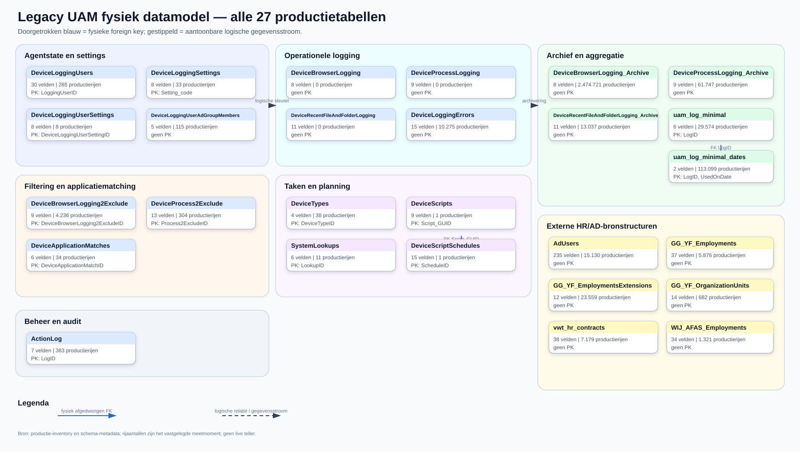
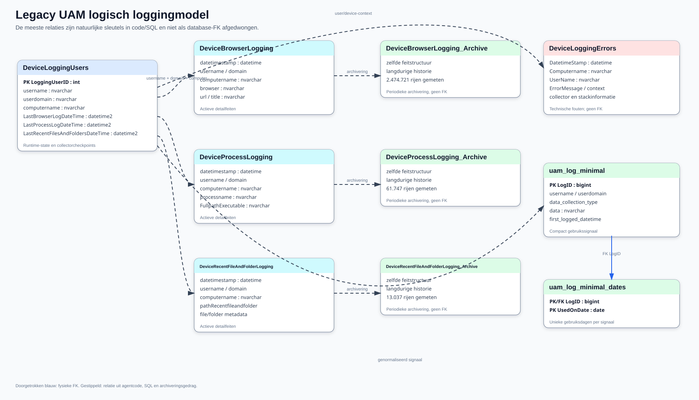
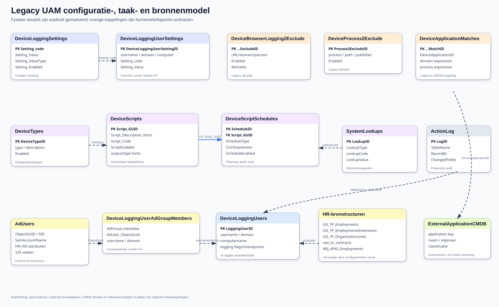

# Legacy databasemodel

## Reikwijdte en bewijs

Het model is gereconstrueerd uit productie `GGWVSQLA002/IAM`, `uam.ps1` en de DEV-/productie-PSU-app. Productie is gebruikt omdat de IAMDEV-kopie via `SELECT INTO` sleutels, indexen en foreign keys verliest.

De export bevat 27 tabellen en 569 velden. De productieprofieljob heeft per tabel één read-only `NOLOCK`-scan uitgevoerd en uitsluitend total/non-null-aantallen teruggegeven. Er zijn geen productiewaarden geëxporteerd voor de data dictionary.

## Fysiek afgedwongen relaties

Slechts twee foreign keys zijn daadwerkelijk aanwezig:



Het overzicht bevat alle 27 tabellen, hun productie-rijtelling, aantal velden
en de aanwezige primary keys. Er zijn maar twee fysiek afgedwongen foreign
keys: `DeviceScriptSchedules.Script_GUID` naar `DeviceScripts.Script_GUID` en
`uam_log_minimal_dates.LogID` naar `uam_log_minimal.LogID`. De overige
koppelingen bestaan in agentcode, SQL, beheerapp of gegevensstroom.

## Logisch operationeel model

De gestippelde relaties hieronder worden door code en kolomnamen gebruikt, maar niet door SQL Server afgedwongen.



De gestippelde relaties zijn natuurlijke sleutels en gegevensstromen die uit
de agent, SQL en archivering volgen. Alleen de blauwe relatie tussen de twee
minimal-tabellen is een database-FK. Dit onderscheid is belangrijk: een nieuwe
implementatie mag de huidige impliciete koppelingen niet per ongeluk als harde,
betrouwbare referential integrity behandelen.

## Logisch configuratie-, taak- en bronmodel



Dit model combineert de globale instellingen en overrides, het nog onvoltooide
taak-/planningsmodel, filtering en applicatiematching, externe HR/AD-structuren
en de polymorfe audit. `ExternalApplicationCMDB` is bewust als doelcontract
getekend: die entiteit bestaat niet fysiek in het legacy schema.

`ExternalHrView` staat voor klantconfigureerbare HR-/AD-contracten. In het legacy schema zijn hiervoor volledige structuren gekopieerd: `AdUsers`, `GG_YF_Employments`, `GG_YF_EmploymentsExtensions`, `GG_YF_OrganizationUnits`, `vwt_hr_contracts` en `WIJ_AFAS_Employments`. De nieuwe UAM mag deze tabellen niet bezitten of hardcoden; definieer smalle configureerbare views met een versieerbaar contract.

## Tabelinventaris

| Domein | Tabellen | Rol |
| --- | --- | --- |
| Agentstate/settings | `DeviceLoggingUsers`, `DeviceLoggingSettings`, `DeviceLoggingUserSettings` | Runtime, checkpoints, globale config en overrides. |
| Detailfeiten | `DeviceBrowserLogging`, `DeviceProcessLogging`, `DeviceRecentFileAndFolderLogging` | Actieve detailtabellen; kunnen na archivering leeg zijn. |
| Historie | de drie `_Archive`-tabellen | Langdurige detailhistorie. |
| Aggregatie | `uam_log_minimal`, `uam_log_minimal_dates` | Compact gebruikssignaal en gebruiksdag. |
| Filtering/matching | `DeviceBrowserLogging2Exclude`, `DeviceProcess2Exclude`, `DeviceApplicationMatches` | Legacy denylist en applicatiematches. |
| Taken | `DeviceScripts`, `DeviceScriptSchedules`, `DeviceTypes`, `SystemLookups` | Uitbreidbare taakdefinitie/planning; deels onaf. |
| Selectie/bronnen | `DeviceLoggingUserAdGroupMembers` plus zes externe bronstructuren | HR/AD-populatie en groepskoppeling. |
| Beheer/audit | `ActionLog`, `DeviceLoggingErrors` | Portalmutaties en agentfouten. |

Grootste feitenverzamelingen tijdens inventarisatie:

| Tabel | Productierijen | Gereserveerd |
| --- | ---: | ---: |
| `DeviceBrowserLogging_Archive` | 2.474.721 | circa 854,5 MB |
| `uam_log_minimal_dates` | 113.099 | zie inventoryartifact |
| `DeviceProcessLogging_Archive` | 61.747 | zie inventoryartifact |
| `uam_log_minimal` | 29.574 | zie inventoryartifact |
| `DeviceRecentFileAndFolderLogging_Archive` | 13.037 | zie inventoryartifact |
| `DeviceLoggingErrors` | 10.275 | zie inventoryartifact |

Exacte momentopnames staan in `artifacts/database/00_legacy_uam_prod_inventory.*` en het nieuwere veldprofiel.

## Data dictionary en veldbeoordeling

De volledige dictionary staat in [legacy-data-dictionary.md](appendices/legacy-data-dictionary.md) en machineleesbaar als:

- `artifacts/database/04_legacy_uam_data_dictionary.csv`;
- `artifacts/database/04_legacy_uam_data_dictionary.json`.

Per veld zijn datatype, nullability, sleutel/index, productievulling, codehits in agent/DEV/PROD, gegevensgevoeligheid, beoordeling, migratieadvies en opmerkingen opgenomen.

Vier velden voldoen aan de strenge reviewregel “productietabel bevat rijen, veld is altijd null en geen exacte codeverwijzing in de drie codebases”:

| Tabel | Veld | Bewijs | Advies |
| --- | --- | --- | --- |
| `DeviceBrowserLogging2Exclude` | `Remarks` | 4.236 rijen; 0 gevuld; 0 codehits | Kandidaat vervallen, eerst externe/reportconsumenten uitsluiten. |
| `DeviceScriptSchedules` | `IntervalMinutes` | 1 rij; 0 gevuld; 0 codehits | Alleen behouden als intervalplanning expliciet in het nieuwe contract komt. |
| `DeviceScriptSchedules` | `SpecificRunTime` | 1 rij; 0 gevuld; 0 codehits | Waarschijnlijk overlapt dit met cron/once scheduling; ontwerpbesluit nodig. |
| `DeviceScriptSchedules` | `LastRunTime` | 1 rij; 0 gevuld; 0 codehits | In nieuw model liever immutable task-run history dan mutable scheduleveld. |

Een kleine populatie, leegte of nul codehits is afzonderlijk geen verwijderbewijs. Dynamisch SQL en externe consumenten blijven mogelijk.

## Belangrijkste modelproblemen

1. Slechts twee fysieke foreign keys; de meeste relaties zijn conventies.
2. Gebruiker/apparaat is herhaald als losse tekstvelden zonder centrale identity keys.
3. Actieve en archieftabellen dupliceren schema en lifecyclelogica.
4. `ActionLog` is polymorf en kan geen referentiële integriteit afdwingen.
5. `DeviceApplicationID` is tekst en verwijst niet fysiek naar een applicatietabel.
6. Planningdoelgroepen zijn gedenormaliseerde tekstlijsten.
7. `DeviceLoggingUsers` combineert identiteit, installatie, runtime, diagnostics en task state.
8. Browserspecifieke en geconsolideerde checkpoints overlappen.
9. Minimal-loguniciteit is logisch maar niet uniek afgedwongen.
10. Volledige klant-HR/AD-tabellen zijn als impliciete afhankelijkheid opgenomen.

## Geïsoleerde IAMDEV-installatie

De documentatiekopie staat onder schema `uam_legacy_doc` in IAMDEV. De installer:

- weigert iedere database behalve exact `IAMDEV`;
- vervangt alleen schemaqualifier `dbo` door `uam_legacy_doc`;
- verwijdert expliciete `USE [IAM]`-regels;
- weigert te overschrijven wanneer het doelschema al tabellen bevat;
- installeert schema, referentiedata en samples in één transactie;
- bevat geen `DROP`, `TRUNCATE` of productiewrite.

Uitvoering hoort in de gedocumenteerde PSU-runtime:

```powershell
.\scripts\Install-LegacyUamDocumentationSchema.ps1 `
    -SqlInstance GGWVSQLa002 `
    -Database IAMDEV `
    -Schema uam_legacy_doc `
    -Confirm:$false
```

De uitgevoerde installatie is geverifieerd op 27 tabellen, 569 velden, 13 primary keys, 2 foreign keys, 15 indexen en 4.891 rijen.
