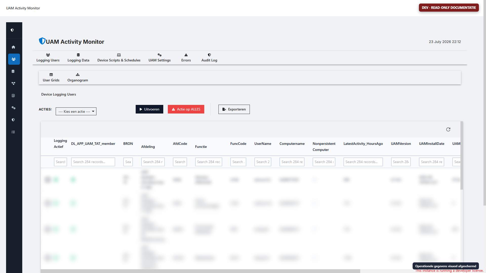
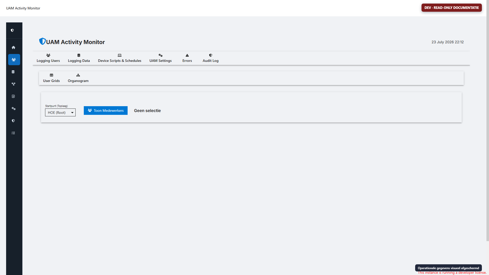
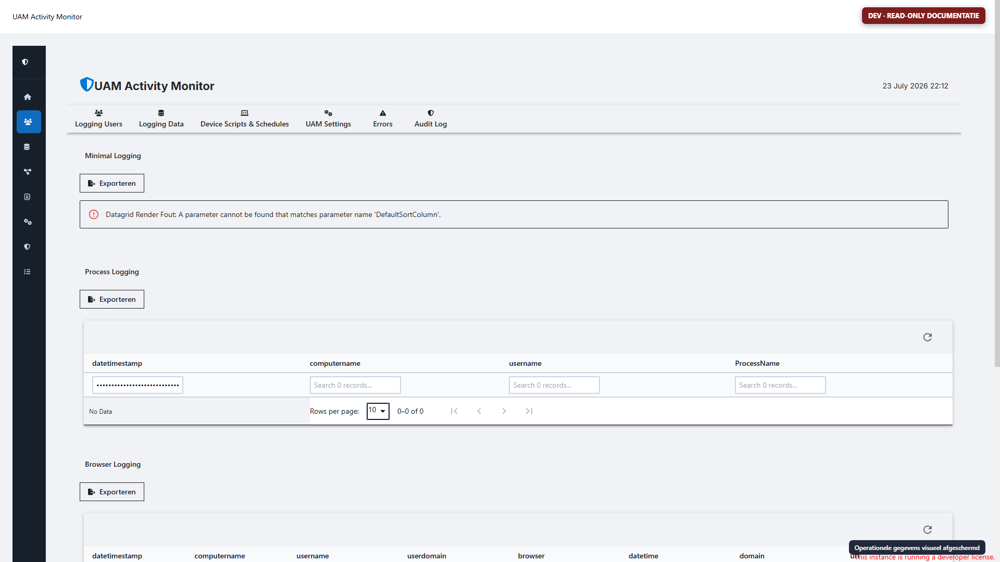
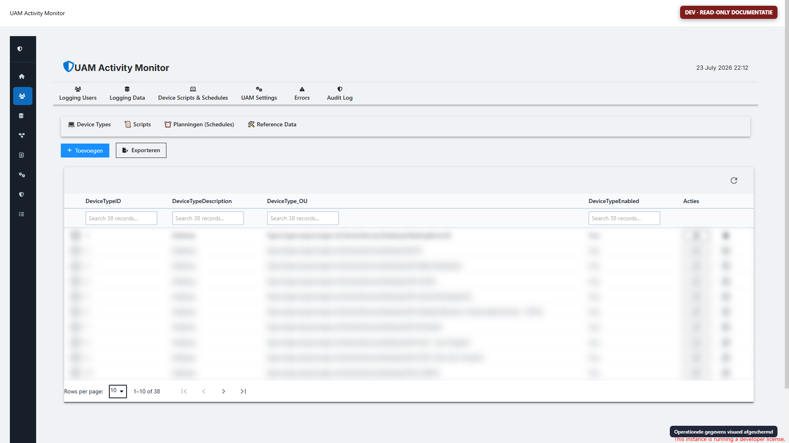
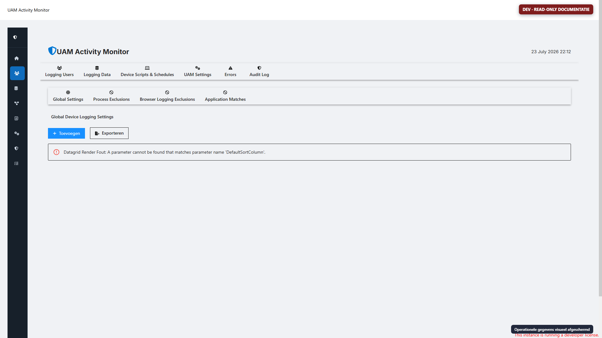
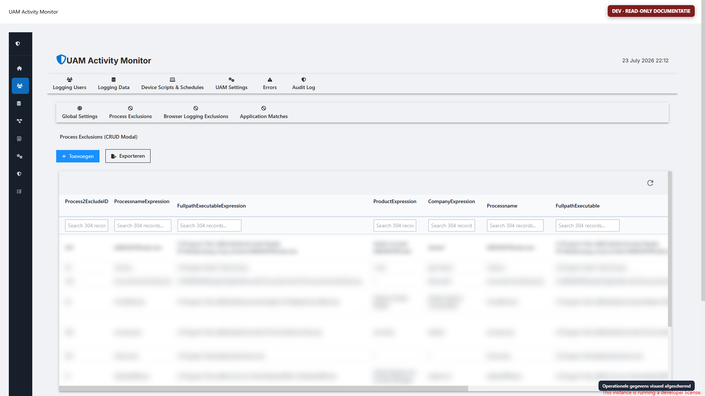
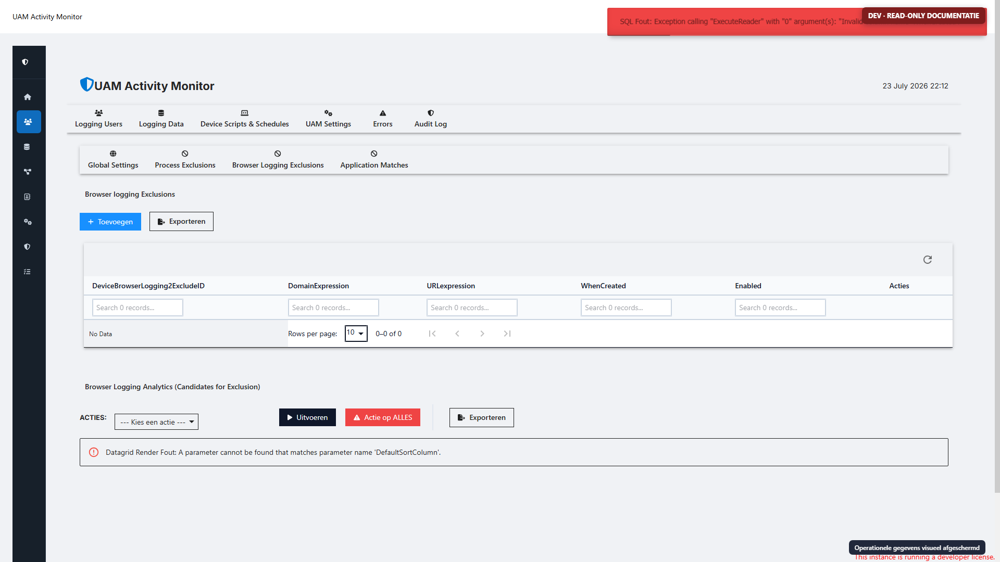
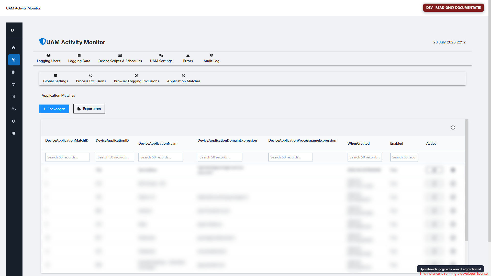
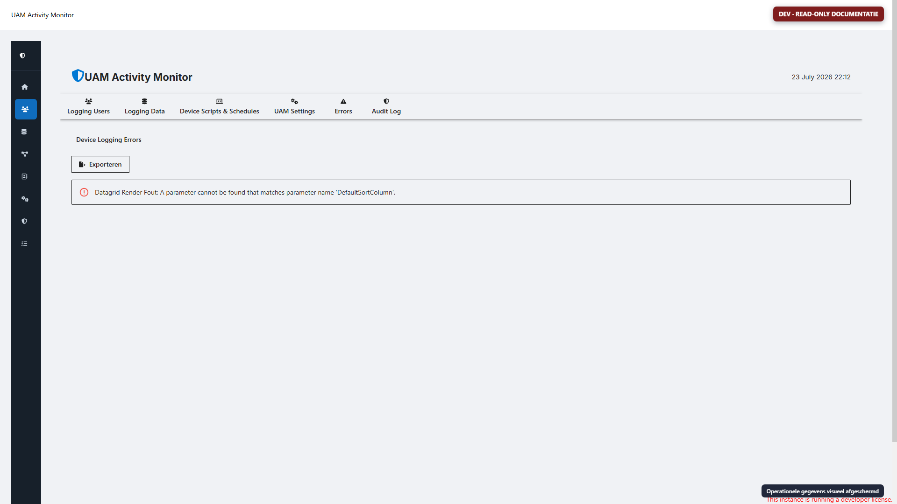
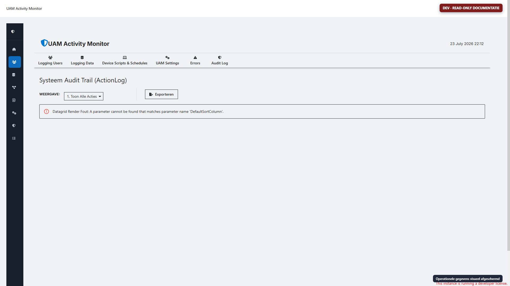

# PSU-app IST

## Omgevingen

| Omgeving | App | Route | Status | Bron |
| --- | --- | --- | --- | --- |
| DEV | `uam-logging` / UAM Activity Monitor | `/uam-logging` | Started | lokaal `uam-logging.ps1`, 1.217 regels |
| PROD | `User Activity Monitor`, ID 18 | `/UAM` | Started | PSU-content, 2.758 regels |
| PROD oud/alternatief | `UAM2` | `/UAM2` | Stopped | niet als actuele IST behandeld |

De productie-app is functioneel uitgebreider dan de DEV-bron. De productiebron is read-only opgehaald via de PSU API en geanalyseerd; de app-token en credentials zijn niet in artifacts opgeslagen.

## Hoofdnavigatie

```text
Logging Users
├─ User Grids
└─ Organogram

Logging Data

Device Scripts & Schedules
├─ Device Types
├─ Scripts
├─ Planningen (Schedules)
└─ Reference Data

UAM Settings
├─ Global Settings
├─ Process Exclusions
├─ Browser Logging Exclusions
└─ Application Matches

Errors
Audit Log
```

De beheerapp combineert drie rollen: operationeel inzicht, configuratie van de agent en een vroege taak-/schedulerfunctie. In de nieuwe oplossing horen deze als afzonderlijke portalcapabilities met expliciete rechten en audit te worden gemodelleerd.

## Veilige opnamewijze

De DEV-app is met een tijdelijk Chrome-profiel en Chrome DevTools Protocol doorlopen. De automation staat uitsluitend toe:

- navigatie via `role=tab` of vier expliciet gewhiteliste ondertablabels;
- een zoek-/filterveld vullen en leegmaken;
- een sorteerknop in een kolomkop bedienen;
- vorige/volgende paginering bedienen.

Niet toegestaan en niet uitgevoerd:

- Toevoegen, Opslaan, Wijzigen of Verwijderen;
- row actions;
- scripts of schedules starten;
- exporteren;
- forms submitten;
- databasewrites.

Vóór elke screenshot worden tabellichamen/gridrijen geblurd, inputwaarden gemaskeerd, canvaslabels geblurd en accountlabels verborgen. De rode badge benoemt de omgeving en read-only status.

## Schermoverzicht

### Logging Users — User Grids

Doel:

- bepalen welke medewerkers/apparaten in de UAM-populatie vallen;
- runtime-, versie-, status- en checkpointinformatie bekijken;
- filters, sortering en paging toepassen;
- in de beheerfunctionaliteit per gebruiker instellingen beïnvloeden.

Belangrijk voor de vervanger:

- scheid “wie mag worden gelogd”, “welke tasks gelden”, “agent health” en “task checkpoint”;
- toon de herkomst van iedere beleidsbeslissing: global policy, groep, user override of tijdelijk diagnosticsbeleid;
- behandel wijzigingen als versieerbare policy en niet als directe losse tabelupdate.



### Logging Users — Organogram

Doel:

- organisatiehiërarchie als alternatieve navigatie voor loggingpopulaties;
- startpunt/toplaag kiezen;
- medewerkers van een gekozen onderdeel tonen.

In de DEV-opname is geen organisatienode gekozen, omdat “Toon Medewerkers” een servercallback kan uitvoeren en de opname strikt op generieke read-only controls is begrensd.



### Logging Data

Doel:

- browser-, proces-, recent-item- en minimal logging bekijken;
- zoeken, sorteren en pagineren;
- operationele trends en individuele detailregels onderzoeken.

Risico's:

- URL's, paden, procesmetadata en gebruikersidentiteiten zijn gevoelige gebruiksdata;
- detailtabellen en archieven hebben verschillende lifecycle;
- breed zoeken op miljoenen browserregels kan kostbaar zijn.

De nieuwe portal moet standaard geaggregeerd openen, een expliciete reden/rol voor detailinzage vereisen en alle detailqueries begrenzen op tijd, tenant en scope.



### Device Scripts & Schedules

Doel:

- apparaattypen beheren;
- aanvullende PowerShell-scripts definiëren;
- schedules en doelgroepen vastleggen;
- referentiewaarden beheren.

De screenshot toont dat het onderdeel al als beheermodule is opgezet, maar de taakuitvoering in de legacy agent niet volledig is afgerond. `Script_Code` maakt willekeurige PowerShell mogelijk en is daardoor geen geschikt eindmodel.

Nieuwe portalcapabilities:

- catalogus van ondertekende taskpackages en versies;
- schema-gevalideerde taskparameters;
- afzonderlijke target-/exclusion-relaties;
- cronpreview, next-run en timezone;
- staged rollout, canary, pause en kill switch;
- immutable task-run history en outputlimieten.



### UAM Settings — Global Settings

Doel:

- globale agentinstellingen als key/value-configuratie beheren;
- beschrijving, groep, datatype, eenheid, enabled en waarde tonen.

In de actuele DEV-app is een concrete renderfout zichtbaar: de gridhelper krijgt een niet-bestaande parameter `DefaultSortColumn`. Dit is een DEV-runtime-/versieverschil en geen bewijs dat productie hetzelfde probleem heeft.

De nieuwe portal moet typed setting schemas gebruiken, met validatie, defaults, revision, change reason, audit, staged activation en rollback. Secrets horen niet in deze generieke settingstore.



### UAM Settings — Process Exclusions

Doel:

- procesnamen/-paden van logging uitsluiten;
- regels zoeken, sorteren en beheren.

Nieuw inzicht is allowlist in plaats van denylist. Toon daarom alleen centraal goedgekeurde applicatie-/procesmatches en registreer waarom een match is toegestaan.



### UAM Settings — Browser Logging Exclusions

Doel:

- domeinen en URL-patronen uitsluiten;
- grote legacy referentielijst beheren.

De productietabel bevat meer dan vierduizend regels. De nieuwe architectuur draait dit om: alleen applicatie-/URL-patronen op een allowlist worden gelogd; de rest wordt niet getransporteerd.



### UAM Settings — Application Matches

Doel:

- domein-/procesexpressies aan een applicatie-id koppelen;
- logging vertalen naar een herkenbare applicatie.

Dit is de functionele voorloper van de gewenste centrale Application Registry. `DeviceApplicationID` is nu tekst zonder FK. In de nieuwe portal wordt dit een echte interne `ApplicationId` met optionele externe CMDB-key en provenance.



### Errors

Doel:

- agentfouten en context bekijken;
- zoeken op apparaat, gebruiker, tijd, loglevel of versie;
- supportdiagnose uitvoeren.

Nieuwe portal: fingerprinting/aggregatie, correlation-id, task-run, redactie-indicator, occurrence count, first/last seen, acknowledgement en gecontroleerde tijdelijke trace policy.



### Audit Log

Doel:

- beheeracties per tabel/record/gebruiker/tijd volgen;
- gewijzigde velden onderzoeken.

Het huidige model is polymorf. De nieuwe auditstore moet immutable events gebruiken met actor, tenant, capability, entity type/id, before/after-diff, reason, correlation en policy revision.



## Functionele handigheden om te behouden

- één portal voor populatie, logging, settings, taken, fouten en audit;
- tabellen met filter, sortering, paging en exportmogelijkheden;
- organogram als begrijpelijke populatienavigatie;
- per-user afwijkingen naast global settings;
- proces-/browsermatching naar applicaties;
- expliciete errors- en auditviews;
- device types en doelgroepconcept voor taken.

## Wat anders moet

- least-privilege RBAC per capability;
- scheiding tussen read, policy edit, task publish, task run en diagnostics;
- API/service-laag in plaats van portalcallbacks die direct SQL wijzigen;
- optimistic concurrency en revisions;
- policy preview en impact count vóór activering;
- allowlists en dataminimalisatie vóór endpointtransport;
- responsive, toegankelijke UI met deep links en bewaarde filters;
- detailtoegang met reden, scope en audit;
- geen arbitraire PowerShell-code als normaal taakmodel.

## Productiescreenshotstatus

De productie-appbron, routes en tabstructuur zijn vastgesteld. De productie-API-token kan appbron en metadata lezen, maar geen interactieve browsersessie aanmelden. De lokale DEV-adminreferenties worden in productie geweigerd. Een geldige productie-opname vereist daarom een handmatige login in het zichtbare tijdelijke browserprofiel. Bij een volgende sessie kan hetzelfde script worden gebruikt:

```powershell
.\scripts\Invoke-UamReadOnlyBrowserWalkthrough.ps1 `
    -AppUri 'http://10.1.23.109:5000/UAM' `
    -EnvironmentLabel PROD `
    -ProxyServer 'http://proxy.net.groningen.nl:8080' `
    -OutputDirectory '.\artifacts\screenshots\prod' `
    -Visible `
    -InteractiveLogin `
    -LoginTimeoutSeconds 900
```

De gebruiker meldt zelf aan en deelt geen wachtwoord. Na redirect naar `/UAM` neemt de read-only automation het over en verwijdert aan het einde het tijdelijke profiel.

## Walkthroughvideo

De overdracht bevat daarnaast `UAM-PSU-app-walkthrough.mp4`: een stille DEV-rondleiding met alle toelichting in beeld. Het bewerkbare PowerPoint-bronbestand, een `.srt`-ondertitelbestand en een Markdown-transcript worden meegeleverd. De video gebruikt de bestaande privacygemaskeerde DEV-opnamen en vermeldt expliciet dat de actuele DEV-heropname en de PROD-opname nog een handmatige PSU-login vereisen.
