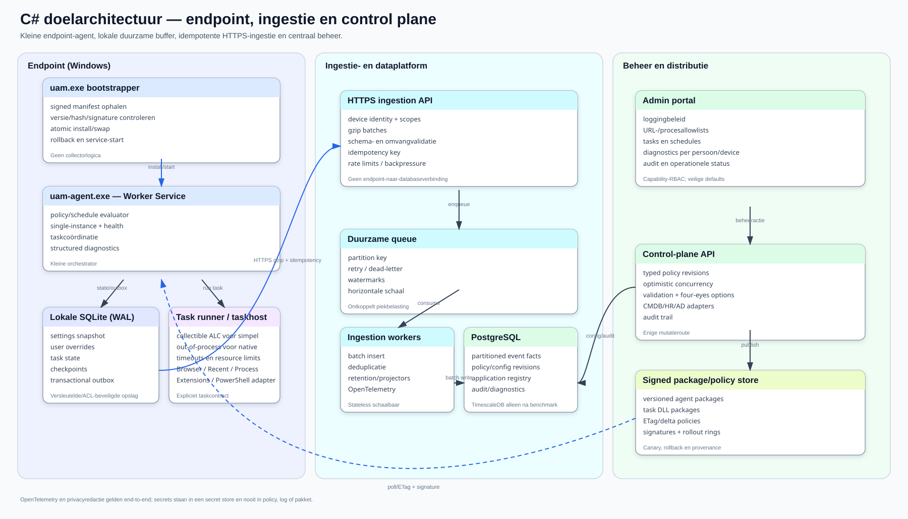

# C# doelarchitectuur

## Ontwerpdoelen

- kleine, stabiele agent met laag idle-geheugen;
- tasks afzonderlijk kunnen versiebeheerden, uitvoeren en isoleren;
- offline-first zonder dataverlies;
- 6.000 gebruikers zonder directe endpoint-naar-databasewrites;
- klantonafhankelijke HR/AD-/CMDB-contracten;
- allowlist en dataminimalisatie vóór transport;
- configureerbare diagnostics per gebruiker/apparaat;
- portable/open-source servercomponenten waar praktisch;
- veilige updates, rollback en aantoonbare audit.

## Componentmodel



De drie zones scheiden endpointverantwoordelijkheden, data-ingestie en centraal
beheer. De agent schrijft niet rechtstreeks naar een centrale database. Alle
uploads lopen als idempotente batches via HTTPS; beleid en taakpakketten worden
getekend, geversioneerd en gecontroleerd uitgerold.

## 1. Bootstrapper

Een kleine `uam.exe` bootstrapper doet alleen:

1. installroot en channel bepalen;
2. package manifest en digitale handtekening valideren;
3. ontbrekende/nieuwere `uam-agent.exe` downloaden of kopiëren;
4. uitpakken naar een versie-directory;
5. self-test uitvoeren;
6. atomisch de `current`-pointer wisselen;
7. service starten/health controleren;
8. bij failure naar vorige versie terugrollen.

Nooit een in-place overwrite van een draaiende executable. Houd minimaal `current`, `previous` en een begrensde packagecache. Het manifest bevat version, SHA-256, signing key id, minimum OS/runtime, files en rollout channel.

## 2. Agent host

Aanbevolen basis: .NET 10 LTS Worker Service als Windows Service.

Verantwoordelijkheden:

- device identity en registratie;
- policy/settings snapshots ophalen;
- scheduler en concurrencylimieten;
- taskpackage verifiëren;
- task runner starten;
- SQLite transacties/outbox;
- upload met retry/backpressure;
- health, metrics en supportbundle;
- updatehandoff naar bootstrapper.

Geen browserspecifieke SQL, HR-query's of portallogica in de host.

## 3. Taskcontract en isolatie

Een taskpackage bevat een signed manifest en één of meer assemblies:

```csharp
public interface IUamTask
{
    Task<UamTaskResult> ExecuteAsync(
        UamTaskContext context,
        JsonElement settings,
        CancellationToken cancellationToken);
}
```

`UamTaskContext` geeft alleen capabilities die de taak nodig heeft: read-only lokale bestandstoegang via helpers, checkpointstore, eventwriter, clock en logger. Geen databasecredential of willekeurige control-plane client.

Een collectible `AssemblyLoadContext` kan managed taskassemblies ontladen. Dit is geen harde isolatie: static references, threads, timers en native libraries kunnen unload blokkeren. Daarom:

- eenvoudige volledig managed tasks: collectible ALC in de agent;
- tasks met native SQLite/browserdrivers, onbekende code of PowerShellcompatibiliteit: apart `uam-taskhost.exe`-proces;
- per task timeout, memory/CPUlimiet, outputlimiet en cancellation;
- kill het taskhostproces wanneer echte vrijgave vereist is.

## 4. Lokale SQLite

Gebruik WAL-mode, korte transacties en één migratie-eigenaar. Encrypt gevoelige payloads waar het dreigingsmodel dat vraagt; bewaar geen serversecrets.

Voorgestelde tabellen:

| Tabel | Sleutel/inhoud |
| --- | --- |
| `agent_state` | device id, install/current/previous version, registration en last contact |
| `settings_snapshot` | scope, revision, ETag/hash, schema version, JSON, activated/expiry |
| `user_override` | user key, setting/task key, value, source, valid from/until |
| `task_definition` | task id/version, manifest, schedule, enabled, capabilityset |
| `task_checkpoint` | device + user + task, cursor/watermark, last success/run |
| `task_run` | immutable run id, timings, result, counts, error fingerprint |
| `outbox_batch` | batch id, state, attempts, next attempt, size, idempotency key |
| `outbox_event` | event id, batch id, task/schema, occurred time, minimized payload |
| `diagnostics_policy` | level, scope, expiry, issuer en reason |

De task schrijft events en checkpoint in één lokale transactie. Een checkpoint mag pas vooruit wanneer alle bijbehorende events duurzaam in de outbox staan.

## 5. Ingestion API

Gebruik ASP.NET Core achter TLS. Endpoints authenticeren als device/tenant met korte tokens of mTLS; geen MSSQL-/PostgreSQL-credentials op endpoints.

Voorbeeldcontract:

```http
POST /v1/ingestion/batches
Authorization: Bearer <device-token>
Content-Encoding: gzip
Idempotency-Key: <batch-uuid>
X-UAM-Schema-Version: 1
```

Response:

```json
{
  "batchId": "...",
  "status": "accepted",
  "acceptedEvents": 500,
  "retryAfterSeconds": 0
}
```

Serverregels:

- maximum compressed/uncompressed size en event count;
- schema-/tenant-/devicevalidatie vóór queue;
- idempotency op tenant + device + key;
- geen PII in accesslogs;
- `429` met jittered retry bij backpressure;
- poison batches isoleren met expliciete reden en support-id.

Startwaarden om te meten, niet als harde waarheid: maximaal 500 events of 1 MiB uncompressed per batch, maximaal twee uploads per device, exponential backoff met full jitter en een centraal instelbaar ratebudget.

## 6. Queue en workers

De API bevestigt pas na duurzame queue-opslag. Geschikte portable opties zijn RabbitMQ of NATS JetStream; een PostgreSQL-backed inbox kan voor een eerste kleine installatie volstaan. Houd het queuecontract abstract zodat deploymentprofielen kunnen verschillen.

Workers:

- valideren en normaliseren;
- matchen URL/proces naar `ApplicationId`;
- bulk-copy/upsert per eventtype;
- bewaken idempotency;
- vullen detailfeiten, minimal aggregates en diagnostics;
- schrijven dead-letter metadata zonder ongeredigeerde payload in algemene logs.

## 7. Databasekeuze

Aanbevolen default: PostgreSQL, omdat het open source, portable en geschikt voor partitionering/bulk ingestie is.

- partitioneer grote eventtabellen op tijd en tenant;
- gebruik BRIN voor lange tijdreeksen en gerichte B-tree-indexen voor tenant/device/application/time;
- scheid control-plane tabellen van high-volume facts;
- bewaar ruwe detaildata korter dan aggregaties;
- gebruik `COPY`/batch insert en voorkom row-by-row writes.

TimescaleDB kan nuttig zijn voor compressie, retention policies en time-bucket queries, maar voeg de extensie pas toe nadat echte loadtests aantonen dat standaard PostgreSQL-partitionering onvoldoende of operationeel onhandig is. MSSQL kan een deploymentadapter blijven, maar is geen vereiste voor de endpointarchitectuur.

## 8. Schaal naar 6.000 gebruikers

De architectuur voorkomt thundering herds:

- schedules krijgen stabiele device-jitter;
- policy kan per task globale concurrency/rate windows publiceren;
- lokale outbox absorbeert netwerk- en serveruitval;
- API geeft backpressure terug;
- queue ontkoppelt HTTP-latency van databasewrites;
- workers schalen horizontaal;
- databasewrites gebeuren in bulk.

Capaciteit moet worden berekend uit gemeten events per user/task/dag, gemiddelde payload, piekfactor, retention en query-SLA. Test minimaal:

1. steady state 6.000 actieve agents;
2. ochtendpiek en reconnect na één uur outage;
3. server/queue 30 minuten unavailable;
4. poison batch en schema mismatch;
5. agentupdate tijdens backlog;
6. databasepartition rollover en retention.

## 9. HR/AD-/CMDB-contracten

Definieer smalle contractviews in plaats van klanttabellen:

```text
PersonSourceView
- ExternalPersonId
- AccountName
- Domain
- IsActive
- OrganizationUnitId
- ManagerExternalPersonId
- ValidFrom / ValidUntil

ApplicationSourceView
- ExternalApplicationId
- Name
- Owner
- LifecycleStatus
- SourceSystem
```

De connection/providerconfiguratie staat centraal en secrets zitten in een secret store. Een import registreert source system, schema version, batch id, row counts en kwaliteit. De interne application registry krijgt een eigen stabiele `ApplicationId` en optionele externe sleutels.

## 10. URL- en procesallowlists

Voorgesteld model:

- `application`;
- `application_external_key`;
- `url_match_rule` met host/padpattern, query policy en priority;
- `process_match_rule` met normalized name, publisher, product en padpolicy;
- `rule_revision`/audit;
- `match_conflict` voor ambiguïteit.

Match op het endpoint zodat niet-toegestane URL's/processen nooit in de outbox komen. Publiceer een compacte, gesigneerde rule snapshot. Test rules centraal met voorbeeldinput zonder echte gebruikersdata.

## 11. Diagnostics en privacy

- structured logs met event id, task run, device, appversion en correlation;
- OpenTelemetry metrics/traces;
- levels centraal en tijdelijk per user/device instelbaar;
- tracepolicy heeft issuer, reason en automatische expiry;
- redactie vóór lokale persistence en transport;
- supportbundle bevat configuratiehashes/counts, geen secrets/cookies/ruwe browserhistorie;
- retention en detailtoegang per tenant/purpose.

## 12. Admin portal

ASP.NET Core API plus een moderne webclient, met capability-RBAC:

- Viewer;
- Policy Administrator;
- Task Publisher;
- Task Operator;
- Diagnostics Operator;
- Auditor.

Portalmodules:

- fleet/agent health;
- population/policy editor met impact preview;
- task catalog, schedules en staged rollout;
- application registry en allowlists;
- usage explorer met aggregatie-first detail drilldown;
- errors/fingerprints en supportacties;
- immutable auditlog.

Iedere mutatie gebruikt optimistic concurrency, reason, actor en revision. Productieacties worden nooit verstopt in generieke tabel-row-actions.

## Niet doen

- geen directe endpoint-naar-databaseconnectie;
- geen complete SQL-statements in SQLite/CSV;
- geen fixed-key secretversleuteling;
- geen willekeurige task-DLL zonder signature/capabilities;
- niet aannemen dat `AssemblyLoadContext` native resources hard isoleert;
- geen volledige URL/pad/processen verzamelen en later pas filteren;
- geen klanttabellen hardcoden;
- geen “Timescale omdat het time series heet” zonder benchmark.
