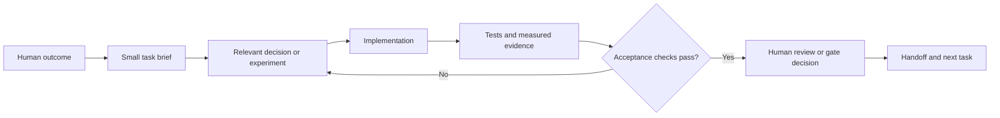

# How work moves through the repository

Every meaningful change follows the same path:

## Why this is repeatable

- A task begins with an observable outcome, not an instruction to “work on the system.”
- Scope and exclusions prevent a later feature from quietly entering an early milestone.
- Uncertain technical claims become small experiments with pass/fail rules.
- Commands and generated evidence make the result reproducible.
- Human decisions are named instead of being guessed by code or an agent.
- A handoff makes the next task independent from chat history.

The detailed procedure and templates are in [the work guide](../work/README.md).
