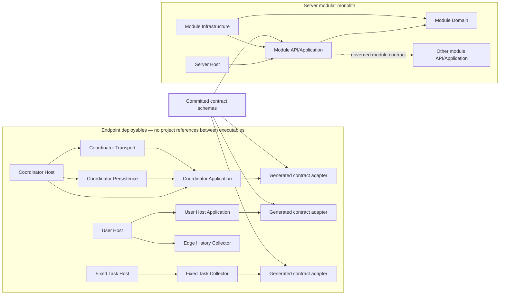
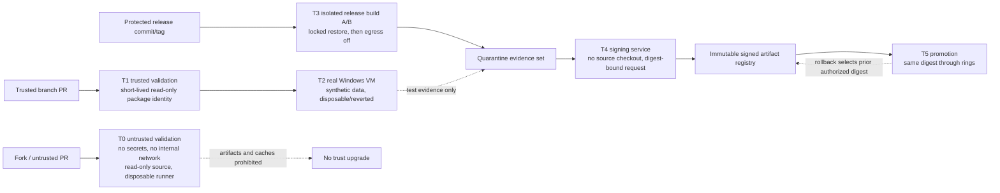
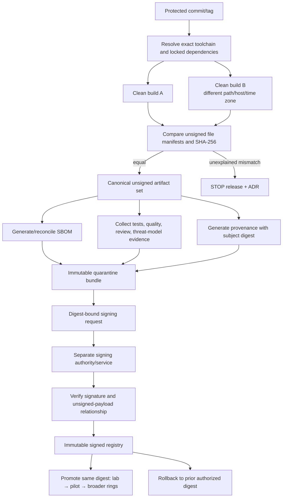
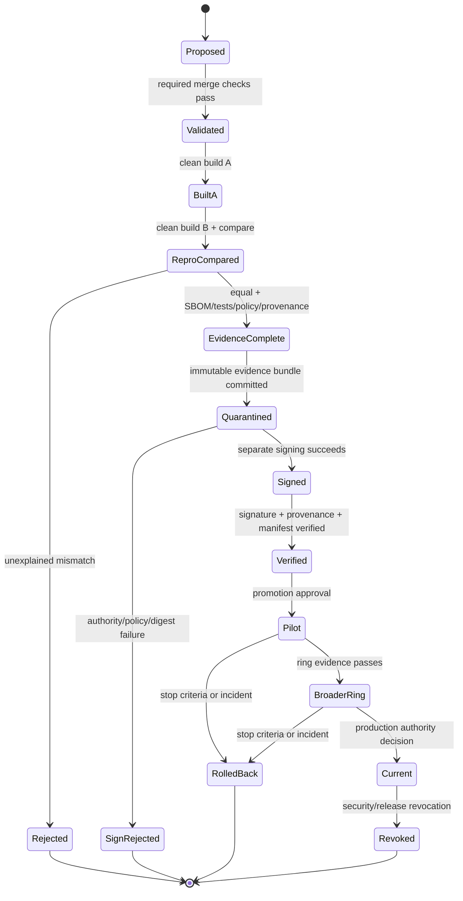
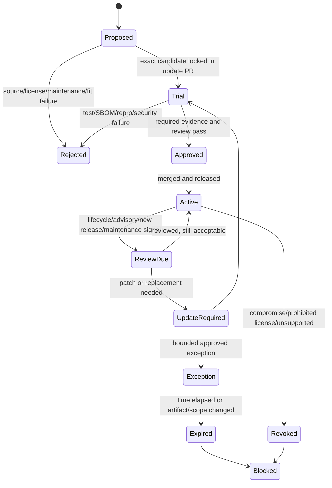

# UAM next generation — repository, solution, build, dependency, and CI architecture

**Research date:** 31 July 2026  
**Result status:** Proposed implementation foundation; decision-ready, not production approval  
**Primary gate:** **No production artifact is promoted without reproducible inputs, review evidence, dependency and license checks, provenance, and separated signing authority.**  
**Evidence vocabulary:** **FACT**, **ASSUMPTION**, **INFERENCE**, **ESTIMATE**, **RECOMMENDATION**, **UNKNOWN**, **HUMAN DECISION**, and **CLI EXPERIMENT** have the meanings defined in the supplied research-evidence rules.

---

## 1. Executive conclusion in easy language, with confidence and residual risk

### Decision

**RECOMMENDATION — adopt one governed monorepo for the first implementation phase.** Keep each executable and server module visibly separate inside it, enforce dependency direction in code and in MSBuild graph tests, and exchange data across deployable boundaries only through versioned generated contracts. Do not create a general-purpose `Shared`, `Common`, plug-in, or script channel.

**RECOMMENDATION — make the build an evidence-producing product.** Every release candidate MUST be built from a reviewed commit and exact locked inputs in two clean environments. The unsigned payloads MUST compare byte-for-byte, or the mismatch MUST stop release and open an ADR. The build then produces a file manifest, SBOM, tests, policy results, and provenance tied to the exact artifact digest. Signing is a later, separately authorized operation; promotion moves the same signed digest through rings and never rebuilds it.

**RECOMMENDATION — divide CI by trust, not merely by speed.** Code from forks or otherwise untrusted pull requests receives no secrets, no internal network access, no writable shared cache, and no path to release artifacts. Trusted validation still receives only short-lived, lane-specific credentials. Windows service, Session 0, user-session, IPC ACL, MSI, upgrade, rollback, and certificate behavior require disposable real Windows VMs; containers or mocked process launches are not accepted substitutes for those claims.

**FACT — current platform basis.** As of 31 July 2026, .NET 10 is an active LTS family, the current servicing release is 10.0.10 dated 14 July 2026, and the family is supported through 14 November 2028 [S01]. This supports choosing the **.NET 10 LTS family** for the bootstrap. It does not make 10.0.10 a timeless architectural constant. The exact SDK patch, Windows SDK, installer tool, Node/frontend toolchain, analyzers, generators, and CI actions MUST be selected and pinned in an execution-time lock manifest.

### Why this is the simplest safe choice

The accepted endpoint and server architecture contains several security and privacy boundaries that are easy to erase accidentally: machine service versus interactive user, task process versus arbitrary extension, endpoint versus central database, one server module versus another, and one realm versus another. A monorepo lets a single change update contracts, implementations, tests, installer, threat model, and evidence atomically. Strict architecture tests and separate deployable projects provide the containment that a monorepo alone does not.

Starting with multiple repositories would add cross-repository version choreography, duplicated policy code, and ambiguous promotion evidence before separate release ownership or access policy has been approved. Starting with an elaborate build framework would add executable build dependencies before the team has proved that thin, reviewable scripts and MSBuild are insufficient.

### Confidence and residual risk

| Conclusion | Confidence | Why | What would lower or change it |
|---|---|---|---|
| Governed monorepo with hard project boundaries | **High** | Fits the accepted modular architecture and enables atomic contract/test/security changes; no supplied evidence requires separate access or release authorities. | Approved access, legal, or independent-release requirements that cannot be met with path protections and separate artifacts. |
| .NET 10 LTS family for bootstrap | **High** for the family; **Medium** for any exact patch | Current official lifecycle evidence supports the family [S01]. Exact patches and supported OS combinations move monthly. | A Windows/EDR/installer compatibility experiment or enterprise support policy rejecting the selected patch/family. |
| Double clean-build reproducibility before signing | **High** as a release control; **Medium** for installer byte identity until measured | .NET/MSBuild expose deterministic-build controls [S02], but the actual UAM package graph and MSI tooling do not yet exist. | CLI evidence showing an unavoidable nondeterministic field that cannot be removed or safely delimited. |
| Real disposable Windows VM lane | **High** | Windows isolates services in Session 0 and interactive sessions elsewhere [S15]; accepted boundaries depend on real service/session behavior. | Only a narrower claim could move to an emulator; the final session/installer claims still require a VM. |
| SBOM plus provenance tied to artifact digest | **High** as a contract; **Medium** for the selected tool | SPDX, CycloneDX, in-toto, and SLSA provide maintained formats [S18][S19][S20][S21]. Reviewed tools have known coverage and operational limitations. | Reconciliation experiments showing selected tooling omits shipped files or resolved components. |
| Separate signing and promote-the-same-digest | **High** | Directly contains build-runner and artifact-substitution risk and supports the accepted release authorization invariant. | A signing system incapable of digest-bound requests or verified handoff; that would be a stop, not a reason to sign in the build lane. |

**Residual risk at this stage:** no repository has yet been scaffolded; no dependency graph, installer, Windows runner image, package mirror, SBOM tool, provenance implementation, signing service, or promotion store has passed the experiments in this result. CI-platform policy, review/signing authority, license policy, staffing, retention, and supported toolchain remain human decisions. Research cannot prove that a future runner, package, action, certificate service, or human approval is uncompromised; the design limits blast radius and makes the evidence inspectable.

---

## 2. Scope, non-goals, accepted inputs, assumptions, and unknowns

### 2.1 Scope

This result defines:

- repository and solution organization;
- deployable, module, contract, test, installer, tooling, documentation, and evidence boundaries;
- .NET and provisional frontend dependency direction;
- reproducible inputs and output comparison;
- dependency, vulnerability, license, secret, SBOM, and provenance policy;
- CI trust zones, Windows VM lanes, runner and cache isolation;
- review, branch, signing, promotion, rollback, incident, and evidence rules;
- topic-scoped threat modelling, observability constraints, realm-isolation checks, data-quality fixtures, and portal accessibility gates;
- falsifying CLI experiments and an ordered repository bootstrap.

### 2.2 Non-goals

This result does **not** choose:

- the production hosting or CI vendor;
- the production database engine, partitioning, or capacity design;
- the endpoint event schema, approved retention, identity level, or legal purpose;
- an autonomous endpoint updater;
- the portal framework;
- a production certificate authority, signing vendor, device PKI, HSM, or secret store;
- staffing numbers, budget, production SLO/RPO/RTO, or evidence-retention duration;
- exact point-in-time versions as permanent architecture.

It also does not redesign the accepted endpoint process model, endpoint outbox, ingestion protocol, modular-monolith server, or installer authority. Build and repository controls protect those decisions; they do not replace them.

### 2.3 Supplied inputs used

Only the four project attachments allowed by the prompt were used:

1. **`00-accepted-baseline-attachment.md` — FACT [I01].** Working July 2026 baseline, invariants, and provisional matters.
2. **`01-existing-system-evidence-summary.md` — FACT with stated limits [I02].** Sanitized evidence that the legacy endpoint is a monolithic PowerShell process with direct SQL coupling and deferred executable SQL, and that static inspection does not establish all runtime behavior.
3. **`05-decisions-contradictions-and-gates.md` — FACT [I03].** Accepted decisions and the ordered proof gates.
4. **`06-research-evidence-rules.md` — FACT as research governance, not technical proof [I04].** Evidence labels, source quality, boundaries, and conflict procedure.

No other Project file was opened or used.

### 2.4 Accepted architectural inputs carried forward

**FACT — accepted baseline.** The repository MUST preserve these boundaries:

- low-privilege machine Coordinator Service;
- one ordinary-token User Host per eligible interactive session;
- short-lived restricted Task Hosts for risky collection;
- no Coordinator profile crawl or user-token creation;
- no arbitrary plug-in or script execution channel;
- minimization before Coordinator IPC, durable endpoint storage, logs, diagnostics, or transport;
- no endpoint central-database credential, SQL client protocol, or executable SQL submission;
- endpoint event/cursor atomicity and at-least-once delivery semantics;
- bounded, versioned, authenticated HTTPS upload contracts;
- modular-monolith server with relational durable inbox and governed module/integration contracts;
- MSI and enterprise deployment as the stable privileged installation boundary;
- synthetic data for the first Edge site/domain-level slice until governance permits otherwise.

The proof-gate order remains authoritative. A repository passing a build test does not bypass G0–G5 or later runtime gates.

### 2.5 Assumptions

| ID | Assumption | Consequence if false | How to resolve |
|---|---|---|---|
| A1 | **ASSUMPTION:** one repository can be protected with path ownership, branch rules, and artifact-level release permissions. | A polyrepo or split release repository may be required. | Human access-policy decision plus platform proof-of-concept. |
| A2 | **ASSUMPTION:** the initial endpoint and server can target one supported .NET LTS family. | Multi-targeting increases build matrix, package graph, and test burden. | Approved OS/runtime inventory and real-VM test matrix. |
| A3 | **ASSUMPTION:** trusted package sources can expose immutable package bytes and vulnerability metadata or be paired with an audit source. | Restore or vulnerability gates cannot be trusted. | Package-mirror/source experiment E03 and owner decision. |
| A4 | **ASSUMPTION:** a signing service can accept digest-bound requests without giving private-key material to the build runner. | Production signing must stop until a compliant service exists. | Signing handoff experiment E10/E16 and signing-authority decision. |
| A5 | **ASSUMPTION:** a disposable or reliably reverted Windows VM capability can be provisioned. | Session/installer claims remain unproved. | CI-platform experiment E09/E11. |
| A6 | **ASSUMPTION:** a repository can store synthetic fixtures that cover privacy and realm failures without production data. | Test design must be revised; production data still must not be imported into CI. | G0 dummy-data contract and fixture review. |

### 2.6 Unknowns that remain gates

- **UNKNOWN:** CI/hosting platform and whether it supports ephemeral Windows VMs, OIDC/workload identity, protected environments, immutable artifacts, attestations, and separated permissions.
- **UNKNOWN:** approved public/private package sources, mirror behavior, air-gap needs, and egress policy.
- **UNKNOWN:** production signing technology, authority mapping, timestamping policy, revocation process, and MSI signing requirements.
- **UNKNOWN:** installer technology and whether its unsigned output is byte-reproducible under the selected toolchain.
- **UNKNOWN:** portal technology, supported browsers, Node/package-manager policy, and accessibility acceptance authority.
- **UNKNOWN:** legal/procurement license allowlist/denylist and obligations for notices, source offers, or copyleft.
- **UNKNOWN:** vulnerability patch SLAs, exception approvers, and evidence-retention duration.
- **UNKNOWN:** exact supported Windows editions/builds, EDR restrictions, proxy behavior, and VM image ownership.
- **UNKNOWN:** branch/review/signing authority and emergency bypass policy.
- **UNKNOWN:** staffing and supported toolchain.

### 2.7 Owner-function notation

This result names **owner functions**, not approved organizational titles: repository maintenance, build/release engineering, endpoint engineering, server engineering, portal/accessibility engineering, security assurance, privacy/product authority, operations/service ownership, signing authority, legal/procurement, and incident command. **HUMAN DECISION:** accountable people or teams must be assigned before a protected branch or production lane is enabled.

---

## 3. Recommended design with exact component responsibilities and trust boundaries

### 3.1 Repository strategy

**RECOMMENDATION:** use one repository through the first production slice, with separately built and separately promoted artifacts. Repository unity MUST NOT imply runtime trust or shared code by default.

#### Repository tree

```text
/
├─ README.md
├─ SECURITY.md
├─ SUPPORT.md
├─ CODEOWNERS                         # platform-specific equivalent is allowed
├─ .editorconfig
├─ .gitattributes
├─ .gitignore
├─ global.json                       # exact SDK; release roll-forward disabled
├─ Uam.slnx                          # or .sln after E01; one canonical solution
├─ Directory.Build.props
├─ Directory.Build.targets
├─ Directory.Packages.props
├─ nuget.config                      # <clear/>, mapped explicit sources, no secrets
├─ packages.lock.json / project locks
├─ src/
│  ├─ edge/
│  │  ├─ coordinator/
│  │  │  ├─ Uam.Edge.Coordinator.Host/
│  │  │  ├─ Uam.Edge.Coordinator.Application/
│  │  │  ├─ Uam.Edge.Coordinator.Policy/
│  │  │  ├─ Uam.Edge.Coordinator.Persistence/
│  │  │  └─ Uam.Edge.Coordinator.Transport/
│  │  ├─ user-host/
│  │  │  ├─ Uam.Edge.UserHost.Host/
│  │  │  ├─ Uam.Edge.UserHost.Application/
│  │  │  └─ Uam.Edge.UserHost.Collectors.EdgeHistory/
│  │  ├─ task-hosts/
│  │  │  └─ edge-history/
│  │  │     ├─ Uam.Edge.EdgeHistoryTask.Host/
│  │  │     └─ Uam.Edge.EdgeHistoryTask.Collector/
│  │  └─ adapters/
│  │     └─ Uam.Edge.GeneratedContracts/  # generated bindings/adapters only
│  ├─ server/
│  │  ├─ host/Uam.Server.Host/
│  │  └─ modules/
│  │     ├─ ingestion/{Api,Application,Domain,Infrastructure}/
│  │     ├─ processing/{Application,Domain,Infrastructure}/
│  │     ├─ devices/{Api,Application,Domain,Infrastructure}/
│  │     ├─ policy/{Api,Application,Domain,Infrastructure}/
│  │     ├─ audit/{Application,Domain,Infrastructure}/
│  │     └─ integrations/{Application,Infrastructure}/
│  ├─ portal/
│  │  ├─ README.md                    # framework remains provisional
│  │  ├─ generated-client/
│  │  └─ accessibility-contract/
│  └─ tools/
│     ├─ Uam.RepoGuard/
│     ├─ Uam.ContractCheck/
│     ├─ Uam.MetricSchemaCheck/
│     └─ Uam.ReleaseManifest/
├─ contracts/
│  ├─ endpoint-ipc/*.proto            # exact IDL subject to ADR/experiment
│  ├─ ingestion/openapi.yaml
│  ├─ control/openapi.yaml
│  ├─ policy/*.schema.json
│  ├─ release/release-manifest.schema.json
│  ├─ release/evidence-manifest.schema.json
│  └─ errors/error-catalog.yaml
├─ tests/
│  ├─ unit/
│  ├─ architecture/
│  ├─ contracts/
│  ├─ component/
│  ├─ integration/
│  ├─ realm-isolation/
│  ├─ privacy-canaries/
│  ├─ windows-vm/
│  ├─ installer/
│  ├─ reproducibility/
│  ├─ accessibility/
│  └─ performance/
├─ eng/
│  ├─ bootstrap/
│  ├─ ci/
│  ├─ repro/
│  ├─ sbom/
│  ├─ provenance/
│  ├─ signing-handoff/
│  ├─ policy/
│  └─ versions/toolchain.lock.json
├─ deploy/
│  ├─ msi/
│  └─ server/
├─ docs/
│  ├─ adr/
│  ├─ threat-models/
│  ├─ runbooks/
│  ├─ support/
│  └─ evidence/
├─ evidence-schemas/
└─ artifacts/                        # gitignored; CI publishes immutable copies
```

**CLI EXPERIMENT E01:** choose `.slnx` versus `.sln` only after the exact selected SDK, IDE fleet, build agents, and ancillary tools prove support. The format is not a security boundary. There MUST be one canonical solution entry point used locally and in CI.

### 3.2 Project responsibilities

| Project group | Responsibility | Explicitly forbidden |
|---|---|---|
| Coordinator Host | Windows service hosting, composition root, lifetime, machine-scoped policy enforcement, IPC endpoint ownership | User-profile crawling, token creation, arbitrary command execution, collector implementation, SQL clients |
| Coordinator Application | Orchestration interfaces and use cases that remain inside accepted privilege and privacy boundaries | Direct Windows registry/profile traversal, transport or storage implementation details |
| Coordinator Persistence | One-writer SQLite implementation and migrations for minimized events/progress | Raw source fields, user-profile acquisition, server SQL protocol |
| Coordinator Transport | Versioned bounded HTTPS batch adapter and receipt handling | Central DB access, unbounded payloads, policy broadening |
| User Host | Ordinary-token session lifecycle, approved user-owned source coordination, minimization before IPC | Machine persistence, upload, creating another user's token, cross-session access |
| Task Host | One fixed, reviewed risky acquisition capability per executable or tightly fixed family | Dynamic assembly discovery, scripts, arbitrary plug-ins, general shell command channel |
| Server module Domain | Module-owned domain model and invariants; BCL-only where practical | Infrastructure, ORM, HTTP, another module's tables or infrastructure |
| Server module Application | Use cases, module ports, authorization/realm requirements | Direct host composition, another module's persistence implementation |
| Server module Infrastructure | Database, transport, external integration adapters behind module ports | Cross-module table reads/writes except an explicitly governed read model/contract |
| Server Host | Composition root, middleware, version registration, health endpoints | Business logic or realm decisions hidden in middleware alone |
| Contracts | Source schemas, compatibility policy, synthetic examples | Secrets, production values, implementation-specific persistence models |
| Tools | Small deterministic repository checks and evidence construction | Becoming an unreviewed general build framework or downloading mutable executables at run time |
| Portal | Administrative UI and generated control client; exact framework provisional | Direct database access, realm selection by untrusted client claim, accessibility waiver by automation alone |

### 3.3 Dependency direction

#### Project dependency diagram



Normative rules:

1. A Domain project MUST depend only on the approved base class library and tiny module-owned abstractions. It MUST NOT reference infrastructure, web, ORM, Windows-service, or another module's domain assembly.
2. Application MAY reference its Domain and contract abstractions. Infrastructure MAY reference its own Application and Domain. Host MAY reference implementations solely to compose them.
3. Endpoint executables MUST NOT reference each other's implementation assemblies. Generated schema bindings MAY be compiled separately, but any convenience wrapper is owned by the consuming deployable.
4. Server modules MUST communicate through an explicit in-process application contract, event contract, or governed read model. Infrastructure-to-infrastructure references and cross-module table coupling are forbidden.
5. An endpoint project MUST fail CI if it references an ADO.NET provider, ORM, central database protocol library, or repository-defined forbidden namespace/package list.
6. Coordinator projects MUST fail CI if they reference APIs or project namespaces intended for profile enumeration, interactive-logon token creation, or the User Host collectors.
7. Task Hosts MUST fail CI if they reference PowerShell hosting, C# scripting, generic plug-in discovery, unrestricted dynamic assembly load, or general process-shell helpers unless a change proposal overturns the accepted baseline.
8. `InternalsVisibleTo` is permitted only for a named test assembly and MUST be enumerated by the repository guard. Production assemblies MUST NOT use it to create hidden cross-module coupling.
9. A broad `SharedKernel`, `Common`, or `Utilities` project is forbidden. A tiny technical primitive MAY be shared only when it has no domain, identity, realm, privacy, persistence, or authorization semantics, has an owner, and passes a dependency review. Duplicating five lines of immutable mapping code is safer than coupling deployables through a vague shared package.

### 3.4 Contracts and generated artifacts

**RECOMMENDATION:** schema source is committed; generated code is not hand-maintained.

- Contract source lives under `/contracts` and has an explicit owner function and compatibility level.
- Generated code SHOULD be emitted under `obj/Generated` or a deterministic generated artifact, not mixed with handwritten domain code.
- If generated code must be committed for an external toolchain, CI MUST regenerate it and fail on any diff. Generated files MUST carry a machine-generated header and source-schema digest.
- A generator is executable supply-chain code. Its exact version/hash/license MUST be locked, its network behavior disabled or explicitly allowed, and its output compared in two clean runs.
- Contract examples MUST use fictional realm, device, user, application, URL/domain, process, and correlation values.
- OpenAPI/IDL/JSON Schema compatibility checking is required before merge. Tool choice is provisional; the repository defines the rules and test corpus independently of the tool.

### 3.5 Build configuration ownership

| File or area | Owns | May be changed by | Required review/evidence |
|---|---|---|---|
| `global.json` | Exact .NET SDK and roll-forward policy | Repository/build function | Lifecycle check, clean build, full tests, reproducibility comparison |
| `Directory.Build.props/targets` | Compiler/analyzer/determinism/repository-wide gates | Build function with security review | Architecture tests, analyzer-delta record, no suppressed warning without rationale |
| `Directory.Packages.props` and lock files | Exact NuGet graph | Component owner plus dependency/security review | Locked restore, vulnerability/license/SBOM delta, relevant tests |
| `nuget.config` | Allowed sources, mapping, audit sources | Build/security function | Dependency-confusion experiment, no credentials, source reachability evidence |
| `contracts/**` | Wire/API/release/error schemas | Contract owner functions | Compatibility, generated-diff, privacy/realm review, synthetic fixtures |
| `eng/ci/**` | CI execution and trust boundaries | Build/security function | Threat-model delta, untrusted-PR test, least-privilege review |
| `eng/signing-handoff/**` | Digest-bound signing request and verification | Build plus signing authority | Separation proof, negative authorization test, incident runbook |
| `deploy/msi/**` | Installer contents/actions/upgrade rules | Endpoint/release function | Disposable VM install/upgrade/rollback, signature and cleanup evidence |
| `docs/threat-models/**` | Assets, actors, boundaries, abuse cases, mitigations | Security plus affected owner | Required when a boundary/data/capability/privilege/dependency/CI/signing change occurs |
| `src/portal/**` | UI implementation and accessibility evidence | Portal owner function | Contract, realm, WCAG 2.2 AA recommendation evidence, manual test record |

### 3.6 Toolchain and dependency policy

**FACT:** NuGet supports Central Package Management, lock files, locked restore, source mapping, and package auditing [S03][S04][S05][S06][S07]. **RECOMMENDATION:** configure all of them, while treating scanner output as one input rather than proof of absence.

Required root configuration:

```jsonc
// global.json — illustrative; exact SDK patch is selected in E01
{
  "sdk": {
    "version": "<EXACT_REVIEWED_DOTNET_10_SDK>",
    "rollForward": "disable",
    "allowPrerelease": false
  }
}
```

```xml
<!-- Directory.Packages.props — illustrative -->
<Project>
  <PropertyGroup>
    <ManagePackageVersionsCentrally>true</ManagePackageVersionsCentrally>
    <CentralPackageVersionOverrideEnabled>false</CentralPackageVersionOverrideEnabled>
    <RestorePackagesWithLockFile>true</RestorePackagesWithLockFile>
    <NuGetAudit>true</NuGetAudit>
    <NuGetAuditMode>all</NuGetAuditMode>
  </PropertyGroup>
  <ItemGroup>
    <!-- exact versions only; no ranges, wildcards, or floating versions -->
  </ItemGroup>
</Project>
```

```xml
<!-- Directory.Build.props — minimum intent, not a complete scaffold -->
<Project>
  <PropertyGroup>
    <Nullable>enable</Nullable>
    <ImplicitUsings>disable</ImplicitUsings>
    <TreatWarningsAsErrors>true</TreatWarningsAsErrors>
    <Deterministic>true</Deterministic>
    <ContinuousIntegrationBuild Condition="'$(CI)' == 'true'">true</ContinuousIntegrationBuild>
    <DebugType>portable</DebugType>
    <GenerateDocumentationFile>true</GenerateDocumentationFile>
    <AnalysisLevel>latest-recommended</AnalysisLevel>
  </PropertyGroup>
</Project>
```

Policy details:

- Release restore MUST run `dotnet restore --locked-mode` against the repository `nuget.config`.
- `nuget.config` MUST begin from `<clear/>`, name every source, map every package ID pattern, and contain no credential.
- Feed credentials MUST come from a supported credential provider or short-lived workload identity. Long-lived PATs, passwords, and encrypted credentials committed in `nuget.config` are forbidden.
- Every package, tool, analyzer, source generator, MSBuild SDK/task, CI action, container image, Windows VM image, and installer extension is a dependency. Each MUST have an immutable identity: exact version plus content hash, full commit SHA, or image digest.
- Analyzers, generators, MSBuild tasks, CI actions, and test adapters execute in the build trust boundary. They receive the same dependency review as production code, even if marked `PrivateAssets="All"`.
- The initial build SHOULD use `dotnet`, MSBuild, PowerShell, and small repository tools. Do not adopt Nuke, Cake, Arcade, or another programmable build framework until measured duplication or portability failures justify the extra executable dependency.
- Initial release builds SHOULD exclude ReadyToRun, NativeAOT, single-file bundling, trimming, and custom post-link rewriting. Each adds output transformations and test/patch/EDR variables. Add one only through an ADR and reproducibility, servicing, and Windows compatibility evidence.
- Source Link settings MUST be reviewed for information disclosure. Private repository URLs, source paths, build-user names, host names, or workspace paths MUST NOT appear in production artifacts. E04 includes a string scan.

### 3.7 CI/CD lanes and trust boundaries

#### CI/CD lane design and trust-boundary diagram



| Lane | Trigger and trust | Credentials/network | Cache policy | Outputs and use |
|---|---|---|---|---|
| T0 untrusted PR | Fork or author without repository trust | No secrets; no internal network; repository token read-only; public/mirrored dependencies only if policy allows | No writable shared cache; cache namespace cannot be read by privileged lanes | Test report only; never a release input |
| T1 trusted PR/main | Protected repository code after trust decision | Short-lived, read-only package identity; no deploy/sign permission | Trust-domain-specific cache keyed by runner image + toolchain manifest + lock digest; no prefix fallback | Required merge evidence; not deployable |
| T2 Windows VM | Trusted changes affecting endpoint/installer plus nightly/release | Synthetic data; temporary package read; no production endpoint, tenant, signing, or central DB credential | VM begins from approved immutable image and is destroyed/reverted; package cache treated as untrusted input and hash-verified | Service/session/IPC/MSI/test-signing evidence |
| T3 release build | Protected release commit/tag and release-policy entry | Restore-only identity; egress allowlist during restore; network disabled for build/test where practical | Disabled or immutable/read-only prepopulation; never accepts T0 writes | Canonical unsigned artifacts, file manifest, SBOM, tests, policy results, provenance request |
| T4 signing | Separately authorized digest request | HSM/signing-service permission only; no source, compiler, package source, or deployment credential | None | Signed artifact plus signing receipt and verification evidence |
| T5 promotion | Approved signed digest | Short-lived environment/ring-scoped deployment identity | None | Promotion receipt; no rebuild or mutation |

Hard rules:

1. A job that executes untrusted code MUST NOT run on a persistent self-hosted runner or a runner with credentials, internal reachability, or privileged caches.
2. A `pull_request_target`-equivalent job MUST NOT check out or execute the pull request's code. A privileged follow-on workflow MUST NOT consume untrusted executable artifacts or cache entries. GitHub documents these privilege-bridge and cache-poisoning hazards [S08][S09][S10]; equivalent controls apply on every platform.
3. Third-party CI actions/extensions MUST be pinned to a full immutable commit SHA or vendor-equivalent digest. Version tags alone are insufficient where mutable [S08].
4. Cache keys MUST include trust domain, runner-image identity, selected SDK/tool manifest digest, lock-file digest, and relevant build flags. There MUST be no broad restore-key fallback into a more privileged lane.
5. Release jobs SHOULD restore from an immutable, governed proxy/mirror, verify lock hashes, record package source identity, then deny network for compilation and tests. A network dependency after the cut is a failure.
6. Self-hosted runners used for trusted work MUST be ephemeral single-job instances or demonstrate equivalent verified reimage/reset. Cleanup scripts alone are not a security boundary.
7. CI environment expressions MUST not interpolate untrusted branch names, commit messages, issue text, paths, or PR fields directly into a shell. Pass them as data through environment variables and quote/validate them.
8. Required checks MUST be identified by protected workflow identity, not by a user-controlled job name alone, where the platform supports it.

### 3.8 Windows-specific CI

**FACT:** Windows services operate in Session 0, isolated from interactive user sessions [S15]. **INFERENCE:** emulator-only tests cannot establish the accepted Coordinator/User Host boundary.

The real-VM lane MUST cover:

- clean install, repair, uninstall, and reboot persistence;
- service account, privileges, ACLs, recovery actions, and Session 0 behavior;
- at least two eligible interactive sessions where the approved lab supports them;
- one ordinary-token User Host per eligible session and no cross-session IPC;
- named-pipe or selected IPC ACL negative tests;
- Task Host launch restrictions and fixed capability;
- upgrade from prior supported package, failed upgrade, rollback, and service recovery;
- synthetic Edge-history acquisition only after the relevant earlier proof gates allow it;
- endpoint logs, traces, crash artifacts, and installer logs scanned for synthetic privacy canaries;
- certificate stores and services compared before/after cleanup.

Test certificates:

- MUST be generated inside the disposable VM for that run;
- MUST use an unmistakable synthetic subject such as `CN=UAM CI Ephemeral Test`;
- MUST be short-lived, non-exportable where the selected API/tool permits, and never copied out with a private key;
- MUST NOT chain to or reuse a production root;
- MUST be deleted with its private key; any temporary trust-store entry MUST be removed and the store diff attached;
- MUST NOT be accepted as evidence that production signing or trust distribution works.

Microsoft documents `New-SelfSignedCertificate` for test certificate creation and SignTool for signing/verification [S13][S14]. Exact certificate algorithms, timestamp policy, and production chain remain a signing-authority decision.

### 3.9 Build/release artifact flow

#### Build/release artifact-flow diagram



Artifact names MUST be deterministic and machine-readable:

```text
uam-{component}-{product-semver}-{rid}-{commit12}.{ext}
uam-{component}-{product-semver}-{rid}-{commit12}.sha256
uam-{component}-{product-semver}-{rid}-{commit12}.files.json
uam-{component}-{product-semver}-{rid}-{commit12}.sbom.spdx.json
uam-{component}-{product-semver}-{rid}-{commit12}.sbom.cdx.json   # optional supplement
uam-{component}-{product-semver}-{rid}-{commit12}.provenance.intoto.jsonl
uam-{component}-{product-semver}-{rid}-{commit12}.evidence.zip
release-manifest.json
```

- Product versioning SHOULD follow SemVer for contracts and product releases. **CLI EXPERIMENT:** prove the mapping into the selected MSI numeric version scheme, upgrade code, package identity, and rollback behavior. Do not silently truncate SemVer metadata into MSI fields.
- The signed artifact name MAY add `.signed` only if consumers cannot confuse it with the unsigned package; the release manifest and digest are authoritative.
- Environment-specific configuration MUST NOT be baked by rebuilding. A deployment binds the same artifact to separately governed runtime configuration.

### 3.10 Configuration and secrets matrix

| Item | Source of truth / owner function | Scope and delivery | Secret? | Validation, rotation, and logging rule |
|---|---|---|---|---|
| Compiler/analyzer/build policy | Repository; build function | Commit-reviewed files | No | Architecture/repro tests; log digest and version, not workstation paths |
| Toolchain manifest | `eng/versions/toolchain.lock.json`; build/security | Exact version/tag/full SHA/hash/license/source | No | Update PR; hash verify before execution; record old/new graph |
| Product privacy ceiling | Signed release configuration; privacy/product authority | Product/release scope; endpoint verifies authorization | Integrity-sensitive | Tenant policy may only narrow; invalid/missing fails closed; log version/digest only |
| Tenant/realm policy | Central governed service; policy owner | Realm-scoped, signed/versioned; endpoint receives bounded policy | Integrity-sensitive, may contain sensitive policy | Realm binding and ceiling monotonicity; no scripts; log opaque revision, not values |
| Feature flags | Typed registry; feature owner | Defined component/ring/realm scope | Usually no, integrity-sensitive | Owner, expiry, safe default, dependencies, rollback; cannot expand privacy ceiling |
| Emergency kill switches | Release/control authority | Narrow capability disable; authenticated, signed, audited | Integrity-sensitive | Fail-safe/off; drill propagation; log activation, authority, revision, outcome |
| Device identity/private key | Enterprise device identity system | Machine credential store/TPM where approved | Yes | Never repo/CI log; rotation/revocation runbook; no shared endpoint key |
| CI workload identity | CI platform identity provider | Job/lane-specific, short-lived | Yes | OIDC/federation preferred; audience and subject constrained; no reusable token |
| Package-feed credential | Credential provider | Read-only and lane-scoped | Yes | Short-lived; source mapping; no write permission in build/test lanes |
| Windows test code-signing key | Generated in disposable VM | Current test run only | Yes | Non-exportable where possible; delete key/cert; compare store before/after |
| Production signing key | HSM/signing service; signing authority | T4 only; key never exported to CI | Yes | Dual/separate authorization per human policy; revocation drill; audit receipt |
| Runtime server secrets | Hosting secret system; operations | Runtime environment only | Yes | Never build into image/artifact; rotate independently; redact logs |
| Synthetic test configuration/data | Repository; test owners | CI/lab only | No | Fictional values; privacy canaries deliberately marked; no production copy |
| Observability exporter credential | Runtime secret system | Component/environment scope | Yes | Short-lived where possible; exporter never sees forbidden fields; redact |
| Signing timestamp service setting | Signing policy | T4 egress allowlist | Usually no; integrity-sensitive | Exact service/algorithm policy recorded; failure must not silently skip timestamp |

### 3.11 Feature flags and kill switches

Every flag definition MUST contain:

```yaml
id: edge.history.collection.v1
ownerFunction: endpoint-engineering
created: 2026-07-31
expires: 2026-10-31
safeDefault: false
scopeKinds: [releaseRing, realm]
privacyCeilingCapability: edge-history-site-domain-v1
dependencies: [policy.schema.v1]
rollback: disable-and-drain
invalidOrMissingBehavior: disabled
```

Rules:

- Flags select compiled, reviewed capabilities; they are not scripts or arbitrary parameter channels.
- A flag or tenant policy MUST NOT enable a source, field, precision, destination, transformation, or capability outside the signed product privacy ceiling.
- Security/privacy-sensitive flags default to disabled on missing, stale, invalid, or unverifiable configuration.
- Flags MUST have an owner function and expiry. Expired flags fail the release gate unless an approved, time-bounded exception exists.
- A kill switch MUST only narrow or stop behavior. Its activation and recovery are durable audited events.
- E14 proves propagation, stale-policy behavior, monotonic narrowing, and cleanup using synthetic data.

### 3.12 Error taxonomy and privacy-safe observability

Stable code families:

- `UAM-BLD-*` build/reproducibility;
- `UAM-DEP-*` dependency/license/audit;
- `UAM-REL-*` release/promotion;
- `UAM-SGN-*` signing/verification;
- `UAM-EDGE-IPC-*`, `UAM-EDGE-STORE-*`, and `UAM-EDGE-POL-*` endpoint runtime;
- `UAM-ING-*`, `UAM-REALM-*`, and `UAM-AUD-*` server runtime.

Classifications: `validation`, `authentication`, `authorization`, `conflict-idempotency`, `dependency`, `transient`, `resource-backpressure`, `integrity`, `privacy`, and `internal`.

HTTP APIs SHOULD use RFC 9457 Problem Details [S22] with a UAM stable code:

```json
{
  "type": "urn:uam:error:realm-scope-mismatch",
  "title": "Request is outside the authenticated realm",
  "status": 403,
  "code": "UAM-REALM-403-001",
  "traceId": "01J...synthetic",
  "retryable": false
}
```

The body and logs MUST NOT contain raw source URLs/domains, user/profile paths, usernames, tenant names, device identifiers, tokens, SQL, exception object dumps, or internal addresses. Safe diagnostics contain bounded component/operation/result enums, schema major, release version, opaque trace ID, duration bucket, and counts.

Metrics rules:

- No URL, domain, user, session, device, realm, exception text, path, correlation value, or unbounded error message may be a metric label.
- Label values MUST come from a committed enum/manifest and pass static cardinality calculation.
- **ESTIMATE for bootstrap:** any metric with a theoretical cardinality over 100 series per component requires a reviewed exception and load evidence; labels expected to exceed 10 values receive explicit review. This is a conservative initial guard informed by Prometheus guidance, not a production capacity fact [S24][S25].
- Exact series and retention budgets are **HUMAN DECISION** informed by E14 and operations cost evidence.
- OpenTelemetry instrumentation is configured to minimize and filter sensitive data; the specification does not make an application safe automatically [S23].

### 3.13 Threat modelling, secure coding, and review

A threat model is required for each deployable and for these cross-cutting boundaries: repository/PR, dependency restore, generated code, runner/cache, Windows VM, installer, artifact quarantine, signing, promotion, configuration/flags, observability, realm authorization, and incident response.

Threat models MUST be updated when any of the following changes: data/source/field, privilege or token, executable/process boundary, IPC or network endpoint, persistence, dependency/tool/action, CI credential, runner image, signing/promotion path, realm authorization mechanism, feature flag, or privacy ceiling.

Secure review checklist:

1. Is realm and resource authorization enforced server-side at the use-case/repository boundary, with a negative test?
2. Can any forbidden source value reach Coordinator IPC, durable storage, diagnostics, evidence, or CI artifact?
3. Does the change create a new token, privilege, process, dynamic load, shell, or script path?
4. Are every input size, enum, path, schema, timeout, cancellation, retry, and idempotency behavior bounded and tested?
5. Are file, directory, registry, pipe, service, and certificate ACLs explicit and negatively tested?
6. Does a retry preserve one business effect and avoid cursor/receipt invariant changes?
7. Is logging allowlisted rather than based on object serialization or exception dumping?
8. Are cryptographic operations delegated to approved platform/library APIs, with algorithm policy outside business code?
9. Did dependency/analyzer/generator/CI changes receive source, license, maintenance, release, and exploitability review?
10. Does the threat model, contract compatibility record, runbook, and rollback plan change with the code?

NIST SSDF 1.1 remains the final baseline used here [S16]. The December 2025 SSDF 1.2 publication is an initial public draft and MUST NOT be represented as a final standard [S17]. OWASP ASVS 5.0.0 is a useful server/portal verification catalogue [S26], but UAM-specific endpoint/privacy/realm threats take precedence.

### 3.14 Branch protection and review evidence

Platform-neutral requirements:

- protected default and release branches/tags; no force-push or deletion;
- pull request required; stale approvals dismissed when protected content changes;
- required checks cannot be skipped by normal writers;
- all conversations/resolved findings recorded before merge;
- path ownership for `eng/ci`, `eng/signing-handoff`, `contracts`, `deploy`, privacy ceiling, dependency policy, threat models, and release manifests;
- direct pushes and self-approval forbidden;
- administrator/emergency bypass, if the platform permits it, is time-bounded, separately authorized, alerts security/release ownership, and creates durable evidence;
- merge commit and review evidence become part of the release evidence manifest.

**HUMAN DECISION — review count and authority.** Conservative temporary proposal: one independent approval for ordinary code and two independent approvals including the relevant security/release/contract owner function for protected paths. No production branch may be enabled until actual accountable groups and bypass rules are approved.

### 3.15 Test layers

| Layer | Purpose | Isolation rule | Required on |
|---|---|---|---|
| Unit | Pure invariants, parsing, minimization, state transitions | No network, clock, filesystem, DB, or environment unless injected/faked | Every PR |
| Architecture | Project/type/package/reference and forbidden API rules | Reads compiled graph or source; deterministic | Every PR |
| Contract | Schema validity, generated drift, compatibility, synthetic examples | No live service | Every PR |
| Component | One process/module with real internal persistence or protocol adapter where useful | Disposable temp directory/process; no production services | Trusted PR/main |
| Integration | Real supported DB/container/service adapters using synthetic data | Unique namespace/database; destroy after run | Trusted main/nightly/release |
| Realm isolation | Cross-realm negative and property tests | At least two fictional realms; no shared mutable fixture | Trusted PR/main/release |
| Privacy canary | Scan logs/traces/metrics/crashes/SBOM/evidence for forbidden synthetic values | Canary corpus must be unmistakably fictional | Every applicable lane |
| Windows VM | Service/session/IPC/installer/certificate/upgrade/reboot | Fresh/reverted VM; synthetic data | Path-triggered, nightly, release |
| Reproducibility | Two clean builds and package comparison | Different path/host/time zone; same locked inputs | Release candidate; nightly during bootstrap |
| Accessibility | Automated semantics plus manual keyboard/focus/screen-reader/zoom/contrast | Synthetic admin data | Portal main/release |
| Performance/resource | Build time, VM time, cache behavior, metric series, package size | Replaceable synthetic workload | Nightly/release; acceptance thresholds human/CLI measured |

Tests MUST NOT be retried automatically to convert failure into success. An infrastructure retry may restart the whole isolated job only when the original result is retained and classified. A flaky required test is a release blocker or must have an approved, expiring quarantine that blocks the affected claim.

### 3.16 Accessibility, data quality, support, cost, and operations

- **RECOMMENDATION:** target WCAG 2.2 AA for the administration portal [S27]. Automated scanners are necessary but insufficient; manual keyboard, focus order, screen-reader, zoom/reflow, contrast, error identification, and timeout tests remain required. Legal applicability and final acceptance are human decisions.
- Contract fixtures MUST include missing required values, unknown enums, duplicate stable identities, schema-major mismatch, time-boundary values, oversized batches, invalid realm binding, retry/replay, and malformed generated clients. They use synthetic data only.
- Runbooks MUST exist before release for: locked-restore/source outage; reproducibility mismatch; vulnerable/compromised dependency; runner/cache compromise; secret exposure; failed SBOM/provenance; certificate residue; signing failure/key compromise; bad MSI/rollback; kill-switch activation; artifact-store outage; realm/privacy incident.
- The monorepo reduces early cross-repository coordination and duplicate policy maintenance. The real Windows VM matrix, immutable package mirror, signing service, artifact/evidence retention, and accessibility/manual testing are the main expected operating costs. Exact costs and staffing remain unknown until E01–E18 measure wall time, compute, storage, failure rate, and operator effort.
- Every runbook and CI lane needs a named primary owner function and secondary responder function. **HUMAN DECISION:** assign people and support hours before enabling production promotion.

---

## 4. Alternatives, rejection reasons, and conditions that would change the choice

| Alternative | Status | Reason for rejection now | Condition that changes the choice |
|---|---|---|---|
| Multiple repositories per endpoint process/module | Rejected initially | Adds cross-repository contract versioning, duplicated gates, non-atomic security fixes, and ambiguous provenance before independent access/release requirements are approved. | Approved legal/access/independent-release boundaries that cannot be enforced in one repository, plus a proven cross-repo release manifest and compatibility process. |
| One repository with one large executable/project | Rejected | Recreates the monolith and erases accepted process, privilege, privacy, and server-module boundaries. | No foreseeable condition without an explicit baseline change proposal. |
| Broad `Common`/`SharedKernel` package | Rejected | Becomes an implicit dependency hub and lets identity, realm, privacy, and persistence semantics leak across modules/deployables. | A narrowly specified, stable technical primitive with no domain/security semantics; it remains named for its purpose, not `Common`. |
| Binary/shared internal NuGet packages between UAM deployables | Deferred | Creates publishing/version choreography without current independent consumers; project references inside a repo would also create runtime coupling. | A separately released consumer or access boundary requires a package; then package API, compatibility, provenance, and deprecation policy are mandatory. |
| Nuke/Cake/Arcade-style programmable build framework | Rejected for bootstrap | Adds executable dependencies and a second abstraction before simple MSBuild plus thin scripts are proven insufficient. | Measured duplication, cross-platform inconsistency, or release errors that a reviewed framework demonstrably reduces; E01 records evidence. |
| Unpinned “latest” SDK, package, action, or tool | Rejected | Makes inputs unreproducible and permits silent supply-chain change. | Never for a production release. An update bot may propose a reviewed exact change. |
| Package version ranges/floating versions | Rejected | Resolution changes without source change and undermines provenance. | Never for release inputs. Exploratory branches may test candidates but cannot promote artifacts. |
| Restore directly from every public source | Rejected | Increases dependency-confusion, outage, mutable availability, and audit-evidence risk. | A governed source policy may permit named public sources with source mapping and recorded hashes; release still requires exact locks and source evidence. |
| Build and sign in one privileged job | Rejected | A compromised compiler/test/action would gain key access and could sign an unreviewed payload. | No acceptable routine condition. Emergency signing still uses a separate digest-bound authority and durable audit. |
| Rebuild for each environment/ring | Rejected | Environment artifacts are no longer the tested/signed subject; substitutions are harder to detect. | Never for code artifacts. Environment binding is configuration/deployment metadata outside the artifact. |
| Hosted runners only | Rejected for final endpoint proof | Ordinary hosted jobs do not establish Windows service, reboot, multi-session, installer, ACL, or cleanup claims. | Hosted ephemeral VMs are acceptable if they expose the required clean-image, session, reboot, and evidence controls. |
| Persistent self-hosted runner for forks | Rejected | Untrusted code can persist, steal residual credentials, poison caches, or pivot internally. | No routine condition. Use disposable isolated infrastructure. |
| Persistent self-hosted runner for trusted release | Rejected by default | Cleanup is weaker than destruction/reimage and expands latent compromise risk. | Only if an approved platform cannot supply ephemeral instances and E09 proves strong single-job reimage, network segmentation, attestation, and residue detection; residual risk remains higher. |
| Windows containers/emulator as the only endpoint lane | Rejected | Cannot prove accepted interactive-session and Session 0 boundaries or full MSI/service behavior. | May be added as a fast lower layer, never as replacement for the real-VM gate. |
| Production-like or sampled production data in CI | Rejected | Violates minimization and disclosure boundaries and is unnecessary for repository/build proof. | No routine condition; use synthetic/sanitized fixtures approved under G0. |
| Tool output alone as SBOM proof | Rejected | Reviewed tools have known parsing/metadata limitations; success can still omit shipped files or dependencies. | Tool output is accepted only after independent reconciliation against the final file manifest and locked dependency graph. |
| Tool output alone as secret-scan proof | Rejected | A current reviewed Gitleaks release has a reported no-detection regression [R08]; a zero exit code is not proof. | A selected scanner must pass positive-control canaries on every tool update and in the protected pipeline. |
| One SBOM format forever | Rejected as architecture | Standards and ecosystem support evolve. | Select a canonical format at implementation time from supported stable versions; maintain conversion/supplement only when it adds verified value. |
| Git LFS or source control for release binaries | Rejected | Mixes source and artifact authority, complicates immutability/retention, and encourages manual promotion. | None for production releases; use an immutable artifact registry/store. |
| Immediate full portal framework scaffold | Deferred | Hosting, skills, browser support, licensing, and portal technology are human decisions. | Approved toolchain/hosting decision plus lifecycle, accessibility, locked dependency, and reproducibility proof. |
| Automatic endpoint self-updater | Out of scope/deferred | Accepted baseline gives MSI/enterprise deployment the privileged boundary; updater requires separate authorization and rollback proof. | Separate ADR and proof gate demonstrate need and safe bounded design. |

### Change-control rule

A change to an accepted baseline decision MUST include: affected decision and invariants, new primary evidence, security/privacy impact, alternatives, smallest falsifying CLI experiment, migration/rollback consequence, and ADR action. This result raises no baseline contradiction.

---

## 5. Interfaces/protocols and example contracts or schemas; normative requirements

### 5.1 Normative language

`MUST`, `MUST NOT`, `SHOULD`, `SHOULD NOT`, and `MAY` are normative for the proposed repository/build contract. A `SHOULD NOT` exception requires a recorded rationale, owner function, expiry/review trigger, and test evidence. Human-policy decisions remain unapproved even where a conservative default is proposed.

### 5.2 Toolchain lock manifest

`eng/versions/toolchain.lock.json` MUST include every executable input not already content-addressed by a language lock file.

```json
{
  "schemaVersion": 1,
  "generatedAt": "2026-07-31T00:00:00Z",
  "entries": [
    {
      "id": "dotnet-sdk",
      "version": "<exact reviewed SDK>",
      "source": "https://dotnet.microsoft.com/",
      "sha256": "<vendor-published-or-independently-recorded-sha256>",
      "license": "MIT and product notices as reviewed",
      "allowedLanes": ["T0", "T1", "T2", "T3"],
      "networkDuringExecution": "none",
      "reviewedOn": "2026-07-31",
      "reviewTrigger": "new patch, advisory, lifecycle change"
    },
    {
      "id": "architecture-test-tool",
      "versionOrCommit": "<exact version or full commit>",
      "sha256": "<sha256>",
      "source": "<official source>",
      "license": "<SPDX identifier after legal review>",
      "allowedLanes": ["T0", "T1", "T3"],
      "networkDuringExecution": "none"
    }
  ]
}
```

Validation MUST fail when an executable is missing, a hash differs, a source is not allowed, a dependency is expired/frozen, or a release lane requests a tool not authorized for that lane.

### 5.3 Release manifest

`release-manifest.json` is the digest-bound handoff object. It MUST be schema-validated and canonicalized before signing-request creation.

```json
{
  "schemaVersion": 1,
  "product": "uam",
  "version": "1.0.0-rc.1",
  "source": {
    "repositoryId": "<approved opaque repository identifier>",
    "commit": "<full commit SHA>",
    "tree": "<tree digest>",
    "ref": "refs/tags/uam-v1.0.0-rc.1",
    "reviewEvidenceDigest": "sha256:<digest>"
  },
  "toolchainManifestDigest": "sha256:<digest>",
  "dependencyLockDigest": "sha256:<digest>",
  "privacyCeilingDigest": "sha256:<digest>",
  "artifacts": [
    {
      "component": "edge-coordinator-msi",
      "name": "uam-edge-coordinator-1.0.0-rc.1-win-x64-0123456789ab.msi",
      "unsignedSha256": "<64 hex>",
      "sizeBytes": 123456,
      "fileManifestSha256": "<64 hex>",
      "sbomSha256": "<64 hex>",
      "provenanceSubject": "sha256:<same unsigned artifact digest or approved package subject>"
    }
  ],
  "requiredChecks": [
    {"id": "repro-R2", "result": "pass", "evidenceSha256": "<digest>"},
    {"id": "dependency-policy", "result": "pass", "evidenceSha256": "<digest>"},
    {"id": "license-policy", "result": "pass", "evidenceSha256": "<digest>"},
    {"id": "privacy-canary", "result": "pass", "evidenceSha256": "<digest>"}
  ],
  "exceptions": [],
  "createdAt": "2026-07-31T00:00:00Z"
}
```

Rules:

- `source.commit`, toolchain/lock/privacy digests, every artifact digest, and every required evidence digest MUST be present before quarantine can become signable.
- A release with an expired exception, missing required check, unknown tool, non-reproducible payload, or mismatched provenance subject MUST be rejected.
- Signing MUST return a receipt that identifies the request digest, signer/key identifier, algorithm policy, timestamp result, signed-artifact digest, authority, and verification result. It MUST NOT expose a private key or reusable signing credential.
- Promotion MUST use compare-and-set on the signed artifact digest and release-manifest digest. A ring alias may change; the object may not.

### 5.4 Evidence manifest

An immutable evidence bundle MUST contain an index rather than relying on CI-page retention alone.

```json
{
  "schemaVersion": 1,
  "releaseManifestSha256": "<digest>",
  "records": [
    {
      "type": "test-result",
      "producer": "windows-vm-installer",
      "runId": "<opaque run id>",
      "startedAt": "2026-07-31T00:00:00Z",
      "endedAt": "2026-07-31T00:20:00Z",
      "runnerImageDigest": "sha256:<digest>",
      "subjectSha256": "<artifact digest>",
      "result": "pass",
      "file": "installer/results.trx",
      "sha256": "<digest>"
    }
  ]
}
```

Evidence MUST record enough context to reproduce or invalidate a claim: source commit, exact tool/runner identities, configuration digest, subject digest, start/end time, result, exception references, and cleanup status. It MUST not contain internal addresses, credentials, raw production activity, personal information, or prohibited endpoint source values.

### 5.5 Dependency exception contract

```yaml
schemaVersion: 1
id: DEP-EX-0001
coordinate: pkg:nuget/Example@1.2.3
artifactSha256: <digest>
issue:
  kind: vulnerability       # vulnerability | license | maintenance | provenance | availability
  identifiers: [CVE-2099-0001]
  severity: high
applicability:
  reachable: false
  exposedBoundary: none
  rationaleEvidence: docs/evidence/DEP-EX-0001-reachability.json
compensatingControls:
  - feature-disabled
  - network-path-not-present
ownerFunction: server-engineering
securityReviewerFunction: security-assurance
legalReviewerFunction: null
created: 2026-07-31
expires: 2026-08-14
remediation:
  targetVersion: <candidate>
  plan: replace-or-upgrade
  tests: [integration-db, realm-isolation]
approvalEvidenceSha256: <digest>
```

An exception MUST be specific to coordinate, artifact hash, issue, affected components, and release range. It MUST expire automatically; changing the package hash or scope invalidates it. `reachable: false` is not accepted without machine-readable or review evidence. An exception cannot waive a forbidden license or active exploitation policy unless the accountable human authority explicitly approves the risk.

### 5.6 Review evidence contract

At minimum, the protected-platform adapter MUST export:

- full merge commit and source tree identity;
- pull request/change request identifier;
- author and reviewers represented by stable organization identities or opaque IDs;
- approval timestamps and whether approvals were stale/dismissed;
- changed protected paths and required owner-function approvals;
- required-check identities and outcomes;
- bypass/emergency events;
- branch/tag protection snapshot digest.

The release pipeline MUST fail if it cannot prove that the release commit is descended from an approved change under the applicable protection policy.

### 5.7 SBOM contract

**RECOMMENDATION:** generate a canonical final-artifact SBOM in the currently selected stable SPDX 3.0 family JSON, subject to E05 proving tool correctness and consumer compatibility [S18]. A CycloneDX 1.7 JSON dependency graph MAY be produced as a supplementary document when it adds ecosystem value [S19]. SPDX 3.1-rc1 is a pre-release and is not a production default until final and supported [S30].

The SBOM MUST:

- identify the product artifact as the subject;
- include every shipped file or link to the separately signed file manifest;
- include resolved direct and transitive packages, runtime/native assets, installer payloads, generated client/runtime dependencies, and bundled tools where applicable;
- carry package URLs/hashes and declared/concluded license fields where determinable;
- mark unknown license or supplier data explicitly rather than invent it;
- exclude secrets and private source/repository paths;
- validate against the selected schema;
- reconcile independently against the final artifact tree and all lock/restore graphs;
- be generated after the canonical unsigned drop is complete, then attested/signed as release evidence.

### 5.8 Provenance contract

The provenance envelope SHOULD use the in-toto Attestation Framework with a current stable SLSA build provenance predicate/profile [S20][S21]. It MUST include:

- exact subject name and SHA-256 digest;
- builder identity and CI trust lane;
- source repository opaque identity, full commit, and ref/tag;
- toolchain manifest and dependency lock digests;
- invocation parameters that affect outputs;
- runner image identity;
- build start/end time;
- whether the build was isolated and whether network was disabled after restore;
- materials sufficient to bind the exact source and inputs;
- no secret values or confidential internal addresses.

Verification MUST be independent of generation and MUST fail if the promoted artifact's digest is not a provenance subject.

### 5.9 Contract compatibility

| Change | Compatibility rule | Gate |
|---|---|---|
| Add optional field with safe default | Minor-compatible if old consumer ignores it and new consumer accepts absence | Bidirectional old/new fixtures |
| Add enum value | Breaking unless consumers are explicitly coded/tested to preserve or reject unknown values safely | Unknown-enum tests |
| Tighten validation/size | Breaking for senders that were previously valid; requires overlap/rollout plan | Old corpus against new validator |
| Remove/rename/change type or semantics | Major breaking | New major schema and migration/compatibility window |
| Change identity/dedupe/privacy meaning | Major architectural/security change | Threat model, ADR, invariant tests |
| Generated-code version update only | No wire change, but output and runtime dependency delta must be reviewed | Regenerate-diff and reproducibility |
| Release-manifest schema | Readers MUST accept current and explicitly supported prior minor versions; signers only emit current | Golden manifests and negative tests |

Contract code MUST carry `schemaMajor`/`schemaMinor` or an equivalent negotiated version. Compatibility windows and end-of-support dates are product/release decisions and MUST appear in the release policy; CI cannot invent them.

### 5.10 Frontend package contract

Until portal technology is approved, the repository contains only the API schema, generated-client boundary, accessibility contract, and synthetic UI fixtures. Once selected:

- exact runtime and package-manager versions MUST be locked;
- one lock file and immutable install mode (`npm ci` or the selected equivalent) MUST be used;
- lifecycle scripts are denied by default during restore where practical and explicitly reviewed when required;
- packages that execute native/post-install code receive elevated dependency review;
- generated API client is regenerated/diffed from `/contracts/control`;
- source maps and bundle metadata are scanned for private repository paths, secrets, and internal addresses;
- the final static/server bundle participates in the same file-manifest, SBOM, provenance, signing, and promotion rules;
- browser compatibility and WCAG evidence are part of release acceptance.

---

## 6. State machines, transaction boundaries, lifecycle, rollout, and compatibility rules

### 6.1 Release-candidate state machine



No transition may be inferred from CI job completion alone. Each transition writes an immutable receipt whose subject is the prior state digest and release-manifest digest.

### 6.2 Build transaction boundaries

1. **Input-resolution transaction:** source commit, repository tree, toolchain manifest, package locks, generated-source inputs, privacy ceiling, build parameters, and runner image are frozen into an input manifest. If any changes, the build is a new candidate.
2. **Restore transaction:** dependencies are fetched only from mapped sources, hashes/locks/audit metadata recorded, then the dependency directory is sealed read-only where practical. Failure leaves no signable candidate.
3. **Unsigned-build transaction:** compilation/package runs without signing secrets. The completed drop is frozen; every file path, size, mode/relevant ACL metadata, and SHA-256 enters the file manifest.
4. **Reproducibility transaction:** build A and B input manifests must match except declared environmental challenge fields. Their unsigned file manifests must match. An unexplained mismatch is not normalized away.
5. **Evidence transaction:** SBOM, tests, policy results, review export, and provenance are each hashed and indexed. The immutable quarantine write is committed only when all required records exist.
6. **Signing transaction:** signing authority accepts only a request digest referencing an existing quarantine object. It signs the authorized artifact, writes a receipt, and returns a new signed digest. It never recompiles or changes non-signature payload content.
7. **Promotion transaction:** an environment/ring pointer moves atomically from one authorized signed digest to another. Rollback moves it to a prior authorized digest; no package is edited.

### 6.3 Reproducibility levels

| Level | Claim | Minimum gate |
|---|---|---|
| R0 | Clean checkout builds successfully with documented bootstrap | Required from first scaffold |
| R1 | Toolchain, dependencies, generators, actions/images, and build flags are exact and locked | Required before first release candidate |
| R2 | Unsigned executable/library/publish payload is byte-identical in two clean challenged environments | Required by primary gate |
| R3 | Unsigned installer/package is byte-identical | Required unless an explicit ADR accepts a narrowly bounded packaging exception after E04/E11 |
| R4 | Signed artifact verifies and all differences from canonical unsigned payload are limited to approved signature/timestamp structures | Required for production signing handoff |

A packaging exception cannot weaken R2 and cannot accept unknown differences. If the selected MSI tool inserts an unavoidable value, the ADR must identify its exact byte/structure semantics, prove stable payload hashes inside the package, show independent extraction/verification, and obtain signing/release authority approval.

### 6.4 Dependency lifecycle



Every update PR MUST show old/new dependency graph, package/action/tool origin and immutable identity, license delta, advisories, release notes, maintenance activity, API/behavior changes, SBOM delta, tests, and reproducibility result. Automated update creation is allowed; automated merge to protected/release paths is not.

### 6.5 Vulnerability patch and exception lifecycle

**RECOMMENDATION pending HUMAN DECISION:** adopt this conservative temporary response policy until service ownership approves a formal SLA:

| Condition | Triage | Contain/disable | Remediate or approved exception |
|---|---:|---:|---:|
| Applicable known-exploited or unauthenticated remote critical | 1 business day | 24 hours | 7 calendar days |
| Applicable critical without known exploitation | 2 business days | As risk requires | 14 calendar days |
| Applicable high | 5 business days | As risk requires | 30 calendar days |
| Applicable medium | 15 business days | Normally release planning | 90 calendar days |
| Low/informational | Routine review | N/A | Next appropriate maintenance cycle |

Clock starts when the project or an authoritative feed knows or reasonably should know. Applicability, reachability, and compensating control must be documented. A scanner outage does not pause obligations; use alternate authoritative sources or freeze promotion. Known-exploited status should include an approved authoritative catalogue such as CISA KEV, subject to organizational jurisdiction/policy.

### 6.6 Runner lifecycle

`Requested → Provisioned from approved image → Image identity verified → Job-scoped identity issued → Checkout/restore → Execute → Evidence uploaded → Credentials revoked → Residue checks → Destroyed/reverted → Destruction receipt`.

A runner that fails image verification, identity scoping, evidence upload, credential revocation, residue check, or destruction proof is quarantined. Its artifacts cannot move to a higher trust state. Incident response treats unexplained persistence as compromise.

### 6.7 Feature-flag lifecycle

`Proposed → Threat/privacy review → Implemented disabled → Synthetic/negative tests → Ring-enabled → Observed → Broadened by approval or rolled back → Removed`.

- A flag cannot become permanently enabled without removing the transitional branch or recording a stable policy purpose.
- Expiry causes CI failure, not silent extension.
- Disabling a collector must not advance its source cursor or silently delete unacknowledged data; runtime-specific proof remains under the accepted gates.

### 6.8 Rollout and rollback

- Release candidate artifacts enter quarantine, then test/lab, then a limited pilot, then broader rings only after ring-specific evidence and human authorization.
- Ring criteria, size, duration, SLO, and stop thresholds are **HUMAN DECISION/UNKNOWN**. CI provides typed fields and requires completion; it does not invent values.
- Rollback is selecting a previously signed, authorized, compatible digest. Downgrade protection MUST distinguish authorized rollback from attacker-forced downgrade.
- MSI major/minor upgrade, package/product codes, service schema, endpoint state migration, and downgrade compatibility are proved in E11. A rollback that would corrupt or make newer local state unreadable is rejected or requires a forward-fix package.
- Release manifests state `minCompatiblePolicyMajor`, `minCompatibleServerMajor`, `minCompatibleEndpointMajor`, and migration/rollback support. Exact windows are owned by product/release authority.

### 6.9 Evidence retention and disposal

**HUMAN DECISION:** approve retention durations and legal holds. Conservative temporary default: immutable release evidence remains available for at least the supported life of the artifact plus the approved rollback and incident-investigation window. It cannot be deleted while the artifact is deployable, installed in a supported ring, subject to an incident/legal hold, or needed to verify a retained signed artifact.

Evidence disposal MUST be an audited workflow that checks references and legal holds, deletes only approved records, and retains a tombstone containing non-sensitive identity/digest and authorization. CI log retention alone is insufficient.

---

## 7. Security/privacy threat and failure register

Owner entries are functions to assign. Every row is a required threat-model and test/runbook input.

| ID | Threat/failure and trigger | Detection | Containment | Recovery and cleanup | Owner function | Required test/evidence | Residual risk |
|---|---|---|---|---|---|---|---|
| T01 | Dependency confusion/typosquatting from ambiguous source resolution | Source-map check; lock/source record diff; unexpected package origin | Stop restore; quarantine cache and package | Correct mapping; purge cache; re-resolve; review affected builds | Build + security | E03 negative package with same ID on untrusted source | Authorized source itself can be compromised |
| T02 | Compromised package/tool/action/image | Advisory/maintainer signal; provenance/hash mismatch; canary anomaly | Freeze promotion; revoke item in toolchain policy; isolate runners/artifacts | Identify provenance subjects; rotate credentials; rebuild from known-good inputs; publish rollback/advisory | Security + release | E15 compromise drill; provenance query | Unknown compromise may precede public notice |
| T03 | Vulnerable/stale dependency | NuGet/audit sources, advisory monitoring, lifecycle review | Disable affected capability or freeze release as applicable | Patch/replace; bounded exception only with controls and expiry | Component + security | Update PR evidence; SLA clock; exception-expiry test | Scanner/feed blind spots and reachability uncertainty |
| T04 | Prohibited/unknown license or missing notice | License inventory delta; SBOM reconciliation; legal policy check | Block merge/release | Replace, obtain approval, add notice/source obligations; regenerate SBOM | Legal/procurement + component | E05/E15 license fixture | Automated license metadata may be incomplete or wrong |
| T05 | Malicious analyzer/source generator/MSBuild task | Executable-dependency inventory; unexpected process/network/file access | Remove from graph; run build in isolated lane; freeze artifacts | Review source/release; rotate runner image; rebuild | Build + security | Sandbox/network-deny test; tool manifest | Build tools inherently execute with runner rights |
| T06 | Cache poisoning across fork/trust boundary | Cache key/namespace policy; synthetic poison marker | Deny cache; invalidate namespace; destroy affected runners | Rebuild without cache; rotate artifact credentials; inspect subjects | Build/security | E08 poison simulation | Platform cache implementation defects |
| T07 | Untrusted PR obtains secrets/write token/internal network | Canary endpoint/token and permission audit; unexpected egress | Revoke job/token; isolate runner; freeze affected workflows | Rotate secrets; inspect logs/artifacts; patch workflow; rebuild | CI platform + security | E07 fork simulation | Zero-day platform escape |
| T08 | `pull_request_target`/follow-on privilege bridge executes untrusted code/artifact | Workflow static checker; protected workflow review | Disable workflow; revoke token/cache | Correct trigger/checkout; purge caches/artifacts; incident review | Build/security | Workflow negative fixture | Reviewer may miss indirect execution path |
| T09 | Shell/expression injection from branch/PR metadata | Static workflow lint; canary branch names | Stop job; revoke token | Quote/validate; pass data through env/file; add regression | Build/security | Malicious synthetic metadata tests | Shell/tool parser edge cases |
| T10 | Persistent self-hosted runner compromise/lateral movement | Image/residue attestation; network alerts; unexpected files/processes | Isolate subnet; revoke identities; destroy instance | Rebuild image from trusted source; investigate all jobs/subjects | CI platform/security | E09 persistence and destruction test | Firmware/hypervisor compromise remains outside repo proof |
| T11 | Dirty Windows VM creates false pass or leaks test state | Before/after inventory; image digest; cert/service/user/file diff | Quarantine evidence; destroy VM | Re-run on clean image; fix teardown/image | Endpoint/build | E09/E11 cleanup receipt | Incomplete inventory may miss residue |
| T12 | Build nondeterminism or hidden environmental input | A/B file hash mismatch; PE/PDB/archive diff | Stop release; quarantine both outputs | Locate cause; pin/remove input; add challenge; ADR only for bounded packaging field | Build | E04, R2/R3 evidence | Some native/vendor tools may resist reproducibility |
| T13 | Generated contract drift or compromised generator | Regenerate-diff; generator hash; schema/output digest | Block merge/release | Restore trusted generator; review output diff; rebuild | Contract/build | E12 | Generator logic can be flawed despite deterministic output |
| T14 | Forbidden project/package/API erodes process or database boundary | Architecture/MSBuild graph/forbidden API tests | Block merge | Refactor or explicit baseline change proposal | Architecture owner | E02 mutation tests | Reflection/native calls can evade simple static rules; add runtime tests |
| T15 | Secret committed or emitted to logs/artifacts | Pre-commit/CI scan with positive controls; artifact string scan | Revoke/rotate immediately; block artifacts; restrict access | Purge where policy permits; preserve incident evidence; add detector | Security + secret owner | E14 secret canaries; history scan | Scanner cannot recognize every secret; human disclosure required |
| T16 | Test certificate/private key escapes or trust store remains changed | Store/file/ACL diff; export attempt; expiry check | Destroy VM; reject evidence/artifacts | Reimage; rotate if reused; fix certificate workflow | Endpoint/build | E10/E11 | VM/hypervisor snapshot may retain material; still test-only |
| T17 | Unauthorized signing or signing-key compromise | Digest-bound request audit; key/service alerts; unexpected signed subject | Disable/revoke key; freeze promotion; block affected digests | Determine affected subjects, rotate/reissue, rebuild/sign, publish rollback/advisory | Signing authority + incident command | E16/E17 negative authorization and revocation drill | Trust ecosystem/timestamp compromise |
| T18 | Build lane gains signing credential | Credential/permission graph check; canary access denial | Revoke identities; freeze release | Split lanes/service policy; rebuild all potentially affected artifacts | Build + signing authority | E16 explicit denied call from T3 | CI/platform administrator could alter both policies |
| T19 | SBOM omits files/components or invents license data | Independent file/lock reconciliation; schema validation; positive/negative corpus | Block release; mark tool unfit | Configure/replace tool; supplement; regenerate and attest | Build/security/legal | E05 | Dynamic/native dependencies may remain hard to identify |
| T20 | Provenance subject/material mismatch | Independent verifier compares promoted digest/materials | Block signing/promotion | Regenerate from quarantined object; investigate substitution | Build/release | E06/E16 tamper tests | Builder identity still depends on CI identity provider |
| T21 | Artifact substituted/mutated or rebuilt during promotion | Digest comparison, immutable-store controls, deployment receipt | Stop ring; roll back pointer | Restore authorized digest; investigate store/credential; rotate | Release/operations | E16 mutation and rebuild rejection | Compromise of artifact store and verifier together |
| T22 | Unauthorized downgrade or stale/frozen release executes | Release policy/version/freeze/revocation check | Refuse install/start; activate kill switch if applicable | Restore authorized version; repair policy; investigate replay | Release/endpoint | E11 downgrade matrix | Offline endpoints may not learn revocation immediately; grace policy human |
| T23 | Realm-isolation regression in server/query/client | Cross-realm negative tests, audit anomaly, mandatory realm context guards | Disable affected endpoint/API; freeze release | Patch authorization/query; assess exposure; rebuild; notify under incident policy | Server/security | E13 property and mutation tests | Complex integration paths may bypass typed repositories |
| T24 | Forbidden source values enter logs/traces/metrics/crashes/evidence | Synthetic canary scans across all sinks; metric schema checker | Disable exporter/capability; quarantine artifacts | Purge according to policy; patch allowlist; rotate identifiers if needed | Component + privacy/security | E14 | Unknown third-party crash/EDR telemetry behavior |
| T25 | Metric-cardinality explosion causes cost or monitoring loss | Static theoretical count; runtime series count; backend alerts | Drop/disable offending metric/exporter | Replace labels with bounded enums; delete excess series per policy | Component + operations | E14 cardinality load | Backend pricing/limits vary and require measurement |
| T26 | Flag/policy broadens privacy ceiling or fails open | Monotonicity validator; signature/expiry check; canary | Reject policy; disable capability; kill switch | Correct config; audit all affected revisions; add regression | Privacy/policy/endpoint | E14 malformed/stale/broaden tests | Offline revocation/propagation delay remains policy-dependent |
| T27 | Flaky/shared-state tests yield false confidence | Repeatability analysis; order/random-seed variation; residue checks | Block affected claim; quarantine test with expiry | Isolate state/time/randomness; preserve original failure; re-run clean | Test owner/build | E08/E09 plus randomized ordering | Rare race may evade finite tests |
| T28 | Scanner/audit/package source outage | Availability/error telemetry; stale-data age | Fail closed for release or invoke approved offline snapshot policy | Restore source; verify snapshot freshness/signature; rerun | Build/operations/security | E03 outage simulation | Extended outage conflicts with patch urgency; human risk decision |
| T29 | Branch protection/check weakened or bypassed | Policy snapshot diff; audit stream; release evidence mismatch | Freeze merges/releases; revoke bypass | Restore policy; re-review affected commits; rebuild candidates | Repository owner/security | E07 policy-drift simulation | Platform administrators remain high-trust humans |
| T30 | CI evidence/logs lost or mutable | Immutable evidence-store hash check; retention monitor | Stop promotion if required evidence unavailable | Restore replicated evidence or rebuild candidate; repair retention | Release/operations | E16 deletion/mutation test | Correlated store outage; retention cost |
| T31 | MSI custom action or installer privilege escalation | Installer static review; VM ACL/service/rollback tests; endpoint protection alerts | Stop package; isolate VM; block digest | Remove custom action, fix privileges, rebuild/re-sign | Endpoint/security | E11 negative ACL/custom-action tests | Windows Installer and enterprise tooling differences |
| T32 | Build artifact leaks private repo URL, path, user, host, or internal address | Binary/PDB/source-map/string scan with synthetic path challenges | Block release | Correct deterministic path/Source Link/debug settings; rebuild | Build/security | E04 artifact disclosure scan | Compiler/vendor metadata not recognized by scanner |
| T33 | Dependency update breaks data quality, identity, or compatibility | Golden corpus, property tests, schema compatibility, diffed results | Reject update/release | Pin prior artifact; patch/replace; update contract via ADR if intentional | Component/contract | E12/E15 | Golden corpus can be incomplete |
| T34 | Accessibility regression prevents administrative use | Automated audit plus manual keyboard/screen-reader/zoom evidence | Block portal promotion for affected functionality | Fix semantics/focus/content; rerun manual and automated tests | Portal/accessibility | E18 automated plus sanitized manual test record | Assistive technology/browser combinations remain broader than tested matrix |
| T35 | Incident response cannot identify affected releases | Provenance/SBOM query drill fails or evidence missing | Freeze all potentially affected digests | Reconstruct index, rebuild clean, improve evidence schema/runbook | Incident command/release | E17 timed tabletop + technical query | Unknown historical compromise or incomplete advisory identifiers |

---

## 8. Detailed test matrix and smallest falsifying prototypes

All durations are **ESTIMATES** for planning and must be replaced by measured CI wall time and operator effort. All data is synthetic. A failed early experiment stops dependent work; passing proves only the stated claim.

### 8.1 Matrix

| ID | Claim being falsified | Setup and instrumentation | Steps | Pass / fail gate | Required evidence | Est. duration | Cleanup |
|---|---|---|---|---|---|---:|---|
| E01 | Repository can scaffold only accepted boundaries with an exact supported toolchain | Clean Windows and non-Windows build agents where relevant; exact candidate SDK; dependency network log; repository guard | Create root policy files and empty projects; run restore/build/test from canonical solution; enumerate project and package graph | **Pass:** only tree/project groups in §3 exist; exact SDK is used; no unexpected download/tool; clean clone succeeds. **Fail:** broad shared project, deployable cross-reference, floating input, unsupported solution format, or hidden bootstrap prerequisite | Git tree, `dotnet --info`, graph JSON, network/process log, clean-build transcript, selected solution-format rationale | 0.5–1 day | Delete test repo/agents; retain sanitized evidence only |
| E02 | Architecture controls reject boundary violations rather than merely documenting them | Compiled scaffold; architecture-test candidate; custom MSBuild graph checker; mutation fixtures | Run baseline; add one mutation each: Coordinator→collector, endpoint→SQL provider, Domain→Infrastructure, module Infrastructure→other module Infrastructure, Task Host→PowerShell/dynamic load, broad `Common`; run checks | **Pass:** baseline passes and every mutation fails with a stable rule ID and useful path. **Fail:** any forbidden mutation passes or a valid graph fails without bounded exception | Rule catalogue, baseline/mutation results, graph snapshots, tool version/hash, false-positive notes | 0.5–1 day | Revert mutation commits; no package/cache promotion from mutation lane |
| E03 | Restore is locked, mapped, source-predictable, auditable, and can build after egress cut | Disposable runner; explicit `nuget.config`; private/public dummy sources; same-ID synthetic package; packet/DNS log; read-only package cache | Restore in locked mode; attempt lock drift; publish same ID to unmapped source; remove audit source; cut network after restore; build/test | **Pass:** lock drift and unmapped source fail; selected source is recorded; audit-source absence is visible; post-restore build makes no network request. **Fail:** ambiguous source wins, build downloads after cut, or credential appears in files/logs | Restore binary log, source mapping, package hashes, lock digest, network log, audit result, cache manifest | 0.5–1 day | Delete synthetic feeds/packages/tokens; destroy runner/cache namespace |
| E04 | Managed/publish payload and candidate package are reproducible and disclose no environment data | Two clean runners/VMs with same input manifest but different root paths, host names, time zones, locale, and start time; PE/PDB/archive diff tools; string scanner | Build A/B with deterministic flags; create sorted file manifests; compare SHA-256; on mismatch inspect structure; scan outputs for challenge paths/host/user/internal-like canaries | **Pass R2:** every unsigned payload file matches; no challenge value appears. **Pass R3:** installer also matches. **Fail:** any unexplained byte/path/timestamp/random/order difference or disclosure | Input manifests, commands, runner identities, A/B file manifests, diff report, disclosure scan, exception ADR if packaging only | 1–2 days initially; <1 hour automated target | Destroy runners; retain only sanitized manifests/diffs/artifacts in quarantine |
| E05 | SBOM represents the final shipped artifact and resolved dependency graph | Canonical unsigned drop; lock graphs; test package with native/runtime asset, build-only package, duplicate transitive path, unknown license, and generated artifact; candidate SBOM tools | Generate SPDX and optional CycloneDX; schema validate; independently enumerate shipped files and resolved components; mutate/remove one entry; rerun verifier; test offline/network behavior | **Pass:** 100% final files and expected components reconcile; mutation is detected; unknown metadata remains explicit; no secret/path leakage; tool network behavior matches policy. **Fail:** omitted/phantom components, unverifiable license claim, or silent network dependency | Tool version/hash, commands, schemas, SBOMs, reconciliation JSON, mutation results, limitations register | 1–2 days | Delete synthetic package/feed; keep canonical sanitized corpus |
| E06 | Provenance binds exact subject, source, materials, builder, and invocation and is independently verifiable | Canonical artifact; candidate in-toto/SLSA producer and independent verifier; OIDC or lab identity; tampered copies | Generate attestation; verify; alter artifact byte, subject name, commit, lock digest, and builder identity in separate tests | **Pass:** valid attestation verifies; each alteration fails; output contains no secret/internal address. **Fail:** verifier accepts any tamper or cannot identify exact subject | Attestation, verification transcript, identity policy, negative-test results, format/version | 0.5–1 day | Revoke lab identity/session; delete tampered artifacts after evidence hashing |
| E07 | Untrusted fork/PR cannot obtain privileged resources or influence protected checks | Fork/synthetic untrusted branch; canary secret; denied internal endpoint; branch rules; audit stream; read-only token | Submit benign and adversarial workflows/metadata; attempt secret read, artifact write, protected ref write, internal connection, privileged environment, policy-name spoof | **Pass:** all privileged attempts fail; canary not exposed; only untrusted namespace outputs exist; required check cannot be spoofed. **Fail:** any trust escape or ambiguous required status | Workflow definitions, permission dump, audit log, canary access log, branch-policy snapshot | 0.5–1 day | Revoke canaries/tokens; delete untrusted artifacts/caches; rotate if exposed |
| E08 | Cache cannot cross trust domains or hide poisoned dependency/output | Separate T0/T1/T3 namespaces; synthetic poisoned file/package with clear marker; exact cache keys | Write poison from T0; attempt reads from T1/T3; alter key components; test fallback; build with cache disabled; compare | **Pass:** privileged lanes never consume T0 entry; no broad fallback; cached package hash is verified; cached and no-cache outputs match. **Fail:** poison influences privileged output or result | Cache policy/keys, access logs, marker scan, output hashes, invalidation proof | 0.5 day | Delete all test namespaces; destroy runners |
| E09 | Trusted runner/Windows VM is single-job clean and demonstrably destroyed/reverted | Candidate runner image; synthetic residue files, process, service, user cert, env value, cache marker; network inventory | Run job that creates residues; finish normally and by forced abort; provision next job; inspect; verify image identity and destruction receipt | **Pass:** no residue accessible; next instance has expected image digest; credentials revoked; forced abort also cleans by destruction. **Fail:** any marker persists or instance is reused without approved reset evidence | Before/after inventories, image digest, instance IDs, revoke/destruction receipts, abort-path result | 1 day | Destroy all instances and identities; remove test resources |
| E10 | Test code-signing certificates are ephemeral and production signing is inaccessible | Disposable Windows VM; certificate-store snapshot; SignTool; synthetic binary/MSI; explicit denial against production signing endpoint | Create short-lived non-exportable test cert; sign/verify; attempt export; remove cert/private key; compare stores; attempt production-sign call from T2/T3 | **Pass:** test signature verifies; private-key export denied where configured; cert/key/trust residue absent; production signing denied. **Fail:** reusable key remains, production access succeeds, or trust store changes persist | PowerShell/SignTool transcript, cert metadata without private material, store diff, denied-call audit, VM destruction receipt | 0.5 day | Delete cert/key and any trust entry; destroy VM; revoke lab credentials |
| E11 | MSI/service install, upgrade, rollback, privilege, session, and cleanup behavior is safe on real Windows | Disposable VM snapshots; synthetic user sessions; service/ACL/process monitor; event log capture; prior/current/failing package fixtures | Clean install; reboot; verify service and sessions; negative IPC; repair; upgrade; forced mid-upgrade failure; rollback; authorized downgrade; unauthorized downgrade; uninstall; residue scan | **Pass:** accepted process/privilege boundaries hold; rollback returns known state; forbidden downgrade blocked; no orphan service/cert/file/ACL; logs are canary-clean. **Fail:** privilege/session crossover, broken rollback, stale service, data loss outside approved fixture, or privacy leak | VM image/OS/tool versions, installer logs, service/token/ACL inventory, session map, package digests, screenshots only if sanitized, cleanup diff | 1–3 days initially | Revert/destroy VM; remove synthetic users/data; revoke temporary identities |
| E12 | Contract compatibility and generation rules catch breaking/drift changes | Golden old/new schema and client fixtures; exact generator; compatibility checker plus UAM-specific semantic tests | Add optional field; add unknown enum; remove/rename/type-change; tighten size; alter identity/privacy semantics; hand-edit generated file | **Pass:** allowed additive change passes required old/new matrix; breaking/semantic/drift changes fail with stable IDs. **Fail:** a breaking case passes or safe additive case is unreasonably blocked without policy route | Schemas, generated digests, test matrix, compatibility report, mutation patches | 1 day | Revert mutations; delete generated temp trees |
| E13 | Realm isolation cannot be bypassed through API, module, repository, cache, job, or generated client | Two or more fictional realms; property-based request generator; DB/query interceptor; synthetic identities; mutation branch removing a realm predicate | Exercise create/read/update/delete/export/audit/control paths across realms; swap payload realm claims; omit context; replay IDs; run mutation | **Pass:** every cross-realm attempt is denied or returns indistinguishable not-found per policy; server derives scope from auth context; mutation tests fail. **Fail:** any cross-realm business effect/view or client claim controls scope | Seed, identities (synthetic), request corpus, query traces with opaque realm IDs, mutation results, audit records | 1–2 days per module slice | Drop test DB/namespaces; revoke identities; retain redacted evidence |
| E14 | Privacy and secret canaries, flags/kill switches, logging allowlists, and metric-cardinality rules work | Synthetic forbidden values resembling URL/path/user/device/realm/token plus canonical synthetic secret families; selected scanner binary/action manifest; repository history/worktree/generated outputs; all log/trace/metric/crash/evidence sinks; metric schema; stale/invalid/broadened flag fixtures | Inject privacy canaries at source boundaries and errors; execute success/failure paths; run the pinned secret scanner over history, worktree, and generated artifacts; verify every positive control is found without printing the secret; scan all outputs; calculate theoretical/run-time series; test missing/stale/invalid policy, broader tenant policy, and kill switch | **Pass:** forbidden privacy canaries never cross prohibited boundaries; every required synthetic secret positive control is detected and redacted; allowed opaque IDs only; labels bounded; broader/invalid policy rejected; kill switch narrows behavior and is audited. **Fail:** any leak, missed scanner positive control, secret value in a report, unbounded label, or fail-open capability | Canary catalogue/digests, scanner version/hash/config and coverage manifest, positive-control and redaction results, sink inventory, scan report, metric calculation, policy/flag test results, cleanup report | 1–2 days | Delete all synthetic secrets and telemetry/test stores; verify no canary remains; revoke exporter credentials; destroy scanner cache/runner |
| E15 | Dependency update/exception/patch process blocks unsafe or expired states | Synthetic packages/advisories/licenses; candidate update bot; exception schema; clock control; release policy | Propose safe update, vulnerable update, license change, abandoned project, build-tool update; create exception; advance clock; change artifact hash/scope | **Pass:** required evidence appears; unsafe updates block; expiry/hash/scope invalidates exception; protected path requires owner review. **Fail:** stale/unsafe dependency releases or exception self-renews | Update PR exports, graph/SBOM/license/advisory delta, review evidence, expiry results | 1 day | Delete synthetic advisories/packages; reset clock fixtures |
| E16 | Signing handoff and promotion preserve the reviewed digest and separation | Lab signing service/HSM emulator with separate identities; immutable artifact store; canonical unsigned package; altered copies | Request signing by digest; deny build identity; sign with authorized identity; verify signature/payload relation; alter package; attempt per-ring rebuild; promote with compare-and-set; rollback | **Pass:** only authorized digest signs; T3 cannot sign; mutation/rebuild rejected; every ring receives same signed digest; rollback selects prior authorized digest. **Fail:** signer accepts unspecified bytes, build identity signs, or ring digest changes | Request/receipt, IAM policy snapshot, unsigned/signed manifests, verifier output, promotion/rollback receipts | 1–2 days | Revoke lab keys/identities; delete emulator state; preserve sanitized receipts |
| E17 | Incident response can locate and contain all artifacts affected by a dependency/runner/signing compromise | Seeded provenance/SBOM/evidence index with multiple releases/rings; fictional advisory/compromised builder/key; runbooks and responder functions | Inject incident; query affected subjects; freeze promotion; revoke dependency/runner/key; select rollback; clean rebuild; verify unaffected set; record decisions | **Pass:** deterministic affected set, freeze/revocation succeed, rollback/rebuild path works, evidence preserved, owner handoffs explicit. **Fail:** unknown affected set, inability to block digest/key, or missing evidence | Timeline, queries/results, policy changes, revocation receipts, rollback/rebuild evidence, post-incident actions | 0.5–1 day tabletop plus 1 day technical drill | Remove fictional incident flags; revoke lab credentials; archive exercise evidence per policy |
| E18 | Portal dependency and accessibility foundation is supportable before framework approval | Candidate frontend/runtime/package manager in isolated branch; synthetic admin UI; automated scanner; keyboard/screen-reader/zoom test plan | Immutable install; clean double build; dependency/SBOM scan; generated-client drift; keyboard/focus/error/zoom/contrast/screen-reader tests | **Pass:** locked/reproducible bundle; no lifecycle-script surprise; generated client exact; automated and manual accessibility criteria pass. **Fail:** unsupported toolchain, nondeterminism, inaccessible critical flow, or unbounded package risk | Tool locks, bundle hashes, SBOM, accessibility report/video only if sanitized, manual tester record | 2–5 days per candidate | Delete candidate branch/artifacts/runners; retain comparison report |

### 8.2 Smallest prototype order and stop logic

1. **E01 then E02 are the bootstrap boundary gate.** Do not implement functional endpoint/server behavior until the empty architecture can reject deliberate violations.
2. **E03 then E04 establish input and output trust.** A build that succeeds but cannot identify its dependency origin or repeat its bytes is not a release build.
3. **E05 and E06 establish evidence semantics.** Do not integrate a production signing service until SBOM and provenance verifiers reject deliberate tampering.
4. **E07–E10 establish CI trust.** Do not put any non-test credential on a runner before the untrusted-fork, cache, reimage, and signing-denial tests pass.
5. **E11 establishes the Windows release boundary.** It cannot be replaced by unit tests and must run before an MSI is treated as a release candidate.
6. **E12–E14 establish compatibility, realm, and privacy enforcement.** These are required before the first functional slice can leave a synthetic lab.
7. **E15–E17 establish sustainable operation and incident recovery.** Production promotion remains stopped until exception expiry, exact-digest promotion, and affected-release queries work.
8. **E18 runs only when a portal candidate is authorized for isolated comparison.** It must pass before framework approval or portal promotion; it does not make that human decision.

### 8.3 Test isolation rules

- Every test obtains a unique synthetic run ID and resource namespace; realm IDs remain fictional and are not metric labels.
- Time, randomness, process launch, filesystem roots, certificates, network clients, and identity contexts are injected or explicitly controlled.
- Integration databases/containers are created per test collection and destroyed; no test assumes execution order.
- Windows VM tests begin from an approved image digest and end with destruction/reversion. A teardown script is defense in depth, not the primary reset control.
- Network calls are denied by default after dependency restore. Any test requiring a service uses a declared emulator/container or an explicitly approved isolated lab endpoint.
- Failed-test artifacts are subject to the same privacy canary and secret scanning as passed-test artifacts.
- Coverage percentage is diagnostic, not a release proof. Required invariant/threat tests and mutation survival are the gate.

---

## 9. Architecture fitness functions and measurable acceptance criteria

Each fitness function has a stable ID, executable implementation, protected-lane placement, owner function, and evidence file. Exceptions are explicit, bounded, and expiring.

| ID | Fitness function | Measurement and acceptance criterion | Lane/frequency | Failure action |
|---|---|---|---|---|
| FF-ARCH-001 | Allowed project dependency graph | Actual MSBuild graph exactly matches allowlist; zero forbidden edges | T0/T1/T3 every change | Block merge/release |
| FF-ARCH-002 | No cross-deployable implementation reference | Zero Coordinator↔User Host↔Task Host implementation project references | T0/T1/T3 | Block |
| FF-ARCH-003 | No endpoint central DB capability | Zero endpoint package references/namespaces to configured SQL clients/ORMs; mutation caught | T0/T1/T3 | Block; change proposal required |
| FF-ARCH-004 | Coordinator privilege/privacy boundary | Zero Coordinator references to user-token creation/profile-crawl/collector APIs on forbidden list; mutation caught | T0/T1/T3 | Block |
| FF-ARCH-005 | Task Host is fixed capability | Zero PowerShell/C# script/general plug-in/dynamic-discovery references; executable manifest lists one approved capability family | T0/T1/T3 | Block |
| FF-ARCH-006 | Server module direction | Domain→BCL/module primitives only; Application→Domain; Infrastructure→own Application/Domain; zero infrastructure-to-other-infrastructure edge | T0/T1/T3 | Block |
| FF-ARCH-007 | Shared-code budget | No project/directory named broad `Common`, `SharedKernel`, or `Utilities`; every approved shared primitive is in explicit allowlist with owner | Every change | Block or time-bounded exception |
| FF-REALM-001 | Mandatory realm context | 100% of designated application/repository methods require authenticated realm context type; no optional/default realm | T1/T3 | Block |
| FF-REALM-002 | Cross-realm mutation survival | Required realm isolation mutation suite detects every removed scope predicate/authorization check in protected corpus | T1/nightly/T3 | Block |
| FF-CON-001 | Schema validity and generated drift | All source schemas validate; regeneration produces zero uncommitted diff; generated header source digest matches | T0/T1/T3 | Block |
| FF-CON-002 | Compatibility | 100% required old/new sender/receiver fixtures pass; every seeded breaking mutation fails | T1/T3 | Block or major-version ADR |
| FF-DEP-001 | Exact dependency versions | Zero floating/ranged package/tool/action/image references in protected inputs | T0/T1/T3 | Block |
| FF-DEP-002 | Locked restore | `--locked-mode` succeeds; deliberate graph drift fails | T0/T1/T3 | Block |
| FF-DEP-003 | Source mapping | 100% resolved packages map to one approved source policy; ambiguous synthetic package cannot resolve from untrusted source | T1/T3 | Block |
| FF-DEP-004 | Vulnerability policy | Zero applicable unexcepted findings above approved threshold; every exception unexpired and hash/scope exact | T1/nightly/T3 | Block/freeze according to policy |
| FF-LIC-001 | License inventory | 100% third-party components have declared status: approved SPDX expression, legal-review-required, or rejected; no `unknown` on production release without approved exception | T1/T3 | Block |
| FF-SEC-001 | Secret scanner positive control | Selected scanner detects every committed synthetic canary and returns required non-zero/block result; scanner version/hash locked | T0/T1/T3 | Block and treat scanner as unfit |
| FF-CI-001 | Untrusted trust zone | Zero secrets/internal access/write permissions; fork artifacts/caches cannot be read by T1–T5 | Scheduled and platform-policy change | Freeze CI/releases |
| FF-CI-002 | Immutable executable CI dependencies | 100% third-party actions/extensions pinned to full commit/digest; platform-native actions follow approved immutable policy | T0/T1/T3 | Block |
| FF-CI-003 | Runner cleanliness | 100% trusted jobs receive verified image identity and destruction/reversion receipt; zero seeded residue in next job | T2/T3, image changes, scheduled | Quarantine outputs; freeze lane |
| FF-REP-001 | Reproducible managed/publish payload | R2: identical sorted path/size/SHA-256 manifests in two challenged clean builds; zero unexplained diff | Nightly during bootstrap; every RC | Stop release + ADR |
| FF-REP-002 | Reproducible installer | R3: identical unsigned package digest, or approved bounded packaging ADR with verified inner payload equality | Every RC | Stop release |
| FF-DISC-001 | Artifact disclosure | Zero synthetic challenge path/host/user/repository/internal-address strings in binaries, PDBs, source maps, packages, logs, evidence | T1/T3 | Block |
| FF-SBOM-001 | SBOM schema | Canonical SBOM validates against selected stable schema | T3 | Block |
| FF-SBOM-002 | SBOM reconciliation | 100% final shipped files and expected resolved components accounted for; zero unexplained phantom component | T3 | Block |
| FF-PROV-001 | Provenance binding | Promoted artifact digest appears exactly as attestation subject; source/material/toolchain digests match release manifest | T3/T5 | Block/freeze |
| FF-SGN-001 | Signing separation | Build identities have zero sign permission; signing job has no source/build/package credentials; denial test passes | Policy change + each RC audit | Freeze signing |
| FF-SGN-002 | Signed-payload integrity | Signature verifies; extracted/non-signature payload matches canonical unsigned manifest under approved comparison | Every signed artifact | Reject/revoke artifact |
| FF-REL-001 | Promote same digest | Signed SHA-256 identical in every ring; no rebuild step or mutable transform exists | Every promotion | Stop/rollback |
| FF-REL-002 | Review evidence | Release commit has required independent/path-owner approvals and required checks; no unresolved/bypass event without explicit authority | Every RC | Block |
| FF-FLG-001 | Flag governance | 100% flags have typed schema, owner, expiry, safe default, scope, rollback, privacy capability; zero expired flag | T0/T1/T3 | Block |
| FF-FLG-002 | Privacy monotonicity | Tenant/flag configuration can only remove/narrow release-ceiling capabilities across exhaustive/property corpus | T1/T2/T3 | Block and activate kill switch if runtime |
| FF-OBS-001 | Sensitive telemetry prohibition | Zero privacy/secret canary across all declared sinks and failure artifacts | T1/T2/T3 | Block; incident handling if escaped |
| FF-OBS-002 | Metric boundedness | Every label derives from committed bounded enum; theoretical count computed; >100 series estimate requires approved exception and load evidence; no forbidden label names | T0/T1/T3 | Block |
| FF-TST-001 | Test reliability | No automatic pass-on-retry; required test quarantine count zero at release; seeded failures are retained | T1/T3 | Block affected claim |
| FF-TST-002 | Cleanup | Zero residual service/user/cert/private key/trust entry/file/process/container/database namespace after test; destruction receipt present where applicable | T2/T3 | Quarantine output |
| FF-ACC-001 | Portal accessibility | Automated critical violations zero plus signed manual evidence for keyboard, focus, screen reader, zoom/reflow, contrast, errors, and timeout behavior on approved matrix | Portal RC | Block portal promotion |
| FF-DQ-001 | Synthetic contract quality corpus | Required malformed, duplicate, replay, boundary, unknown-enum, oversize, and identity cases all have expected result; corpus digest recorded | T1/T3 | Block |
| FF-IR-001 | Affected-release query | For seeded compromised component/builder/key, evidence index returns exact expected artifact/release/ring set | Scheduled and before production | Stop production approval |

### 9.1 Quality gates and fitness-function aggregation

A release-candidate gate is a pure function over immutable evidence digests. It MUST NOT accept a manually edited “green” status. The result is one of:

- `PASS`: all required functions pass and all exceptions are valid;
- `FAIL`: a required function failed;
- `INCOMPLETE`: evidence absent, stale, unreadable, or not bound to the subject;
- `POLICY_HOLD`: technical evidence passed but a human decision/authorization is absent;
- `REVOKED`: a dependency, key, runner, artifact, or policy has been revoked.

Only `PASS` plus the separately required human release/signing authorization may enter T4/T5. `INCOMPLETE` is not a pass.

---

## 10. Human decisions and owner questions

The options below are not approvals. “Temporary default” means the safest state in which implementation can proceed without granting production authority.

### 10.1 Hosting and CI platform policy

| Options | Consequences | Conservative temporary default | Accountable role/function questions |
|---|---|---|---|
| GitHub Enterprise Cloud/Actions | Strong repository integration, OIDC and artifact-attestation options; private-repository attestation and runner features may depend on plan; Windows VM design still needed. | Keep pipeline adapters portable; permit only T0/T1 prototype with no production credentials until E07–E09 pass. | Platform owner: Can it provide ephemeral Windows VMs, protected environments, immutable artifacts, audit export, OIDC subject constraints, full-SHA action policy, and retention controls? |
| Azure DevOps/Azure Pipelines | Mature Windows/enterprise integration; platform-specific service connections, environments, agents, and artifact/provenance implementation require separate hardening. | Same portable lane contract; no persistent privileged agent accepted by default. | Platform owner: Can agents be single-job/reimaged, service connections federated and job-scoped, and protected checks/audits exported? |
| Other hosted/on-premises CI | May satisfy sovereignty/integration needs but can increase runner, patching, identity, audit, and provenance ownership. | No production lane until feature-by-feature evidence maps to T0–T5. | Platform/security: Who patches runners/controllers, protects logs/caches/artifacts, handles isolation incidents, and proves identity? |
| Hybrid hosted control plane + isolated Windows VM pool | Often best fit for Windows proof, but adds network/image/VM lifecycle operations. | Preferred technical hypothesis, not approval. | Operations/security: Who owns image build, segmentation, destruction receipts, capacity, and emergency isolation? |

**HUMAN DECISION:** select the platform and approve data residency, commercial terms, runner model, network boundary, auditability, and operational ownership. A platform name does not waive any trust-zone requirement.

### 10.2 Licensing and procurement constraints

Options include permissive-only dependencies; a reviewed allowlist with case-by-case weak/strong-copyleft policy; commercial scanners/signing/CI; or open-source/self-operated alternatives. Consequences affect notices, distribution obligations, support, data transfer, procurement time, and operator burden.

**Conservative temporary default:** permit only reference review and lab trials of permissively licensed tools; do not ship or make a production dependency until legal/procurement records an approved SPDX expression/policy outcome and required notices. Unknown license blocks release.

Questions for legal/procurement authority:

- Which licenses are allowed for runtime, build-only, test-only, CI action, container image, and copied source?
- Is SaaS processing of repository metadata, SBOMs, dependency names, or attestations allowed?
- Which notice/source-offer obligations and retention records are required?
- Are commercial support, escrow, indemnity, or regional hosting required?
- Who can approve a time-bounded license exception, and can any category never be excepted?

### 10.3 Branch, review, release, and signing authority

Options range from one owner group to separate code, security/privacy, release, and signing authorities. More separation reduces single-person compromise but increases lead time and on-call coordination.

**Conservative temporary default:** no direct push; ordinary changes need an independent reviewer; protected CI/signing/contracts/privacy/deploy paths need two independent approvals including the relevant owner function; build identity cannot sign or promote; production promotion remains disabled until named authorities and emergency rules are approved.

Questions:

- Who owns each protected path and can approve dependency, privacy-ceiling, contract, installer, CI, signing, and incident changes?
- What constitutes independence and prohibited self-approval?
- Who can create/revoke release tags, authorize signing, promote each ring, or order rollback?
- Is dual control required for signing and production promotion?
- What emergency bypass exists, who can invoke it, how quickly does it expire, and who reviews it afterward?
- Which commit/tag signature policy, key types, timestamping, and revocation rules are mandatory?

### 10.4 Staffing and supported toolchain

Options include a small cross-functional team owning repository/build/endpoint/server; dedicated platform/release/security functions; or a managed platform service. Understaffing makes runner images, dependencies, signing, accessibility, and incidents stale even when code is sound.

**Conservative temporary default:** support one current .NET LTS family and the smallest Windows/architecture matrix that proves the first slice; do not promise extra Windows editions, CPU architectures, portal frameworks, or CI platforms before ownership and test capacity exist.

Questions:

- Who is primary and secondary owner for repo/build, Windows VM images, dependency response, installer, signing, artifact/evidence store, portal accessibility, and incident command?
- What support hours and patch response can those owners sustain?
- Which Visual Studio/.NET SDK/Windows SDK/Node/package-manager versions are supported for developers and CI?
- Who maintains synthetic fixtures and real-VM test accounts/sessions?
- Who performs manual accessibility testing and restore/rollback drills?

### 10.5 Additional owner questions

| Decision | Options/consequences | Temporary default | Accountable function |
|---|---|---|---|
| Canonical SBOM format/tool | SPDX 3.0-family, CycloneDX 1.7, or both; tool coverage/consumer support differ | Run E05 with at least two candidates; no production selection by popularity | Security/build/legal |
| Vulnerability SLA and advisory sources | Faster containment costs capacity; slower response increases exposure | Use §6.5 proposal only as interim blocker; approve formally before production | Security/service owner |
| Evidence retention | Longer retention aids incident/rollback but increases cost/privacy burden | Retain release evidence while artifact is supported/deployable; no deletion without policy | Legal/security/release |
| Signing service/HSM | Cloud signing, enterprise PKI/HSM, on-prem service | Lab emulator only; no production key in CI | Signing authority/security |
| Package mirror/source | Direct mapped public source, enterprise proxy, curated offline snapshot | Exact source map + locks; release experiment must prove outage/offline behavior | Platform/security |
| Windows VM image | Vendor-hosted ephemeral, enterprise image factory, dedicated lab pool | Disposable synthetic lab image; no internal credentials | Endpoint/platform/security |
| Portal framework and browser matrix | Supported TypeScript frameworks or server-rendered alternatives; different skills/dependency cost | Contracts/accessibility foundation only | Portal/product/platform |
| MSI tool | WiX or another supported enterprise installer tool; licensing/repro differ | Candidate comparison in E04/E11; no permanent choice in prose | Endpoint/release/procurement |
| Metric series/cost budget | Conservative bounded labels versus richer dimensions | Static bound and >100-review estimate; no realm/device/user labels | Operations/product |
| Release rings and stop criteria | Lab/pilot/broad; exact populations/durations/SLOs | No production ring until approved typed policy exists | Product/operations/release |

---

## 11. CLI experiments/measurements and exact evidence they must produce

Commands use placeholders and synthetic paths only. They must be wrapped by repository scripts that preserve exit codes, redact environment-specific connection details, and write a machine-readable evidence index. The examples assume the canonical solution is `Uam.slnx`; E01 may select `Uam.sln` and update commands consistently.

### 11.1 Common evidence preamble

PowerShell:

```powershell
$ErrorActionPreference = 'Stop'
$ProgressPreference = 'SilentlyContinue'
$Evidence = Join-Path $PWD 'artifacts/evidence'
New-Item -ItemType Directory -Force -Path $Evidence | Out-Null

git status --porcelain=v1 | Set-Content "$Evidence/git-status.txt"
git rev-parse HEAD | Set-Content "$Evidence/source-commit.txt"
git rev-parse HEAD^{tree} | Set-Content "$Evidence/source-tree.txt"
dotnet --info | Set-Content "$Evidence/dotnet-info.txt"
Get-FileHash global.json,Directory.Build.props,Directory.Build.targets,Directory.Packages.props,nuget.config `
  -Algorithm SHA256 | ConvertTo-Json -Depth 4 | Set-Content "$Evidence/root-input-hashes.json"
```

Gate: `git-status.txt` is empty for a release build; exact source and root-input digests are present. CI additionally records runner image, trust lane, job identity, start/end time, and network policy.

### 11.2 E01 — scaffold accepted boundaries only

```powershell
pwsh ./eng/bootstrap/New-UamRepository.ps1 -Solution Uam.slnx -NoFunctionalCode

dotnet sln Uam.slnx list | Set-Content "$Evidence/projects.txt"
dotnet restore Uam.slnx --locked-mode --configfile ./nuget.config `
  -p:RestoreLockedMode=true -bl:"$Evidence/restore.binlog"
dotnet build Uam.slnx -c Release --no-restore `
  -p:ContinuousIntegrationBuild=true -p:Deterministic=true `
  -bl:"$Evidence/build.binlog"
dotnet test Uam.slnx -c Release --no-build `
  --logger "trx;LogFileName=bootstrap.trx" `
  --results-directory "$Evidence/test-results"
dotnet format Uam.slnx --verify-no-changes --no-restore

dotnet run --project ./src/tools/Uam.RepoGuard -- `
  validate-tree --root . --policy ./eng/policy/repository-boundaries.json `
  --output "$Evidence/repository-boundaries.json"
```

Evidence: exact project list, root tree, restore/build binary logs, test TRX, formatter result, repository-guard JSON, network/process inventory, selected solution-format compatibility record. Pass only if no functional collector/server behavior or unapproved shared project was scaffolded.

### 11.3 E02 — architecture dependency mutations

```powershell
dotnet test ./tests/architecture/Uam.Architecture.Tests/Uam.Architecture.Tests.csproj `
  -c Release --no-build `
  --logger "trx;LogFileName=architecture-baseline.trx" `
  --results-directory "$Evidence/architecture"

dotnet run --project ./src/tools/Uam.RepoGuard -- `
  graph --solution Uam.slnx `
  --policy ./eng/policy/project-dependencies.json `
  --output "$Evidence/project-graph.json"

# Repository fixture runner creates and reverts one forbidden mutation at a time.
pwsh ./eng/ci/Invoke-ArchitectureMutationTests.ps1 `
  -Cases ./tests/architecture/mutations `
  -EvidenceDirectory "$Evidence/architecture-mutations"
```

Required mutation cases and expected stable codes:

```text
ARCH001 coordinator-references-user-collector
ARCH002 endpoint-references-sql-client
ARCH003 domain-references-infrastructure
ARCH004 module-infrastructure-cross-reference
ARCH005 task-host-references-scripting-or-plugin-api
ARCH006 broad-shared-kernel-created
ARCH007 production-internals-visible-to-production
```

Evidence: baseline graph and each mutation patch/result. Gate: every mutation fails for its intended rule; baseline passes.

### 11.4 E03 — locked restore, source mapping, audit, and egress cut

```powershell
# Start with an empty isolated package cache.
$env:NUGET_PACKAGES = Join-Path $PWD 'artifacts/nuget-packages'
Remove-Item $env:NUGET_PACKAGES -Recurse -Force -ErrorAction SilentlyContinue

# Do not print credentials. A credential provider/workload identity supplies read access.
dotnet restore Uam.slnx --locked-mode --configfile ./nuget.config `
  -p:RestoreLockedMode=true -p:NuGetAudit=true -p:NuGetAuditMode=all `
  -bl:"$Evidence/restore-locked.binlog"

dotnet package list --project Uam.slnx --include-transitive --vulnerable `
  --no-restore --format json --output-version 1 `
  | Set-Content "$Evidence/dependency-vulnerability-report.json"

pwsh ./eng/ci/Export-NuGetResolution.ps1 `
  -Solution Uam.slnx -PackagesPath $env:NUGET_PACKAGES `
  -Output "$Evidence/nuget-resolution.json"

# In the isolated runner, platform policy now denies network. This command must still pass.
dotnet build Uam.slnx -c Release --no-restore `
  -p:ContinuousIntegrationBuild=true -bl:"$Evidence/build-after-egress-cut.binlog"
```

Negative subtests:

1. Change one `PackageVersion` without regenerating locks; locked restore MUST fail.
2. Place the same synthetic package ID/version on an unmapped source; it MUST not be selected.
3. Remove or stale the audit source; release policy MUST return `INCOMPLETE`, not green.
4. Delete one package from the sealed cache after restore; build MUST fail without network rather than fetch elsewhere.

Evidence: root/user/machine NuGet configuration inventory with secret values redacted, resolved package/source/hash list, lock digests, audit age/source, packet/DNS log, negative-test results, cache digest.

### 11.5 E04 — challenged double clean build

Repository command:

```powershell
pwsh ./eng/repro/Invoke-DoubleCleanBuild.ps1 `
  -SourceCommit (git rev-parse HEAD) `
  -ToolchainManifest ./eng/versions/toolchain.lock.json `
  -Configuration Release `
  -ChallengeRootPaths `C:\b\one`,`D:\different-root\two` `
  -ChallengeTimeZones 'UTC','Pacific Standard Time' `
  -ChallengeLocales 'en-US','nl-NL' `
  -OutputDirectory ./artifacts/repro `
  -DisableNetworkAfterRestore
```

Each build executes:

```powershell
dotnet restore Uam.slnx --locked-mode --configfile ./nuget.config
dotnet publish <PROJECT> -c Release --no-restore -r win-x64 --self-contained false `
  -p:ContinuousIntegrationBuild=true -p:Deterministic=true `
  -p:PathMap="$PWD=/_/src" -o <DROP>

pwsh ./eng/repro/New-FileManifest.ps1 -Path <DROP> -Output <DROP>.files.json
```

Comparison:

```powershell
pwsh ./eng/repro/Compare-FileManifests.ps1 `
  -Reference ./artifacts/repro/A.files.json `
  -Candidate ./artifacts/repro/B.files.json `
  -Output "$Evidence/repro-comparison.json" `
  -FailOnAnyDifference

pwsh ./eng/repro/Find-ArtifactDisclosure.ps1 `
  -Paths ./artifacts/repro/A/drop,./artifacts/repro/B/drop `
  -CanaryFile ./tests/privacy-canaries/build-environment-canaries.json `
  -Output "$Evidence/artifact-disclosure-scan.json"
```

Evidence: A/B input manifests, runner image IDs, full commands, file manifests, structural diff for every mismatch, disclosure scan, R2/R3 result. Unknown differences are never stripped solely to obtain a pass.

### 11.6 E05 — SBOM generation and independent reconciliation

Tool invocation is selected by E05, so the repository wrapper is normative while implementation is provisional:

```powershell
pwsh ./eng/sbom/New-UamSbom.ps1 `
  -Drop ./artifacts/canonical-unsigned `
  -SourceRoot . `
  -Format SPDX-3.0-JSON `
  -ToolManifest ./eng/versions/toolchain.lock.json `
  -Output ./artifacts/release/uam.sbom.spdx.json `
  -Offline

pwsh ./eng/sbom/Validate-UamSbom.ps1 `
  -Sbom ./artifacts/release/uam.sbom.spdx.json `
  -Schema ./eng/sbom/schemas/<PINNED-STABLE-SCHEMA> `
  -FileManifest ./artifacts/release/uam.files.json `
  -NuGetResolution "$Evidence/nuget-resolution.json" `
  -Output "$Evidence/sbom-reconciliation.json" `
  -RequireAllShippedFiles -RequireAllResolvedRuntimeComponents
```

Candidate-specific lab examples, never copied into release pipeline until selected and hash-locked:

```powershell
<SBOM_TOOL> generate <PINNED_ARGUMENTS> --output ./artifacts/release/uam.sbom.spdx.json
<SBOM_VALIDATOR> validate ./artifacts/release/uam.sbom.spdx.json
<CYCLONEDX_DOTNET> Uam.slnx --json --output ./artifacts/release/cyclonedx
```

Evidence: exact tool artifact hash and repository commit/tag, stdout/stderr, schema version, network trace, final SBOM hash, file/dependency reconciliation, license unknowns, seeded omission/phantom mutation results. The tool's own SBOM MAY be recorded but does not replace UAM output proof.

### 11.7 E06 — provenance

```powershell
pwsh ./eng/provenance/New-UamProvenance.ps1 `
  -Subject ./artifacts/canonical-unsigned/<ARTIFACT> `
  -ReleaseManifest ./artifacts/release/release-manifest.json `
  -InputManifest ./artifacts/repro/A.inputs.json `
  -Output ./artifacts/release/<ARTIFACT>.provenance.intoto.jsonl

<PROVENANCE_VERIFIER> verify `
  --subject ./artifacts/canonical-unsigned/<ARTIFACT> `
  --attestation ./artifacts/release/<ARTIFACT>.provenance.intoto.jsonl `
  --policy ./eng/provenance/policy.json `
  > "$Evidence/provenance-verification.txt"
```

Tamper one byte and repeat; verification MUST fail. Repeat with wrong source commit, material digest, builder identity, and subject name. Evidence includes both positive and negative verifier outputs and identity policy. If GitHub is selected, `actions/attest` is only a platform implementation candidate and MUST be pinned to a full reviewed SHA; the architecture remains in-toto/SLSA and verifier based.

### 11.8 E07/E08 — fork trust and cache poisoning

Platform adapter:

```powershell
pwsh ./eng/ci/Test-UntrustedPullRequestBoundary.ps1 `
  -ScenarioRepository <SYNTHETIC-FORK-REPOSITORY> `
  -CanarySecretName UAM_CI_SYNTHETIC_SECRET `
  -DeniedEndpoint https://example.invalid/denied `
  -Output "$Evidence/untrusted-boundary.json"

pwsh ./eng/ci/Test-CacheTrustBoundary.ps1 `
  -UntrustedNamespace t0-synthetic `
  -TrustedNamespaces t1-synthetic,t3-synthetic `
  -PoisonMarker UAM_SYNTHETIC_CACHE_POISON `
  -Output "$Evidence/cache-boundary.json"
```

Gate: T0 cannot read canary, connect to denied internal test endpoint, write protected refs/artifacts, obtain an environment credential, or create a cache consumed by trusted lanes. All synthetic credentials are revoked afterward.

### 11.9 E09 — runner destruction/reimage

```powershell
pwsh ./eng/ci/Test-EphemeralRunner.ps1 `
  -ImageId <APPROVED-IMAGE-ID> `
  -Markers File,Environment,Process,Service,Certificate,Cache `
  -IncludeForcedAbort `
  -Output "$Evidence/runner-lifecycle.json"
```

Evidence must include provisioned instance IDs, image digest/attestation, job-scoped identity issue/revoke times, marker inventory, forced-abort path, destruction/reversion receipts, and next-job absence check. Connection details are redacted.

### 11.10 E10 — safe test certificate and signing denial

On a disposable Windows VM only:

```powershell
$Before = Get-ChildItem Cert:\CurrentUser\My,Cert:\CurrentUser\Root |
  Select-Object PSParentPath,Thumbprint,Subject,NotAfter

$cert = New-SelfSignedCertificate `
  -Type CodeSigningCert `
  -Subject 'CN=UAM CI Ephemeral Test' `
  -CertStoreLocation 'Cert:\CurrentUser\My' `
  -KeyExportPolicy NonExportable `
  -HashAlgorithm SHA256 `
  -NotAfter (Get-Date).AddHours(4)

signtool sign /fd SHA256 /sha1 $cert.Thumbprint <SYNTHETIC-ARTIFACT>
if ($LASTEXITCODE -ne 0) { throw 'UAM-SGN-TEST-001: test signing failed' }

signtool verify /pa /all /v <SYNTHETIC-ARTIFACT> |
  Set-Content "$Evidence/test-signature-verification.txt"
if ($LASTEXITCODE -ne 0) { throw 'UAM-SGN-TEST-002: verification failed' }

# Production signing endpoint call is performed by a repository adapter and MUST return denied.
pwsh ./eng/signing-handoff/Test-SigningAccessDenied.ps1 `
  -CallerLane T3 -Output "$Evidence/production-signing-denial.json"

Remove-Item "Cert:\CurrentUser\My\$($cert.Thumbprint)" -DeleteKey -Force
$After = Get-ChildItem Cert:\CurrentUser\My,Cert:\CurrentUser\Root |
  Select-Object PSParentPath,Thumbprint,Subject,NotAfter
Compare-Object $Before $After | ConvertTo-Json -Depth 4 |
  Set-Content "$Evidence/certificate-store-diff.json"
```

Gate: valid synthetic signature, no private-key export, production signer denied, empty unexplained store diff, VM destroyed.

### 11.11 E11 — Windows installer/service/session matrix

Repository harness:

```powershell
pwsh ./eng/ci/Invoke-WindowsVmInstallerMatrix.ps1 `
  -VmImageId <APPROVED-WINDOWS-IMAGE-ID> `
  -Packages ./artifacts/installer/<PREVIOUS>.msi,./artifacts/installer/<CURRENT>.msi `
  -Scenarios CleanInstall,Reboot,Repair,Upgrade,UpgradeFailure,Rollback,AuthorizedRollback,UnauthorizedDowngrade,Uninstall `
  -SyntheticSessionCount 2 `
  -EvidenceDirectory "$Evidence/windows-installer" `
  -DestroyVm
```

Inside the VM, evidence collectors record only sanitized metadata:

```powershell
Get-CimInstance Win32_Service | Where-Object Name -Like 'Uam*' |
  Select-Object Name,StartName,StartMode,State,PathName
Get-Process | Where-Object ProcessName -Like 'Uam*' |
  Select-Object ProcessName,Id,SessionId,Path
sc.exe qprivs <UAM-SERVICE-NAME>
# Repository-specific ACL collector exports SDDL with synthetic local principals only.
```

Pass/fail is defined in E11, not by MSI exit code alone. Package logs and event logs are scanned by E14 before evidence publication.

### 11.12 E12/E13 — compatibility and realm isolation

```powershell
pwsh ./eng/ci/Invoke-ContractCompatibility.ps1 `
  -Baseline ./tests/contracts/baseline `
  -Candidate ./contracts `
  -GeneratorManifest ./eng/versions/toolchain.lock.json `
  -MutationCases ./tests/contracts/mutations `
  -Output "$Evidence/contract-compatibility.json"

dotnet test ./tests/realm-isolation/Uam.RealmIsolation.Tests/Uam.RealmIsolation.Tests.csproj `
  -c Release --no-build `
  --logger "trx;LogFileName=realm-isolation.trx" `
  --results-directory "$Evidence/realm-isolation"

pwsh ./eng/ci/Invoke-RealmMutationTests.ps1 `
  -Cases ./tests/realm-isolation/mutations `
  -Output "$Evidence/realm-mutations.json"
```

Evidence: old/new fixture matrix, generated source digests, synthetic realm test seed, denied outcomes, sanitized query/audit traces, mutation results. Payload realm claims must not determine authenticated scope.

### 11.13 E14 — privacy/secret canaries, flags, and metric cardinality

```powershell
pwsh ./eng/ci/Invoke-PrivacyCanarySuite.ps1 `
  -CanaryFile ./tests/privacy-canaries/canaries.json `
  -SinkManifest ./eng/policy/observability-sinks.json `
  -ArtifactRoots ./artifacts/evidence,./artifacts/test-results,./artifacts/crashes `
  -Output "$Evidence/privacy-canary-results.json"

pwsh ./eng/ci/Test-SecretScannerPositiveControls.ps1 `
  -ScannerManifest ./eng/toolchain/secret-scanner.lock.json `
  -CanaryManifest ./tests/secret-scanning/canaries.json `
  -Coverage history,worktree,generated-artifacts `
  -Output "$Evidence/secret-scanner-positive-controls.json"

pwsh ./eng/ci/Test-FeaturePolicyMonotonicity.ps1 `
  -CeilingFixtures ./tests/privacy-canaries/privacy-ceilings `
  -TenantPolicyFixtures ./tests/privacy-canaries/tenant-policies `
  -Output "$Evidence/policy-monotonicity.json"

pwsh ./eng/ci/Measure-MetricCardinality.ps1 `
  -Schema ./contracts/observability/metrics.yaml `
  -ObservedSnapshot ./artifacts/test-results/metrics-snapshot.json `
  -Output "$Evidence/metric-cardinality.json"
```

Gate: zero forbidden privacy canary in any prohibited sink/artifact; every required synthetic secret is detected in every declared scanner coverage mode without the value appearing in reports; every metric label is bounded and non-sensitive; invalid/stale/broader policy fails closed; the kill switch disables only the declared capability and writes synthetic audit evidence.

### 11.14 E15 — dependency and exception workflow

```powershell
pwsh ./eng/ci/Export-DependencyChange.ps1 `
  -Base <BASE-COMMIT> -Head HEAD `
  -Output "$Evidence/dependency-change.json"

pwsh ./eng/ci/Validate-DependencyPolicy.ps1 `
  -Resolution "$Evidence/nuget-resolution.json" `
  -Sbom ./artifacts/release/uam.sbom.spdx.json `
  -Exceptions ./eng/policy/dependency-exceptions `
  -AsOf 2026-07-31T00:00:00Z `
  -Output "$Evidence/dependency-policy.json"

pwsh ./eng/ci/Validate-DependencyPolicy.ps1 `
  -Resolution "$Evidence/nuget-resolution.json" `
  -Exceptions ./tests/dependencies/expired-exception `
  -AsOf 2026-08-15T00:00:00Z `
  -ExpectFailure UAM-DEP-EXPIRED-001
```

Evidence: graph and license delta, official release/advisory links, exact package/tool bytes, applicability rationale, tests, reviewer functions, exception expiry/hash/scope negative results.

### 11.15 E16 — digest-bound signing and same-digest promotion

```powershell
pwsh ./eng/signing-handoff/New-SigningRequest.ps1 `
  -ReleaseManifest ./artifacts/release/release-manifest.json `
  -Artifact ./artifacts/canonical-unsigned/<ARTIFACT> `
  -Output ./artifacts/signing/request.json

pwsh ./eng/signing-handoff/Submit-SigningRequest.ps1 `
  -Request ./artifacts/signing/request.json `
  -CallerIdentity <AUTHORIZED-LAB-SIGNER-IDENTITY> `
  -Output ./artifacts/signing/receipt.json

pwsh ./eng/signing-handoff/Verify-SignedArtifact.ps1 `
  -Unsigned ./artifacts/canonical-unsigned/<ARTIFACT> `
  -Signed ./artifacts/signed/<ARTIFACT> `
  -SigningReceipt ./artifacts/signing/receipt.json `
  -Output "$Evidence/signed-artifact-verification.json"

pwsh ./eng/ci/Promote-UamArtifact.ps1 `
  -ReleaseManifest ./artifacts/release/release-manifest.json `
  -SignedArtifact ./artifacts/signed/<ARTIFACT> `
  -Ring pilot -ExpectedCurrentDigest <CURRENT-DIGEST> `
  -Output "$Evidence/pilot-promotion-receipt.json"
```

Repeat with a one-byte-mutated artifact and T3 identity; both MUST fail. Query every ring and compare SHA-256. Evidence: IAM policy digest, denial, request/receipt, unsigned/signed comparison, signature verification, immutable object metadata, promotion and rollback receipts.

### 11.16 E17 — incident drill

```powershell
pwsh ./eng/ci/Invoke-SupplyChainIncidentDrill.ps1 `
  -Scenario ./tests/incidents/compromised-dependency.json `
  -EvidenceIndex ./artifacts/evidence-index `
  -Runbooks ./docs/runbooks `
  -Output "$Evidence/incident-drill.json"
```

The command must produce: incident timeline, exact affected/unaffected release and ring set, freeze result, dependency/runner/key/digest revocation result as applicable, rollback choice, clean rebuild subject, evidence-preservation receipt, missing-owner or manual-decision fields, and post-incident backlog. It must use fictional identifiers only.

### 11.17 E18 — provisional portal toolchain and accessibility foundation

Run this experiment only when a portal candidate is introduced. It compares a candidate; it does not approve the framework, conformance level, supported assistive-technology matrix, licensing, procurement, or production hosting. All UI content and identities MUST be fictional.

```powershell
pwsh ./eng/frontend/Restore-Frontend.ps1 `
  -ToolchainManifest ./eng/toolchain/frontend.lock.json `
  -DependencyLock ./src/portal/<LOCKFILE> `
  -CaptureLifecycleScripts `
  -CutNetworkAfterRestore `
  -Output "$Evidence/frontend-restore.json"

pwsh ./eng/frontend/Build-FrontendTwice.ps1 `
  -Project ./src/portal `
  -ChallengeRoots C:\uam-a,C:\uam-b `
  -ChallengeLocales en-US,nl-NL `
  -Output "$Evidence/frontend-reproducibility.json"

pwsh ./eng/contracts/Verify-GeneratedClient.ps1 `
  -Schema ./contracts/control-api `
  -GeneratedRoot ./src/portal/src/generated `
  -Output "$Evidence/frontend-generated-client.json"

pwsh ./eng/frontend/Test-PortalAccessibility.ps1 `
  -Fixture ./tests/accessibility/synthetic-admin-flow.json `
  -AutomatedAdapter <PINNED-CANDIDATE-ADAPTER> `
  -ManualProtocol ./tests/accessibility/manual-protocol.md `
  -Output "$Evidence/frontend-accessibility.json"
```

The restore wrapper MUST record exact runtime, package-manager, registry, package, lifecycle-script, binary/action, and network identities; reject lock drift; and prevent lifecycle scripts not explicitly admitted by policy. The build wrapper MUST compare canonical bundles, source maps, asset manifests, and generated clients across clean roots. The accessibility evidence MUST include automated findings plus a sanitized human record for keyboard order, visible focus, error association, 200%/400% zoom/reflow as applicable, contrast, names/roles/states, and the approved screen-reader/browser candidate matrix [S27].

**Pass:** the exact toolchain is supported and locked; restore origin and lifecycle execution are known; the clean bundle is reproducible or has a bounded accepted R3 packaging exception; generated-client drift fails; frontend dependencies reconcile into the release SBOM; the synthetic critical flow passes the selected automated and manual accessibility protocol with no unresolved blocker. **Fail:** mutable/floating input, unexpected script/network execution, bundle drift, inaccessible critical operation, generated-client mismatch, missing SBOM component, unsupported runtime, or an unresolved license/security exception.

Evidence: exact toolchain manifest and hashes, lock digest, registry/network/lifecycle log, A/B bundle manifests and diff, generated-client digest, SBOM reconciliation, automated report, sanitized manual tester record, candidate limitations, cleanup receipt. Cleanup: remove the isolated candidate branch and artifacts, destroy runners/caches, delete any recordings containing synthetic data after extracting approved evidence, and preserve only the sanitized comparison package.

### 11.18 Measurements to collect from every lane

These are measurements, not yet acceptance budgets:

- wall-clock and queue time by step/lane;
- CPU/RAM/disk/network bytes and cache hit/miss;
- package-source and audit-source availability/staleness;
- build and package output sizes;
- reproducibility mismatch count/root cause;
- test count, failure, flake, and quarantine age;
- Windows VM provisioning/destruction time and failure rate;
- SBOM component/file count and reconciliation exceptions;
- provenance/signing/promotion latency and denial count;
- evidence storage growth and retrieval time;
- metric theoretical/observed series count;
- operator interventions and time spent.

**HUMAN DECISION:** use the measured distribution to set budgets and SLOs. Do not set production promises from the estimates in this result.


---

## 12. ADR proposals

All ADRs below are **Proposed**. “Owner” means the accountable owner function defined in §2.7; a named person/team and approval record remain **HUMAN DECISION**. None of these ADRs grants production authority.

| ADR | Decision and status | Alternatives considered | Rationale and evidence | Owner function | Review trigger and required action |
|---|---|---|---|---|---|
| ADR-006-001 | **RECOMMENDATION — Proposed:** keep endpoint, server, portal contracts, installers, tests, and build/release automation in one governed monorepo through the first production slice; publish separately versioned artifacts. | Multiple repositories immediately; repository per deployable; endpoint-only repository. | A monorepo permits one atomic review of contract, generator, consumer, installer, test, SBOM, and provenance changes. Runtime trust boundaries remain separate and are enforced by projects and tests, not folder proximity. | Repository maintenance with endpoint/server/portal owner concurrence. | Review after independently releasable teams or materially different access/residency policies are proven. A split needs a contract registry, cross-repository provenance, compatibility matrix, and migration ADR before moving code. |
| ADR-006-002 | **RECOMMENDATION — Proposed:** model each deployable and domain module as an explicit project/package boundary; forbid a general `Shared`, `Common`, or `Utilities` dependency. | One large solution project; broad shared kernel; arbitrary project references. | The accepted Coordinator/User Host/Task Host/session and server-module boundaries are security/privacy boundaries. Convenience sharing would permit accidental privilege, realm, or raw-data flow. | Repository maintenance and security assurance. | Review when duplication has a measured maintenance cost. Any shared extraction must name its consumers, API surface, threat impact, semantic owner, and deletion plan. |
| ADR-006-003 | **RECOMMENDATION — Proposed:** enforce dependency direction with a repository graph validator, architecture tests, API-surface checks, and mutation tests. | Rely on code review; use only namespace conventions; use only one third-party architecture test library. | A single mechanism is incomplete: project references, package references, generated APIs, reflection, and configuration can each bypass another. E02 must prove forbidden mutations fail. | Repository maintenance and security assurance. | Review when project-system changes or a new language/build system is introduced. A replacement is accepted only if the E02 mutation corpus still fails closed. |
| ADR-006-004 | **RECOMMENDATION — Proposed:** define contracts from versioned schemas and deterministic generators; committed generated source is allowed only when verified against generator output. | Hand-maintained DTO duplication; runtime reflection/dynamic payloads; copy generated files without drift checks. | Schema-first contracts make compatibility, minimization, error, and realm fields reviewable. Generator drift must be detectable and generated output must not become an unreviewed code channel. | Contract/schema owner with privacy and security review. | Review on schema language/generator change or when cross-repository consumers appear. Run E12 and generation reproducibility before acceptance. |
| ADR-006-005 | **RECOMMENDATION — Proposed:** select a currently supported .NET LTS family at execution time; pin the exact SDK and disallow implicit roll-forward in release builds. | Float to newest installed SDK; pin a major only; use an STS release by default. | **FACT:** on 31 July 2026, .NET 10 is active LTS and 10.0.10 is the current patch; Microsoft requires current patches for support [S01]. `global.json` can require an exact SDK with `rollForward: disable` [S28]. Exact patches remain point-in-time choices. | Build/release engineering with supported-toolchain authority. | Review monthly and on advisory, feature-band, OS-support, or end-of-support change. Update through a reviewed toolchain PR and rerun E03–E06/E11. |
| ADR-006-006 | **RECOMMENDATION — Proposed:** centralize package versions, commit lock files, map every package ID pattern to an approved source, fail on unlisted sources, and disable ad hoc version overrides. | Floating versions/ranges; developer-local feeds; restore from any configured source; transitive pinning without review. | Locked and mapped inputs reduce dependency confusion and unreviewed graph change; they do not prove package safety. E03 must prove clean restore, offline/repository-snapshot restore, and egress denial. | Dependency governance and build/release engineering. | Review on package source/mirror change, lock schema change, or dependency incident. Any emergency source must be time-bounded, scoped, audited, then removed. |
| ADR-006-007 | **RECOMMENDATION — Proposed:** define reproducibility levels R0–R4 and require R2 byte-identical canonical unsigned payloads before release eligibility; signed output differences must be explained and verified rather than expected to match byte-for-byte. | “Build succeeded” as reproducibility; compare only package versions; require signed MSI bytes to match across signatures. | Determinism has to distinguish inputs, compiled payloads, container/archive metadata, installer containers, and signatures/timestamps. E04 deliberately changes paths, machine, locale, time zone, and user profile. | Build/release engineering. | Review after any SDK/compiler/generator/installer/archive/signing change or reproducibility mismatch. Stop promotion until classified and resolved or an explicit bounded R3/R4 exception is approved. |
| ADR-006-008 | **RECOMMENDATION — Proposed:** separate CI into T0–T5 trust zones; untrusted PR code receives no secrets, write tokens, internal network, shared writable cache, signing access, or persistent runner. | One pipeline/runner pool; secrets available to fork jobs; run untrusted code on persistent self-hosted runners. | A pull request can change build scripts and tests, so running it is arbitrary code execution. Isolation and least authority must precede convenience. E07/E08 prove token, network, cache, and artifact boundaries. | CI platform owner and security assurance. | Review on CI platform/runner model change or bypass incident. A zone may gain authority only after a threat-model delta and negative tests prove the narrower capability. |
| ADR-006-009 | **RECOMMENDATION — Proposed:** use emulator/container lanes for fast portable tests and disposable real Windows VMs for service/session/ACL/MSI/signing evidence; never claim emulator parity with Windows security boundaries. | Hosted Windows runner only; Wine/containers only; manual shared VM. | Session 0 isolation, service identities, ACLs, install/repair/uninstall, ordinary-token user hosts, and multi-session behavior are OS behaviors [S15]. E09–E11 require a clean VM and destruction receipt. | Endpoint engineering, CI platform owner, security assurance. | Review when supported Windows editions/builds, VDI/RDS, CPU architecture, EDR, or installer technology changes. Expand the matrix only with ownership and measured capacity. |
| ADR-006-010 | **RECOMMENDATION — Proposed:** treat SBOM generation as a reconciled quality gate, not a success-exit artifact; emit at least one approved machine-readable format and bind it to release digests. | No SBOM; accept scanner output without reconciliation; inventory only direct packages. | SBOM tools differ in coverage of transitive packages, files, generated assets, frontend dependencies, installers, and licenses. E05 compares SBOM results with independent restore/file inventories and fails unexplained omissions. | Security assurance, build/release engineering, legal/procurement. | Review on SBOM format/tool/consumer change or coverage incident. No canonical tool is selected until E05 and legal/operational review pass. |
| ADR-006-011 | **RECOMMENDATION — Proposed:** issue machine-verifiable provenance whose subjects are canonical artifact digests and whose materials include source, toolchain, dependency locks, generator inputs, and CI identity; do not claim a SLSA level before controls are assessed. | Build log only; attest a mutable tag/path; self-assert a maturity level. | Provenance is useful only when a verifier can connect the exact promoted bytes to reviewed inputs and an allowed builder. in-toto/SLSA are data/control models, not automatic UAM assurance [S20][S21]. | Build/release engineering and security assurance. | Review on builder/CI platform or provenance predicate change. E06 must reject a changed subject, material, builder, or review identity. |
| ADR-006-012 | **RECOMMENDATION — Proposed:** build once, sign through a separately authorized digest-bound handoff, and promote the same verified signed digest between rings; never rebuild per environment. | CI holds signing key; sign mutable paths; rebuild for test/pilot/production; manually copy files. | Separation constrains a compromised build job and prevents environment drift/artifact substitution. Signing adds publisher integrity but does not repair an unreviewed build. E10/E16 test denial, binding, promotion, and rollback. | Signing authority and release authority, separately accountable. | Review on signing service/key/timestamp/certificate policy change or emergency bypass. Freeze promotion after any digest, identity, or receipt mismatch. |
| ADR-006-013 | **RECOMMENDATION — Proposed:** configuration is typed and owned by layer; secrets are external references resolved at runtime; release-authorized privacy ceiling and kill-switch semantics cannot be widened by tenant or environment configuration. | One shared JSON file; secrets in repository/CI variables copied into artifacts; arbitrary remote flags. | Configuration is executable behavior. Typed ownership prevents an endpoint/server/realm or privacy decision from being silently changed by deployment convenience. E14 must prove forbidden canaries cannot cross IPC/storage/log/metric boundaries. | Product/privacy authority, service owners, security assurance. | Review for every new setting/flag/secret or authority change. A new remotely controlled capability requires threat/privacy review and deny-by-default compatibility behavior. |
| ADR-006-014 | **RECOMMENDATION — Proposed:** use stable error codes and bounded observability dimensions; prohibit raw activity, URL/path, subject, user, device, realm, free-form exception, and secret values from metric labels. | Log full payloads for debugging; emit tenant/device/user labels; unbounded exception strings. | Logs and telemetry are durable exfiltration and cost surfaces. Metrics need bounded cardinality and privacy-safe dimensions; richer investigation uses access-controlled event/audit records, not labels. E14 calculates theoretical cardinality and tests canaries. | Operations/service owners with privacy/security review. | Review on each new log field, metric label, trace attribute, or diagnostic bundle. A budget breach or canary finding blocks release. |
| ADR-006-015 | **RECOMMENDATION — Proposed:** dependency/advisory/license exceptions are scoped, evidence-backed, independently reviewed, expiring, and fail closed after expiry; patch urgency is based on UAM applicability and exposure, not severity score alone. | Permanent waiver; scanner severity alone; silently suppress advisory; “latest” dependency policy. | Availability of a patched release, reachability, endpoint privilege, network exposure, exploit evidence, and mitigations all matter. Human patch SLAs remain undecided. E15 tests expiry and scope. | Security assurance, dependency governance, service owner, legal/procurement where relevant. | Review on new advisory/license evidence, exception expiry, exploitability change, or support status change. Emergency mitigation must create a follow-up update/cleanup record. |
| ADR-006-016 | **RECOMMENDATION — Proposed:** retain immutable release evidence, threat-model deltas, approvals, SBOM/provenance/signing/promotion receipts, and incident records under an approved lifecycle; release support and rollback must not depend on ephemeral CI logs. | CI log retention only; indefinite ungoverned retention; delete evidence after deployment. | Incident scoping and rollback require durable subject/material/approval evidence. Indefinite storage creates cost and possibly privacy risk. Duration and legal policy remain human decisions. | Release, security, legal/privacy, operations. | Review when support/retention policy, artifact lifecycle, storage system, or legal hold changes. E17 must retrieve evidence without privileged production access. |
| ADR-006-017 | **RECOMMENDATION — Proposed:** make accessibility checks part of portal repository gates from the first interactive UI, with automated checks plus keyboard/screen-reader/manual evidence; target WCAG 2.2 subject to human approval. | Defer accessibility until portal completion; automated scanner only. | Accessibility defects become structural and expensive when deferred. WCAG 2.2 is a current W3C Recommendation [S27], but conformance level/browser/assistive-technology support are product and policy decisions. | Portal/accessibility engineering and product authority. | Review when portal framework, component system, supported browser/AT matrix, or conformance target changes. A critical navigation/name/role/state regression blocks portal release. |
| ADR-006-018 | **RECOMMENDATION — Proposed:** maintain one repository-scoped supply-chain incident runbook and per-deployable operational runbooks with named primary/secondary owner functions before production promotion. | Rely on individual knowledge; generic enterprise incident plan only. | Build, dependency, runner, signing, release, realm, and privacy incidents require different containment and evidence. E17 tests exact affected release/ring calculation, freeze, rollback/rebuild, cleanup, and evidence preservation. | Incident command with build/release and service owners. | Review after every incident/drill, ownership change, or architecture/CI/signing change. Missing owner or unexecutable step is a stop gate. |

**INFERENCE:** these ADRs do not conflict with the accepted baseline. They translate the accepted runtime/release/privacy boundaries into repository and evidence controls. If implementation discovers a material conflict, it MUST use the baseline change-proposal format rather than silently weakening either side.

---

## 13. Ordered implementation backlog with dependencies and stop gates

This is the **ordered bootstrap backlog**. Items may be parallelized only where their dependencies are satisfied. “Done” means committed implementation plus machine-readable evidence from the named experiments—not prose or a green job alone.

| Order | Backlog item | Depends on | Concrete repository deliverables | Verification/evidence | Stop gate and owner function |
|---:|---|---|---|---|---|
| B00 | Record temporary governance boundaries without granting production authority. | None. | `GOVERNANCE.md`; owner-function map; protected-path map; review-evidence schema; decision register listing unresolved CI, license, signing, staffing, retention, SLA, and platform choices. Use role/function identifiers, not personal data. | Schema validation and one synthetic review-evidence example. | **STOP** protected branch/release work if no accountable function is mapped for CI, dependencies, contracts/privacy ceiling, installer, signing, promotion, and incidents. Human authority remains required. |
| B01 | Scaffold root build/toolchain files and the accepted solution shape only. | B00. | `Uam.slnx` or one documented alternative; `global.json`; root `Directory.Build.props/targets`; `Directory.Packages.props`; `NuGet.Config`; `.editorconfig`; deterministic `eng/build.*`; artifact/evidence directories. | E01 repository-tree and project-list assertions; exact `dotnet --info` capture; no product logic. | **STOP** if the scaffold adds a broad Shared/Common project, direct SQL endpoint project, arbitrary plugin/script channel, or disallowed deployable. Repository maintenance. |
| B02 | Add deployable/domain projects with zero or placeholder behavior and explicit references. | B01. | Coordinator, User Host, restricted Task Host, endpoint persistence/transport contracts, server ingestion/domain/worker/control boundaries, portal contract client, installer, CLI/tooling, and corresponding tests as defined in §3. | E01 and project-graph export. | **STOP** if runtime security/session/realm boundaries are represented only as folders/namespaces. Endpoint/server/security owners. |
| B03 | Implement dependency fitness functions and mutation corpus before feature code. | B02. | Graph allowlist; forbidden package/API rules; no broad shared code; no endpoint DB client; no coordinator user-profile/token APIs; no Task Host dynamic script/plugin API; test fixtures that intentionally violate each rule. | E02 positive and negative/mutation evidence. | **STOP** feature implementation if any forbidden mutation passes or if a rule cannot identify the violating edge. Repository/security. |
| B04 | Establish schema-first contract generation and compatibility checks. | B02–B03. | Versioned contract schemas; pinned generator; generated output policy; schema lint; clean-tree drift check; old/new reader/writer fixtures; stable error/problem contract. | E12 generator reproducibility, drift, and compatibility evidence. | **STOP** adding cross-boundary DTOs by hand if they bypass schema/compatibility review. Contract/privacy/security owners. |
| B05 | Lock dependency inputs and package sources. | B01, B03. | Central versions; lock files for every restore root; approved source mapping; local-tool manifest/lock; frontend lock when applicable; source/credential provider adapter; dependency resolution export. | E03 clean-cache restore, locked mode, source-map denial, no-network rebuild, and sanitized egress log. | **STOP** if any dependency resolves from an unmapped/unrecorded source, any lock changes implicitly, or credentials appear in logs/config. Dependency/build/security. |
| B06 | Pin analyzers, formatting, generated-code handling, compiler warnings, and test isolation defaults. | B03–B05. | Analyzer policy; warning baseline with no silent blanket suppressions; deterministic formatting command; test temp-root allocator; fixed culture/time-zone controls; synthetic fixture package; test category definitions. | Clean format/analyzer run; isolation collision and parallel test; documented scoped suppressions. | **STOP** if generated code evades security/privacy analysis without an explicit reviewed rule or tests share mutable user/machine state. Repository/security/test owners. |
| B07 | Prove challenged reproducibility of canonical unsigned outputs. | B01–B06. | Canonical build/publish/package scripts; normalized archive metadata; build-input manifest; binary/package comparison and mismatch classifier; isolated builder image/VM recipe. | E04 R0–R2 pass across two clean roots/builders; R3 installer finding recorded; mismatch evidence empty or explained and bounded. | **PRIMARY STOP:** no release candidate, signing request, or promotion until R2 passes. Build/release engineering. |
| B08 | Admit an architecture-test dependency only after comparison with in-repository graph checks. | B03, B05. | Tool admission record (for example ArchUnitNET candidate); exact package hash/source/license; tests showing added coverage; fallback/removal path. | E02 rerun with tool disabled/enabled and mutation corpus. | **STOP** if the dependency creates blind spots, reflection/load instability, unsupported framework coupling, or licensing block. Repository/security/legal. |
| B09 | Implement secret scanning as a defense-in-depth, positive-controlled gate. | B05–B06. | Pinned scanner binary/action; repository-specific allowlist with owners/expiry; synthetic canary corpus for each required secret family; history/worktree/generated-artifact coverage; scanner positive-control and redaction harness; redacted reports. | E14 secret-scanner positive-control subtest must detect every required synthetic canary; no real secrets. Reproduce any selected scanner binary from exact digest/source. | **STOP** tool admission if a canonical positive control returns success/no finding; tool exit code alone is not evidence. Security/repository. |
| B10 | Build T0/T1 untrusted and trusted PR lanes with cache/artifact separation. | B00–B07, B09. | Platform-neutral lane contract; least-permission token config; no-secret untrusted lane; cache namespaces bound to trust/toolchain/lock digest; immutable job artifacts; full-SHA external action policy/adapters. | E07 fork/PR trust and E08 cache poisoning tests, including a malicious fixture. | **STOP** trusted/protected lanes if untrusted code can read secrets, write protected state, reach internal services, poison reusable caches/artifacts, or persist runner state. CI platform/security. |
| B11 | Create disposable real-Windows VM image factory and evidence adapter. | B10 plus CI platform temporary choice. | Versioned image recipe; synthetic local users/sessions; no production/domain credentials; VM identity and attestation metadata; network policy; single-job lease; destruction/reimage receipt. | E09 compromise-marker and destruction/reimage evidence. | **STOP** Windows privileged tests on persistent/shared workstation-style agents. Endpoint/platform/security. |
| B12 | Implement MSI candidate, safe test-certificate path, and Windows service/session matrix. | B03–B07, B11. | Installer source; deterministic payload manifest; service account/ACL declarations; install/repair/upgrade/rollback/uninstall tests; per-run private test CA/cert; signing emulator adapter; session harness. | E10 signing denial and cert cleanup; E11 service/session/ACL/MSI evidence. | **STOP** if private keys leave the VM, test roots survive cleanup, service becomes interactive/elevated unexpectedly, user-host tokens are minted by Coordinator, or uninstall leaves privileged artifacts. Endpoint/release/security. |
| B13 | Select and reconcile SBOM candidates. | B05–B07; frontend lock if present. | Tool adapters for at least two candidates or one candidate plus independent inventory; SPDX/CycloneDX validator(s); package/file/frontend/installer reconciliation; license-confidence and omission report. | E05 complete machine-readable reconciliation; exact tool bytes and network behavior recorded. | **PRIMARY STOP:** no release candidate if SBOM is missing, invalid, not digest-bound, or contains unexplained required-component omissions/unknown licensing. Security/build/legal. |
| B14 | Generate and verify provenance independently of the builder. | B07, B10, B13. | Provenance predicate; material/subject collector; allowed-builder policy; verifier runnable outside build job; evidence index; CI-platform adapter. | E06 valid verification plus changed subject/material/builder/review negative tests. | **PRIMARY STOP:** no signing handoff if provenance cannot be verified from immutable evidence or names a mutable subject. Build/security/release. |
| B15 | Implement configuration, flags/kill switches, error taxonomy, and privacy-safe observability foundation. | B03–B04, applicable baseline privacy contract. | Typed config schemas; authority matrix; product privacy-ceiling evaluator; fail-closed kill-switch state machine; error code registry; log/trace/metric allowlists; cardinality calculator; diagnostic redactor. | E14 canary tests, monotonic policy tests, stale/unknown flag tests, cardinality evidence. | **STOP** first collector data flow if forbidden values can reach IPC/storage/log/diagnostics/metrics or tenant/environment configuration can widen released capability. Privacy/product/security/operations. |
| B16 | Add realm-isolation, data-quality, and contract compatibility test suites. | B04, B15, server boundary scaffold. | Synthetic multi-realm/device/session fixtures; server-derived realm tests; stable identity/dedupe cases; malformed/duplicate/out-of-order/poison cases; schema downgrade/unknown-field tests. | E12/E13. | **STOP** ingestion/control/portal implementation if a realm can be supplied/trusted from payload, cross-realm access succeeds, or unknown incompatible contracts are accepted silently. Server/security/privacy. |
| B17 | Implement dependency/license/advisory workflow and patch dashboard from machine-readable evidence. | B05, B09, B13. | Dependency change report; advisory inputs and freshness stamp; license policy adapter; exception schema/workflow; expiry gate; owner/runbook links; sanitized evidence. | E15 expired/scope mismatch denial and one synthetic urgent advisory exercise. | **STOP** release on unknown/unapproved license, stale advisory evidence beyond approved policy, expired exception, or unowned exposed critical issue. Exact SLA is a human decision. |
| B18 | Implement digest-bound signing handoff and same-digest promotion using lab identities only. | B07, B10, B12–B14, B17; signing platform decision for production later. | Signing request/receipt schema; identity/authorization adapter; canonical unsigned/signed comparison; timestamp/signature verifier; immutable release object; ring promotion/rollback receipt. | E10/E16 with one-byte mutation, unauthorized identity, wrong current digest, and cross-ring digest comparison. | **PRIMARY STOP:** build identity cannot sign/promote; no mutable path signing; no environment rebuild; no production key or ring until named separated authorities approve. Signing/release/security. |
| B19 | Complete threat models, secure review checklists, runbooks, support matrix, and incident drill. | B10–B18. | System and per-boundary threat-model deltas; secure coding/review standard; supply-chain/runner/signing/privacy/realm/rollback runbooks; escalation and evidence map; unsupported-scenario list. | E17 fictional incident drill; every step executable and evidence retrievable. | **STOP** production lane if owner is missing, containment cannot freeze release/signing/promotion, affected versions cannot be enumerated, rollback/rebuild is untested, or evidence relies only on expiring CI logs. Incident command/service owners. |
| B20 | Enable the first Edge site/domain minimized functional slice only after foundation and predecessor proof gates. | B00–B19 plus applicable accepted-baseline G0/G1 and privacy gates. | Minimal collector/domain slice, synthetic fixtures, release manifest, SBOM/provenance, installer, runbooks, disabled-by-default policy. | All applicable tests plus the separate endpoint/browser proof-gate evidence; no raw production activity. | **STOP** on any failed earlier gate. Passing foundation gates proves repository/release controls only; it does not prove live Edge acquisition, privacy approval, capacity, or production fitness. Product/privacy/endpoint/release. |
| B21 | Consider a production-capable protected/release/signing/promotion lane. | B20 and all unresolved human decisions resolved. | Approved CI platform controls; named authorities; licensing/procurement outcome; staffed support; retention/patch policy; production signing integration; auditable branch/environment rules. | Full E01–E18 rerun on the approved platform, limited to experiments applicable to the promoted product surface plus independent release review. | **GO** only when the primary gate at the end of this result is satisfied. Otherwise remain lab-only. Human release/signing/platform authorities. |

### 13.1 Bootstrap critical path

```text
B00 governance map
  -> B01 scaffold -> B02 boundaries -> B03 architecture mutations
  -> B04 contracts -----> B15 config/privacy/observability -> B16 isolation/quality
  -> B05 locked inputs -> B06 quality/test isolation -> B07 R2 reproducibility
                      \-> B09 secret positive controls -> B10 CI trust zones
                                                       -> B11 Windows VM
                                                       -> B12 MSI/session/test signing
  B07 + B13 reconciled SBOM + B10
                      -> B14 provenance -> B18 signing/promotion
  B13 + B17 dependency/license/advisory policy -------/
  all above -> B19 incident/readiness -> B20 first slice -> B21 production lane decision
```

**RECOMMENDATION:** create one issue per backlog item and one child issue per falsifying experiment. Do not create hundreds of product-feature issues before B03/B05/B07/B13/B14 prove the repository can reject an unsafe change.

---

## 14. Open-source repository assessment table

**Method.** Repositories were selected for architectural relevance, not popularity. The review used the exact release/tag/commit shown where available, relevant source/test/build/security files, current release activity through 31 July 2026, and public issue evidence. A permissive license is not organizational approval: notice, SaaS/data-transfer, package provenance, trademark, procurement, and transitive obligations still require legal/procurement review. “Dependency candidate” means **not yet admitted**; it must pass the relevant CLI experiment with exact bytes/digest.

| Ref | Repository, exact revision, and relevant files | License/compatibility | Maintenance, tests, security posture | UAM similarity and threat-model differences | Reuse / do not copy | Suitability |
|---|---|---|---|---|---|---|
| R01 | [`dotnet/runtime`](https://github.com/dotnet/runtime), release [`v10.0.10`](https://github.com/dotnet/runtime/releases/tag/v10.0.10), commit [`8f030f80c0dd2722eb2f618984e9db6784765963`](https://github.com/dotnet/runtime/commit/8f030f80c0dd2722eb2f618984e9db6784765963). Relevant: [`eng/`](https://github.com/dotnet/runtime/tree/8f030f80c0dd2722eb2f618984e9db6784765963/eng), [`.github/workflows/`](https://github.com/dotnet/runtime/tree/8f030f80c0dd2722eb2f618984e9db6784765963/.github/workflows), [`src/libraries/`](https://github.com/dotnet/runtime/tree/8f030f80c0dd2722eb2f618984e9db6784765963/src/libraries), [`src/tests/`](https://github.com/dotnet/runtime/tree/8f030f80c0dd2722eb2f618984e9db6784765963/src/tests), root build props/targets and `global.json`. | MIT. Permissive, but notices and all bundled/transitive components still need inventory. It is the platform source, not code to vendor into UAM. | Release page records 15 July 2026 and a verified release commit; Microsoft support policy lists runtime patch 10.0.10 dated 14 July 2026. Very broad test/build infrastructure and public security process, but scale/complexity itself raises maintenance cost. | Similar: large .NET monorepo, central engineering configuration, generated/build artifacts, cross-platform test lanes. Different: runtime/compiler ecosystem, many architectures, and public OSS supply chain; it does not model UAM realm isolation, endpoint session privacy, MSI policy, or product privacy ceiling. | Reuse ideas: root build conventions, explicit engineering scripts, generated/source separation, test categorization, exact toolchain metadata. Do **not** copy Arcade/runtime build complexity, repository size, broad friend-assembly patterns, or lane count without UAM need. | **Reference only** for .NET build/repository engineering; .NET runtime/SDK selection is governed separately by support and E03/E04. |
| R02 | [`dotnet/reproducible-builds`](https://github.com/dotnet/reproducible-builds); exact package release [`DotNet.ReproducibleBuilds 2.0.5`](https://www.nuget.org/packages/DotNet.ReproducibleBuilds/2.0.5), published 18 June 2026. Relevant repository paths: [`config/`](https://github.com/dotnet/reproducible-builds/tree/main/config), [`src/`](https://github.com/dotnet/reproducible-builds/tree/main/src), [`tests/`](https://github.com/dotnet/reproducible-builds/tree/main/tests), [`docs/`](https://github.com/dotnet/reproducible-builds/tree/main/docs), `Directory.Build.props`, `Directory.Packages.props`, `version.json`. **Limitation:** the gallery did not expose a matching source tag/commit in this review; source-to-package traceability must be established before admission. | MIT. Build-only/private-assets use is likely compatible, subject to approval. Check whether published repository metadata would expose a confidential repository URL and whether isolation settings conflict with selected SDK/installer/generators. | Package 2.0.5 is current as reviewed and the repo contains dedicated tests. Its README describes reproducibility and workstation-isolation settings. Missing reviewed source commit for 2.0.5 lowers provenance confidence despite package recency. | Similar: exact UAM need to reduce machine-specific MSBuild inputs. Different: package settings cannot by themselves prove UAM archive/MSI/generator/frontend reproducibility or source/feed integrity. | Reuse candidate settings and isolation tests. Do **not** assume adding a package makes a build reproducible; independently inspect imported MSBuild and run E04, including metadata leakage checks. | **Dependency candidate only after** package hash/source commit/provenance, license, imported-property review, and E04 pass; otherwise reference only. |
| R03 | [`TNG/ArchUnitNET`](https://github.com/TNG/ArchUnitNET), release/tag [`0.13.3`](https://github.com/TNG/ArchUnitNET/releases/tag/0.13.3), commit [`b25c4f940b1d067e97092783d0ef16e4fe12d8c3`](https://github.com/TNG/ArchUnitNET/commit/b25c4f940b1d067e97092783d0ef16e4fe12d8c3). Relevant: [`ArchUnitNET/`](https://github.com/TNG/ArchUnitNET/tree/b25c4f940b1d067e97092783d0ef16e4fe12d8c3/ArchUnitNET), [`ArchUnitNETTests/`](https://github.com/TNG/ArchUnitNET/tree/b25c4f940b1d067e97092783d0ef16e4fe12d8c3/ArchUnitNETTests), [`.github/workflows/`](https://github.com/TNG/ArchUnitNET/tree/b25c4f940b1d067e97092783d0ef16e4fe12d8c3/.github/workflows), solution/build files. | Apache-2.0. Permissive with notice requirements; legal approval still required. Test-only dependency reduces product runtime surface but not CI supply-chain risk. | Release page records 5 March 2026, a verified commit, and focused fixes; tags show multiple recent releases. Repository has a substantial test project. No public release page proves UAM-specific security. | Similar: executable rules over .NET type dependencies and naming. Different: cannot see MSBuild project/package/source graph, generated schema drift, runtime configuration, reflection/dynamic loading behavior, or policy semantics by itself. | Reuse fluent architecture rules where they add readable failure messages. Do **not** replace project graph/API/package/config validators or mutation tests with reflection-based tests alone. | **Test dependency candidate**, contingent on R03 package admission and E02 proving incremental detection value and deterministic loading. |
| R04 | [`microsoft/sbom-tool`](https://github.com/microsoft/sbom-tool), release [`v4.1.5`](https://github.com/microsoft/sbom-tool/releases/tag/v4.1.5), commit [`c83b43dee2dd70b4d6ba16a97cde6b43f971d9c3`](https://github.com/microsoft/sbom-tool/commit/c83b43dee2dd70b4d6ba16a97cde6b43f971d9c3). Relevant: [`src/`](https://github.com/microsoft/sbom-tool/tree/c83b43dee2dd70b4d6ba16a97cde6b43f971d9c3/src), [`test/`](https://github.com/microsoft/sbom-tool/tree/c83b43dee2dd70b4d6ba16a97cde6b43f971d9c3/test), [`pipelines/`](https://github.com/microsoft/sbom-tool/tree/c83b43dee2dd70b4d6ba16a97cde6b43f971d9c3/pipelines), `Directory.Packages.props`, CLI/docs. | MIT. Build tool only, but it scans filesystem/package metadata and may use optional data sources; network/data-transfer behavior, component licenses, and notice requirements need review. | Release page records 15 December 2025 and verified commit, including Component Detection update. Tests and release assets exist. Open issues are active; successful execution is not proof of complete files/packages/licenses. | Similar: generates release SBOM from .NET/filesystem inputs. Different: it does not know UAM’s required component universe, generated contracts, frontend/installer coverage expectations, or license decisions. | Reuse output generation/validation ideas and deterministic namespace/document metadata. Do **not** treat tool output as authoritative inventory or allow external enrichment without approved egress/data handling. | **Tool candidate** for E05; accept only after exact-binary pinning, network capture, format validation, and independent reconciliation. |
| R05 | [`CycloneDX/cyclonedx-dotnet`](https://github.com/CycloneDX/cyclonedx-dotnet), release [`v6.2.0`](https://github.com/CycloneDX/cyclonedx-dotnet/releases/tag/v6.2.0), commit [`55877e2ae058ae9686783ac084d2257d3fcedab1`](https://github.com/CycloneDX/cyclonedx-dotnet/commit/55877e2ae058ae9686783ac084d2257d3fcedab1). Relevant: [`CycloneDX/`](https://github.com/CycloneDX/cyclonedx-dotnet/tree/55877e2ae058ae9686783ac084d2257d3fcedab1/CycloneDX), [`CycloneDX.Tests/`](https://github.com/CycloneDX/cyclonedx-dotnet/tree/55877e2ae058ae9686783ac084d2257d3fcedab1/CycloneDX.Tests), [`EndToEndTests/`](https://github.com/CycloneDX/cyclonedx-dotnet/tree/55877e2ae058ae9686783ac084d2257d3fcedab1/EndToEndTests), [`docs/`](https://github.com/CycloneDX/cyclonedx-dotnet/tree/55877e2ae058ae9686783ac084d2257d3fcedab1/docs), [`.github/`](https://github.com/CycloneDX/cyclonedx-dotnet/tree/55877e2ae058ae9686783ac084d2257d3fcedab1/.github). | Apache-2.0. Permissive with notices; exact CLI package and transitives require policy. Review whether restore/network behavior and embedded license text are acceptable. | Release page records 27 April 2026; it added configuration-specific restore handling and license fixes. Unit and end-to-end test directories exist. Format conformance still needs local validator/reconciliation. | Similar: .NET dependency SBOM with modern CycloneDX output. Different: dependency graph is not complete release file inventory; it does not prove installer/frontend/generated/native content coverage or legal conclusions. | Reuse as a second inventory/format candidate and configuration-specific tests. Do **not** combine outputs by naive union or accept `UNKNOWN`/license text without policy and privacy review. | **Tool candidate** for E05, especially as an independent comparison to SPDX tooling; not selected by default. |
| R06 | [`testcontainers/testcontainers-dotnet`](https://github.com/testcontainers/testcontainers-dotnet), release [`4.13.0`](https://github.com/testcontainers/testcontainers-dotnet/releases/tag/4.13.0), commit [`1717807affaae9b967035516ebedcd76dd7eaffb`](https://github.com/testcontainers/testcontainers-dotnet/commit/1717807affaae9b967035516ebedcd76dd7eaffb). Relevant: [`src/`](https://github.com/testcontainers/testcontainers-dotnet/tree/1717807affaae9b967035516ebedcd76dd7eaffb/src), [`tests/`](https://github.com/testcontainers/testcontainers-dotnet/tree/1717807affaae9b967035516ebedcd76dd7eaffb/tests), [`.github/`](https://github.com/testcontainers/testcontainers-dotnet/tree/1717807affaae9b967035516ebedcd76dd7eaffb/.github), `Directory.Build.props`, `Directory.Packages.props`, `nuget.config`, `SECURITY.md`. | MIT. Test-only dependency; container image licenses, registries, tags/digests, Docker socket authority, and transitive packages remain separate concerns. | Release page records 2 July 2026, immutable/verified release, and attested NuGet packages. Repository has broad tests and a security policy. Container daemon exposure remains a high-authority CI surface. | Similar: disposable relational/database integration environments for server modules. Different: containers cannot prove Windows service/session/ACL/MSI behavior and do not automatically isolate a compromised test from the host daemon/network. | Reuse bounded server integration fixtures, lifecycle, wait strategies, and digest-pinned images. Do **not** expose a shared production-capable Docker socket to untrusted PRs or substitute containers for real Windows E11. | **Dependency candidate for trusted server integration lanes only**, after daemon/runner threat review and image/license/source pinning. |
| R07 | [`actions/attest`](https://github.com/actions/attest), release [`v4.2.1`](https://github.com/actions/attest/releases/tag/v4.2.1), commit [`508db95dd578ae2727ebd6217d5ba78e4fbda05d`](https://github.com/actions/attest/commit/508db95dd578ae2727ebd6217d5ba78e4fbda05d). Relevant: [`src/`](https://github.com/actions/attest/tree/508db95dd578ae2727ebd6217d5ba78e4fbda05d/src), [`__tests__/`](https://github.com/actions/attest/tree/508db95dd578ae2727ebd6217d5ba78e4fbda05d/__tests__), [`dist/`](https://github.com/actions/attest/tree/508db95dd578ae2727ebd6217d5ba78e4fbda05d/dist), `action.yml`, `package-lock.json`, `RELEASE.md`. | MIT. GitHub-specific JavaScript action and service dependency; pin full commit, review bundled `dist`, transitive Node code, OIDC permissions, plan/residency/retention, and platform terms. | Release page records an immutable verified release on 29 July 2026. Repository tests exist. README states private/internal attestation requires GitHub Enterprise Cloud and is not supported on GitHub Enterprise Server, so portability is limited. | Similar: binds artifact digest to in-toto/SLSA-style provenance or SBOM. Different: only fits one possible CI/hosting decision; service-generated attestation does not prove UAM input completeness, review authority, runner integrity, or signing separation. | Reuse predicate/subject verification patterns and short-lived workload identity if GitHub is selected. Do **not** place platform-specific syntax in architecture contracts, pin only a major tag, or mistake service availability for assurance. | **Platform adapter candidate only if GitHub is approved**; otherwise reference. E06 remains platform-neutral and authoritative. |
| R08 | [`gitleaks/gitleaks`](https://github.com/gitleaks/gitleaks), release [`v8.30.1`](https://github.com/gitleaks/gitleaks/releases/tag/v8.30.1), commit [`83d9cd684c87d95d656c1458ef04895a7f1cbd8e`](https://github.com/gitleaks/gitleaks/commit/83d9cd684c87d95d656c1458ef04895a7f1cbd8e). Relevant: `cmd/`, `detect/`, `config/`, tests, `.github/`, release config. Public issue [`#2170`](https://github.com/gitleaks/gitleaks/issues/2170) reports that the v8.30.1 binary missed a canonical GitHub PAT and exited successfully. | MIT. Scanner itself is permissive, but binaries/rules/action wrappers require exact digest/provenance review. Reports may contain secrets and must be redacted/secured. | Release page records 21 March 2026. Active project and tests are not sufficient to dismiss a current positive-control failure report. Issue #2170 is a reporter claim, not a final maintainer adjudication; nevertheless it is directly relevant to tool trust. | Similar: repository/history secret detection. Different: regex/entropy scanning cannot prove no secret, private key, credential, internal address, or confidential data exists; UAM also needs prevention, least privilege, redaction, and incident response. | Reuse only the concept of a pinned scanner plus repository-specific canaries. Do **not** adopt v8.30.1 or any later binary without exact-version positive controls; never suppress a failed canary because “the scanner passed.” | **Neither as reviewed version.** Reconsider a resolved/released version only through B09/E14 with known canaries and independent review. |

### 14.1 Open-source selection gates

A candidate becomes an admitted build/test dependency only when all of the following are true:

1. exact package/binary/container/action bytes and source/release identity are recorded;
2. license and data-processing outcome is approved for its use category;
3. maintained supported release and advisory process are identified;
4. positive and negative controls prove the claimed UAM function;
5. network, filesystem, environment, cache, token, and telemetry behavior is captured in an isolated lane;
6. output is independently validated/reconciled;
7. rollback/removal does not make the repository unbuildable or unverifiable;
8. a named owner function accepts update and incident work.

Popularity, vendor identity, a verified Git tag, an attestation, or a zero exit code satisfies none of these gates alone.

---

## 15. Source register

### 15.1 Supplied allowlisted evidence

Only the four files allowed by the prompt were read. No other Project file was opened, searched, quoted, summarized, or used.

| Ref | Source/date/version | Claim supported | Limitations |
|---|---|---|---|
| I01 | `00-accepted-baseline-attachment.md`; baseline dated 31 July 2026; synthesis SHA-256 `acaee72712c9203a8827cc235b36b12fb3caf65136d64ea6f3cb9b80681cd5f1`. | Accepted endpoint/server/privacy/durability/release invariants, provisional matters, and requirement for explicit change proposals. | Condensed working baseline, not production authority or runtime proof. |
| I02 | `01-existing-system-evidence-summary.md`; supplied July 2026 sanitized summary with fingerprints for redacted legacy endpoint agent, DEV administration app, and production DDL. | Legacy monolithic PowerShell, direct endpoint SQL/deferred executable SQL, user/session-dependent collection, broad admin/schema mutation surface, and the need to avoid carrying these couplings into shared code/build design. | Static metadata summary; no runtime settings, volumes, consumers, or full code. Presence is not approval to preserve behavior. |
| I03 | `05-decisions-contradictions-and-gates.md`; July 2026 final-synthesis extract, SHA-256 `acaee72712c9203a8827cc235b36b12fb3caf65136d64ea6f3cb9b80681cd5f1`. | Strong agreements, resolved tensions, proof-gate order, and rule that failed early gates stop dependent work. | Accepted for implementation research only; not unconditional production approval. |
| I04 | `06-research-evidence-rules.md`; supplied 31 July 2026 package rules. | Evidence labels, source hierarchy, privacy/sanitization boundaries, confidence method, and requirement for CLI/lab proof. | Research-quality rules, not evidence that a technical claim is true. |

### 15.2 Primary standards and official platform documentation

| Ref | Stable link; source/release date; reviewed version | Claim supported | Limitations / UAM-specific fitness |
|---|---|---|---|
| S01 | Microsoft, [.NET and .NET Core Support Policy](https://dotnet.microsoft.com/en-us/platform/support/policy/dotnet-core), last updated 14 July 2026; reviewed 31 July 2026. | .NET 10 is active LTS; current patch listed as 10.0.10 dated 14 July 2026; supported installations must remain current on patches; self-contained deployments own runtime updates. | A lifecycle table does not prove UAM compatibility, performance, Windows support matrix, or exact SDK choice. Recheck at implementation/release time. |
| S02 | Microsoft Learn, [MSBuild properties for `Microsoft.NET.Sdk`](https://learn.microsoft.com/en-us/dotnet/core/project-sdk/msbuild-props), last updated 27 March 2026. | Official SDK/MSBuild build properties and generated-file controls; supports centralized, inspectable deterministic build configuration. | Individual properties do not prove whole-artifact reproducibility; E04 is required. |
| S03 | Microsoft Learn/NuGet, [Central Package Management](https://learn.microsoft.com/en-us/nuget/consume-packages/central-package-management), last updated 26 August 2025. | Root `Directory.Packages.props`, centrally managed versions, disabling `VersionOverride`, and mapping multiple sources. | Centralization is not locking, provenance, license approval, or dependency safety. |
| S04 | Microsoft Learn/NuGet, [PackageReference lock files](https://learn.microsoft.com/en-us/nuget/consume-packages/package-references-in-project-files#locking-dependencies), reviewed 31 July 2026. | NuGet supports dependency lock files and locked restore behavior. | Locks identify resolution, not package trust; exact behavior depends on client version and every restore root. |
| S05 | Microsoft Learn/NuGet, [Package Source Mapping](https://learn.microsoft.com/en-us/nuget/consume-packages/package-source-mapping), reviewed 31 July 2026. | Package ID patterns can be mapped to sources, reducing unintended source resolution. | Mapping does not authenticate a malicious package already present at an approved source; mirror governance and E03 remain necessary. |
| S06 | Microsoft Learn/NuGet, [Auditing package dependencies for security vulnerabilities](https://learn.microsoft.com/en-us/nuget/concepts/auditing-packages), reviewed 31 July 2026. | NuGet provides audit controls for direct/transitive dependencies and advisory sources in current clients. | Advisory feeds can be delayed, unavailable, incomplete, or non-applicable; independent sources and freshness evidence are needed. |
| S07 | Microsoft Learn/NuGet, [Security best practices for software supply chains](https://learn.microsoft.com/en-us/nuget/concepts/security-best-practices), reviewed 31 July 2026. | Use trusted sources, lock dependencies, verify packages/signatures where supported, protect credentials, and minimize package-source risk. | General guidance; does not decide UAM package mirror, signature policy, licenses, or exceptions. |
| S08 | GitHub Docs, [Secure use reference for GitHub Actions](https://docs.github.com/en/actions/reference/security/secure-use), reviewed 31 July 2026. | Workflows execute code; pin third-party actions to full commit SHA, minimize token permissions, protect secrets, and review workflow changes. | GitHub-specific and not proof that GitHub is approved; controls must be mapped to any selected CI platform and tested by E07/E08. |
| S09 | GitHub Security Lab, [Preventing pwn requests](https://securitylab.github.com/resources/github-actions-preventing-pwn-requests/), 8 August 2021; reviewed 31 July 2026. | Explains the danger of running untrusted PR code with privileged `pull_request_target` context and unsafe artifact handoff patterns. | Original engineering guidance, platform-specific and older; current platform documentation and local negative tests take precedence. |
| S10 | GitHub Docs, [Security hardening for GitHub Actions](https://docs.github.com/en/actions/how-tos/security-for-github-actions/security-guides/security-hardening-for-github-actions), reviewed 31 July 2026. | Least privilege, environment protection, runner and reusable workflow security, and audit considerations. | Does not guarantee self-hosted runner isolation or cache safety; E07–E09 are required. |
| S11 | GitHub Docs, [OpenID Connect](https://docs.github.com/en/actions/concepts/security/openid-connect), reviewed 31 July 2026. | CI can exchange a short-lived, claim-bound workload identity instead of storing long-lived cloud credentials. | Availability/claims/provider policy vary; OIDC does not make an overprivileged role safe. Human CI choice remains open. |
| S12 | GitHub Docs, [Artifact attestations](https://docs.github.com/en/actions/concepts/security/artifact-attestations), reviewed 31 July 2026. | GitHub can create/verify artifact attestations and supports provenance/SBOM use cases. | Platform/plan/service constraints apply; an attestation only proves its signed statement and does not establish complete UAM materials or a maturity level. |
| S13 | Microsoft PowerShell PKI, [`New-SelfSignedCertificate`](https://learn.microsoft.com/en-us/powershell/module/pki/new-selfsignedcertificate), reviewed 31 July 2026. | Windows provides a supported way to create purpose-scoped self-signed certificates for lab tests. | A self-signed test certificate is not production code-signing identity; lifecycle, ACL, root trust, export, and cleanup must be proven in E10. |
| S14 | Microsoft Learn, [SignTool](https://learn.microsoft.com/en-us/windows-hardware/drivers/devtest/signtool), reviewed 31 July 2026. | Official Windows signing/verification utility and digest/timestamp options. | Tool capability does not define signing authority, key protection, certificate issuance, or deterministic signed bytes. |
| S15 | Microsoft Learn, [Interactive Services / Session 0 isolation](https://learn.microsoft.com/en-us/windows/win32/services/interactive-services), reviewed 31 July 2026. | Windows services run in noninteractive Session 0; service/user-session behavior requires real OS tests. | Documentation does not prove UAM launcher/token/IPC correctness on supported editions, VDI/RDS, or EDR. E11 remains mandatory. |
| S16 | NIST SP 800-218, [Secure Software Development Framework (SSDF) Version 1.1](https://csrc.nist.gov/pubs/sp/800/218/final), published February 2022. | Organizing secure development around preparing, protecting software, producing well-secured software, and responding to vulnerabilities. | Outcome-oriented framework; UAM must translate it into repository-specific gates/tests. It is not certification. |
| S17 | NIST, [SP 800-218 Rev. 1 Initial Public Draft / SSDF 1.2](https://csrc.nist.gov/pubs/sp/800/218/r1/ipd), published 17 December 2025; draft reviewed 31 July 2026. | Current draft direction includes evolved secure-development/supply-chain practices and informs future review. | Draft, not final normative replacement for SSDF 1.1; do not claim compliance solely from this result. |
| S18 | SPDX, [official specifications index](https://spdx.dev/use/specifications/) listing SPDX 3.0 as the current document version, [SPDX Specification 3.0.1](https://spdx.github.io/spdx-spec/v3.0.1/), and [`spdx-3-model` release 3.0.1](https://github.com/spdx/spdx-3-model/releases/tag/3.0.1), released 12 December 2024; reviewed 31 July 2026. | A current stable SPDX 3.0-family formal, machine-readable software/component/license/provenance data model is available for SBOM evidence. | Ecosystem/tool/consumer support may lag; format validity does not prove inventory completeness or license conclusion. |
| S19 | CycloneDX, [CycloneDX v1.7 specification](https://cyclonedx.org/docs/1.7/json/), released 21 October 2025; reviewed 31 July 2026. | Current CycloneDX schema supports component/dependency and supply-chain metadata. | Tool output and downstream support vary; choose only after E05 and consumer/legal review. |
| S20 | in-toto, [Attestation Framework v1.2.0](https://github.com/in-toto/attestation/releases/tag/v1.2.0), released 18 March 2026; reviewed 31 July 2026. | Standard envelope/statement model for binding subjects to typed predicates. | It specifies representation, not builder trust, input completeness, or policy. |
| S21 | SLSA, [Specification v1.2](https://slsa.dev/spec/v1.2/) (Approved) and [repository release/tag `v1.2`](https://github.com/slsa-framework/slsa/releases/tag/v1.2), dated 24 November 2025; reviewed 31 July 2026. | Current build track/provenance requirements and threat model can guide UAM provenance controls. | UAM must not self-assert a SLSA level until the full selected platform/control evidence is independently assessed. |
| S22 | IETF, [RFC 9457 — Problem Details for HTTP APIs](https://www.rfc-editor.org/rfc/rfc9457.html), July 2023. | Standard problem-details media types and extensible error response shape. | Does not define UAM error taxonomy, privacy redaction, retry semantics, or authentication behavior. |
| S23 | OpenTelemetry, [Security guidance](https://opentelemetry.io/docs/security/), reviewed 31 July 2026. | Telemetry pipelines and collectors require authentication, encryption, least privilege, sanitization, and controlled sensitive data. | General guidance; UAM-specific field/attribute allowlists and canary tests remain mandatory. |
| S24 | Prometheus, [Metric and label naming](https://prometheus.io/docs/practices/naming/), reviewed 31 July 2026. | Metrics should use stable names/units and labels representing bounded dimensions. | Does not set a UAM cardinality/cost budget. |
| S25 | Prometheus, [Instrumentation practices](https://prometheus.io/docs/practices/instrumentation/), reviewed 31 July 2026. | Warns against high-cardinality labels and guides event/error metric design. | Exact series costs depend on selected telemetry backend, scrape topology, retention, and traffic; measure and obtain human budget approval. |
| S26 | OWASP, [Application Security Verification Standard 5.0.0](https://github.com/OWASP/ASVS/releases/tag/v5.0.0_release), released 30 May 2025. | Current application-security verification catalogue can seed secure coding/review and web/API tests. | Not all controls apply to endpoint services/build systems; applicability mapping and evidence are required. No certification claim. |
| S27 | W3C, [Web Content Accessibility Guidelines (WCAG) 2.2](https://www.w3.org/TR/WCAG22/), Recommendation 5 October 2023, current edited Recommendation reviewed 31 July 2026. | Current accessibility criteria for portal design and testing. | Conformance level, supported browsers/assistive technologies, legal duties, and acceptance authority are human decisions; automated tools are incomplete. |
| S28 | Microsoft Learn, [`global.json` overview](https://learn.microsoft.com/en-us/dotnet/core/tools/global-json), last updated 9 March 2026. | Exact SDK version selection; `rollForward: disable`; .NET 10 SDK search-path/test-runner options. | Exact SDK still must be installed/verified and updated through policy; local developer IDE behavior can differ. |
| S29 | NuGet Gallery, [`DotNet.ReproducibleBuilds` 2.0.5](https://www.nuget.org/packages/DotNet.ReproducibleBuilds/2.0.5), published 18 June 2026. | Current package release, MIT license statement, build properties, and isolation intent used in R02 assessment. | Gallery README still contains older usage examples and did not expose the exact source commit in this review; package is not admitted. |
| S30 | SPDX, [`spdx-3-model` 3.1-rc1](https://github.com/spdx/spdx-3-model/releases/tag/3.1-rc1), pre-release published 24 January 2026; reviewed 31 July 2026. | Establishes that 3.1-rc1 is the first in a pre-release series leading to SPDX 3.1 general availability. | Pre-release; it is not the canonical production format until final and supported by the selected generator, validators, and consumers. |

### 15.3 Reviewed open-source release sources

| Ref | Release/commit reviewed | Claim supported | Limitations |
|---|---|---|---|
| R01 | `dotnet/runtime` `v10.0.10`, commit `8f030f80c0dd2722eb2f618984e9db6784765963`, release page dated 15 July 2026. | Current .NET runtime source/release engineering reference. | Runtime repository architecture is not UAM architecture. |
| R02 | `DotNet.ReproducibleBuilds` package `2.0.5`, published 18 June 2026; repository paths reviewed 31 July 2026. | Reproducible/isolation build package candidate. | Exact source commit for package not established; blocks admission without further evidence. |
| R03 | `TNG/ArchUnitNET` `0.13.3`, commit `b25c4f940b1d067e97092783d0ef16e4fe12d8c3`, release dated 5 March 2026. | Maintained .NET architecture-rule test candidate. | Type-level rules are only one fitness-function layer. |
| R04 | `microsoft/sbom-tool` `v4.1.5`, commit `c83b43dee2dd70b4d6ba16a97cde6b43f971d9c3`, release dated 15 December 2025. | SPDX-oriented SBOM tool candidate with active code/tests. | Coverage, licenses, egress, and current issues require E05. |
| R05 | `CycloneDX/cyclonedx-dotnet` `v6.2.0`, commit `55877e2ae058ae9686783ac084d2257d3fcedab1`, release dated 27 April 2026. | CycloneDX .NET dependency SBOM candidate and independent comparison. | Dependency BOM is not whole-release inventory. |
| R06 | `testcontainers/testcontainers-dotnet` `4.13.0`, commit `1717807affaae9b967035516ebedcd76dd7eaffb`, immutable release dated 2 July 2026. | Maintained disposable server-integration test reference/candidate. | Docker authority and image supply chain require hardening; no Windows session proof. |
| R07 | `actions/attest` `v4.2.1`, commit `508db95dd578ae2727ebd6217d5ba78e4fbda05d`, immutable release dated 29 July 2026. | GitHub-specific digest attestation adapter candidate. | Platform/plan-specific and not portable architecture. |
| R08 | `gitleaks/gitleaks` `v8.30.1`, commit `83d9cd684c87d95d656c1458ef04895a7f1cbd8e`, release dated 21 March 2026; issue #2170 opened 14 June 2026. | Demonstrates why secret-scanner positive controls are mandatory. | Issue report is not final maintainer adjudication; exact reviewed release is unsuitable until independently disproved/fixed. |

**Source limitation:** public documentation and repositories establish documented capability, release state, and reusable patterns. They do not prove UAM fitness, organizational competence, configuration, contractual rights, Windows behavior, reproducibility, SBOM completeness, runner isolation, signing separation, or production readiness. Those claims remain gated by §§8, 11, and 13.

---

## 16. Confidence table for every major conclusion

Confidence is qualitative, as required. “Evidence that would change it” names a concrete falsifier or missing authority, not a percentage.

| Major conclusion | Label | Confidence | Why | Evidence that would lower/change the conclusion |
|---|---|---|---|---|
| A governed monorepo is the simplest safe starting repository model. | **RECOMMENDATION / INFERENCE** | **High** for first slice. | Accepted architecture has tightly coupled contract, endpoint, server, installer, and migration changes; atomic review/provenance is valuable, while runtime trust stays separate. | Proven independently releasable teams, different residency/access policies, or scaling data showing monorepo review/build cost cannot be contained by paths/partial lanes. |
| Runtime/deployable boundaries must be explicit projects with enforced one-way dependencies, not folders. | **RECOMMENDATION** | **High**. | Session/privilege/realm/privacy boundaries are accepted invariants; compile-time references and forbidden APIs are directly testable. | E02 fails to detect realistic bypasses, or selected language/build system cannot expose a dependable graph—requiring a new enforcement design. |
| A broad `Shared/Common/Utilities` project should be forbidden by default. | **RECOMMENDATION** | **High**. | Such projects erase semantic ownership and invite privileged/raw/realm-sensitive coupling; narrow owned contracts/value libraries can be justified individually. | Measured duplicate defects/cost plus an API proposal that remains pure, tiny, owner-defined, and passes all boundary/privacy mutations. |
| Schema-first contracts with deterministic generation and compatibility tests are appropriate. | **RECOMMENDATION** | **High**. | Multiple process/deployable/language boundaries and staged migration need reviewable version contracts; drift/generation can be tested. | Generator nondeterminism or consumer constraints that cannot be resolved through a small prototype; then revise generator/schema ADR, not revert to dynamic arbitrary payloads. |
| Use a supported .NET LTS family and pin exact execution-time SDK/tool bytes. | **FACT + RECOMMENDATION** | **High** for policy; **Medium** for today’s exact patch beyond the research date. | Official policy lists .NET 10 LTS/current patch as of 31 July 2026 and requires current servicing [S01]. | New patch/advisory/support/Windows compatibility evidence at implementation time; exact lock must change through reviewed toolchain PR. |
| Central versions, lock files, source mapping, and isolated restore are necessary inputs. | **RECOMMENDATION** | **High**. | They reduce floating resolution and dependency-confusion paths and are supported by NuGet; E03 can falsify configuration. | A selected alternative dependency manager provides equal or stronger exact source/content locking and passes the same egress/rebuild tests. |
| Locked inputs are insufficient without challenged reproducibility. | **INFERENCE / RECOMMENDATION** | **High**. | Time/path/locale/tool-generated/archive/installer inputs can change bytes despite identical dependency locks. | E04 demonstrates an alternative equivalence measure is necessary for a specific non-byte-stable format and a safe bounded verifier is approved. R2 for canonical unsigned payloads remains expected. |
| Canonical unsigned payloads should reach R2 before signing/promotion. | **RECOMMENDATION** | **High** for managed payloads; **Medium** for installer container until E04. | Byte identity gives a strong, automatable substitution/control point. Installer metadata/tool limitations are unknown. | E04 shows a selected installer cannot reach R3 and independent semantic extraction is both complete and safer; an explicit ADR/exception would define the bounded comparison. |
| Untrusted PR code must have no secrets/internal network/shared writable cache/persistent runner. | **RECOMMENDATION** | **High**. | Running a PR executes attacker-controlled build/test code; CI primary guidance supports least privilege, and E07/E08 are falsifiable. | No evidence is expected to justify weakening; a platform that cannot provide it is unsuitable for untrusted execution. |
| Disposable real Windows VMs are required for service/session/ACL/MSI evidence. | **FACT + RECOMMENDATION** | **High**. | Windows Session 0, token/session, service, ACL, and installer behavior cannot be faithfully established by Linux containers/emulation [S15]. | An officially supported isolation environment demonstrates identical kernel/session/installer semantics under E11; hosted runner disposability still must be proven. |
| Safe test certificates must be per-run, non-production, non-exported where possible, and removed with the VM. | **RECOMMENDATION** | **High**. | Test signing otherwise creates persistent trust/key leakage; Windows tooling supports scoped lab certificates, but E10 must prove lifecycle. | Approved enterprise test-PKI design with stronger centralized controls and evidence; production keys still remain outside CI build jobs. |
| SBOM generation must be reconciled against independent inventories. | **RECOMMENDATION** | **High**. | Reviewed tools cover different universes and have active fixes/issues; a valid file can still omit required components. | A formally verified build graph emits a complete release inventory and independent tests demonstrate no material gap; reconciliation would then validate that graph instead of a second scanner. |
| No canonical SBOM tool/format should be selected by prose yet. | **UNKNOWN / RECOMMENDATION** | **High**. | Consumer, legal, tool coverage, egress, format, and operations evidence is absent. | E05 plus downstream consumer/legal/procurement evidence establishes one or dual formats and exact toolchain. |
| Provenance must bind the exact promoted artifact digest to materials and allowed builder. | **RECOMMENDATION** | **High**. | Subject/material/builder binding is the core verifiable property; mutable names and logs are insufficient. | A selected signing/artifact system offers a stronger equivalent statement and passes all E06 mutations; the platform-neutral contract can map to it. |
| Do not claim a SLSA level from this research alone. | **FACT / RECOMMENDATION** | **High**. | Levels include platform/control requirements not proven by repository design or a provenance file. | Independent assessment of the implemented approved CI/build platform against the exact current SLSA specification. |
| Build, signing, and production promotion authorities must be separated; promote one digest rather than rebuild. | **RECOMMENDATION** | **High**. | This contains build-job compromise and prevents environment-specific substitution/drift; E16 directly tests identity and digest binding. | A human-approved alternative demonstrates equal separation and artifact identity with audited controls. Rebuild-per-environment would require exceptional new evidence and a change ADR. |
| Feature flags/kill switches cannot widen the release privacy ceiling and must fail closed on stale/unknown state. | **INFERENCE / RECOMMENDATION** | **High**. | Accepted privacy ceiling is release-authorized and tenant policy may only narrow it; remote arbitrary capability would contradict it. | A baseline change proposal with legal/product/privacy authority and new primary evidence; otherwise no change. |
| Error/observability contracts must use stable codes and bounded, privacy-safe dimensions. | **RECOMMENDATION** | **High**. | Raw/free-form/high-cardinality values create privacy, secret, availability, and cost risk; E14 can test canaries and series bounds. | Approved field-level observability design with measured backend budget and proof that added dimensions cannot identify activity/subjects/realms improperly. |
| Patch SLAs, license policy, evidence retention, CI platform, and signing authority cannot be decided by research. | **HUMAN DECISION** | **High**. | They depend on risk appetite, law/contracts, budget, staffing, service promises, and organizational authority expressly excluded by the prompt. | Formal accountable decisions recorded in repository policy/ADR and validated by implementation evidence. |
| Dependency exceptions must be scoped and expire automatically. | **RECOMMENDATION** | **High**. | Permanent suppressions make future exposure invisible; scope/expiry are machine-testable. | A stricter policy forbids all exceptions; that is compatible. Evidence is unlikely to support non-expiring silent waivers. |
| Current open-source candidates are references/candidates, not automatic dependencies. | **FACT / RECOMMENDATION** | **High**. | Exact reviews reveal fit differences, platform constraints, and an active scanner failure report; no candidate has passed UAM experiments/legal approval. | Successful B08/B09/B13/E02/E05/E15 admission records for exact bytes and use category. |
| The CLI experiments are the smallest practical falsifiers for foundation claims. | **CLI EXPERIMENT / RECOMMENDATION** | **Medium**. | They target direct failure modes and produce machine-readable evidence, but have not been run and the final CI/installer/tool choices are unknown. | Prototype execution reveals missing attack paths, nondeterminism, unavailable instrumentation, or excessive cost; update experiments before product work proceeds. |
| The foundation design is compatible with the accepted baseline. | **INFERENCE** | **High**. | It preserves endpoint session boundaries, minimization, no endpoint SQL, modular monolith, MSI privilege ownership, typed contracts, recoverability, and explicit proof gates. | Any implementation need that would create arbitrary Task Host code, Coordinator user-token/profile access, raw pre-minimization persistence/logging, direct endpoint DB access, or unauthorized release execution must trigger a baseline change proposal. |
| Passing these controls is necessary but not sufficient for production. | **FACT / RECOMMENDATION** | **High**. | Production purpose/legal authority, real Windows behavior, browser acquisition, capacity, restore, operations, staffing, and service objectives remain outside or later gates. | Nothing should change this conclusion; only completion of the full approved gate chain can add evidence, not make foundation proof sufficient by itself. |

### 16.1 Residual risk

What remains unsafe, uncertain, costly, human-dependent, or unprovable by this research alone:

- **UNKNOWN — actual execution:** none of E01–E18 has been run in the target repository/CI/Windows environment. Commands and gates are designs until their signed evidence exists.
- **UNKNOWN — toolchain output:** exact .NET SDK, Windows SDK, installer, generators, Node/package manager, analyzers, SBOM tools, provenance adapter, scanner, and CI runner versions may expose nondeterminism, vulnerabilities, license restrictions, or unsupported behavior.
- **UNKNOWN — Windows reality:** service identities, session launch, IPC ACLs, multi-session behavior, installer rollback, EDR interference, proxy/VPN, VDI/RDS, TPM, supported editions/builds, and resource use need approved real-VM evidence. Containers and documentation cannot prove them.
- **UNKNOWN — supply-chain services:** package mirrors, advisory freshness, CI identity claims, cache/artifact immutability, attestations, timestamping, signing/HSM, revocation, and audit export depend on the selected platform and commercial/operational configuration.
- **HUMAN DECISION — authority and policy:** hosting/CI platform, licenses/procurement, review/branch/signing/promotion authority, emergency bypass, staffing, patch SLA, evidence retention, support matrix, budget, SLO/RPO/RTO, legal purpose/prohibited uses/access, and production approval are unresolved.
- **Residual compromise risk:** reviewed dependencies, build tools, runners, compilers, package sources, CI control plane, signing service, or maintainer identities can still be compromised. Containment depends on least privilege, short-lived identity, independent subject verification, immutable evidence, release freeze/revocation, clean rebuild, rollback, and practiced incident response.
- **Residual insider/collusion risk:** separated approvals reduce but do not eliminate collusion, coerced approval, or compromised identities. Human identity assurance, audit monitoring, and personnel controls are outside repository code.
- **Residual scanner/SBOM risk:** no scanner proves absence of secrets or vulnerabilities; no SBOM tool automatically proves completeness or licensing. Positive controls, independent inventories, manual review, and incident detection remain necessary.
- **Residual reproducibility risk:** byte-identical outputs can reproduce malicious inputs and do not prove source correctness. Signed output may legitimately vary due to signatures/timestamps; the comparison boundary must be demonstrated, not assumed.
- **Residual privacy/realm risk:** architecture tests cannot prove all runtime data flows. Synthetic canaries, code review, integration tests, threat modelling, authorization tests, and later production-safe monitoring are all needed. Research does not approve any real activity data.
- **Operational cost:** disposable Windows VMs, clean double builds, SBOM reconciliation, provenance verification, accessibility/manual tests, dependency response, evidence retention, signing separation, rollback drills, and incident exercises require sustained staffing and platform capacity.
- **Migration risk:** the legacy system’s hidden runtime settings, consumers, dynamic SQL paths, reports, and operational practices are incompletely known. Repository design must not infer compatibility from static evidence; migration contracts and observations need separate gated research.
- **Impossible to prove through research alone:** lawful/ethical purpose, employee consultation, organizational competence, future maintainer behavior, absence of all software defects, availability under unknown production loads, and production approval.

### 16.2 Explicit next stop/go gate

**NEXT GATE — FOUNDATION CLI GATE (lab/repository only):**

**GO** to implementation of the first synthetic functional slice only when all of the following evidence exists for one commit and one exact toolchain manifest:

1. **E01** proves the scaffold contains only accepted deployables/boundaries;
2. **E02** proves every forbidden dependency/API mutation fails;
3. **E03** proves locked, source-mapped, credential-safe restore and isolated/no-network build from recorded inputs;
4. **E04** proves R2 byte-identical canonical unsigned payloads in challenged clean builds, with any installer R3 limitation explicitly recorded;
5. **E05** produces a valid digest-bound SBOM and reconciles it against independent dependency/file inventories with no unexplained required omissions or unapproved licenses;
6. **E06** produces independently verifiable provenance and rejects changed subject/material/builder/review evidence;
7. temporary owner-function mappings and review evidence exist, while production signing/promotion remain disabled.

**STOP** on any missing, stale, ambiguous, manually edited, non-reproducible, or failed evidence. A failure opens a defect or ADR change; it does not become a silent waiver.

**PRODUCTION PROMOTION GATE:** no production artifact may be promoted unless the exact artifact also has protected review evidence, current dependency/advisory/license results, complete SBOM, verifiable provenance, E07–E18 evidence applicable to the selected platform and promoted product surface, independently authorized digest-bound signing, same-digest ring promotion, tested rollback/incident runbooks, resolved human platform/licensing/authority/staffing decisions, and all applicable earlier UAM proof gates. The build identity MUST NOT be the signing or production-promotion authority.

That is the explicit stop/go rule: **first prove reproducible inputs, boundaries, SBOM, and provenance in the CLI lab; then implement the synthetic slice; keep production promotion stopped until separated authority and the complete evidence chain are approved and verified.**
